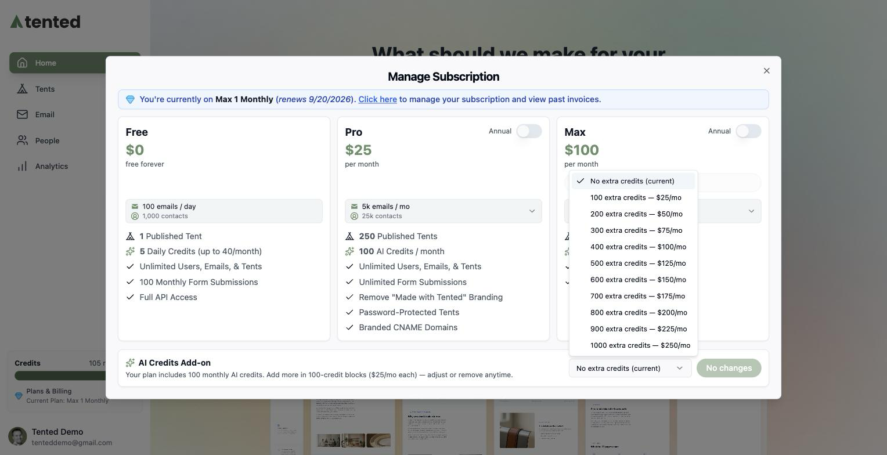
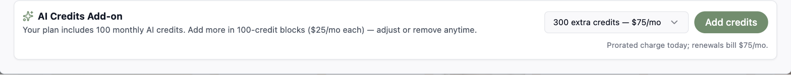

## What credits pay for

**AI credits** power generation — everything else in Tented is free to use. Publishing, sending, importing contacts, and collecting form submissions never consume a credit.

| Action | Credits |
|---|---|
| Generating a new tent or email | **1** |
| Iterating on an existing tent or email | **0.5** |
| [AI image generation](/working-with-tents/generating-images) | **0.5** per image |
| Chatting without changing the content | **0.5** on Free — **included** on paid plans |

## Your monthly allotment

- **Free** — 5 credits per day (the daily pool resets at 12am UTC), up to 40 per rolling month.
- **Pro and Max** — a flat **100 credits per month**, on every tier. Plan tiers change your email volume and contact allowance, not your credits — and plan credits reset at the start of each billing period.

The **Credits** meter at the bottom of the sidebar always shows what's left; hover it for the period breakdown. See [Viewing Current Usage](/billing-subscriptions/viewing-usage) for the full usage picture.

## Need more? The AI Credits Add-on

Paid plans can bolt extra credits onto the subscription in **100-credit blocks** — **$25/month** per block on monthly plans, **$270/year** on annual. Click **Plans & Billing** in the sidebar to open **Manage Subscription**; the add-on lives at the bottom of the dialog.

Open the dropdown and pick your **total** extra credits — the price for each option is shown right in the list, and your current selection is marked:

Pick a higher amount and the button turns into **Add credits**, with the exact billing consequence spelled out underneath — you're charged a prorated amount today, and renewals bill the new total:

The extra credits are available immediately, and the sidebar meter grows to match.

<Note>
  The add-on tops out at **5,000 extra credits** (50 blocks). The dropdown always offers headroom above what you currently hold, so you can step up as you grow.
</Note>

## Adjusting or removing the add-on

The same dropdown scales the add-on **down** as well:

- **Decrease** — pick a lower amount and click **Decrease credits**. You keep everything you've already paid for until the end of the current billing period; renewals bill the smaller amount from then on.
- **Remove** — pick **No extra credits** and click **Remove add-on**. Same grace: paid credits stay usable through the period, and the add-on simply doesn't renew.
- **Changed your mind?** Stepping back up within credits you've already paid for is free — the button reads **Restore credits** and there's no new charge.

## When you run out mid-flight

Hitting your credit limit doesn't block you silently — Tented tells you at the moment of generation:

- **Free plans** see a *Daily Limit Reached* or *Monthly Free Limit Reached* dialog with the option to upgrade.
- **Paid plans** see an *AI Credit Limit Reached* dialog showing when your plan credits reset — with the same add-on purchase panel right there, so you can top up and keep working without leaving the flow.

<Card
  title="Next: Viewing Current Usage"
  icon="arrow-right"
  href="/billing-subscriptions/viewing-usage"
>
  Track credits, sends, and generations across your workspace.
</Card>
