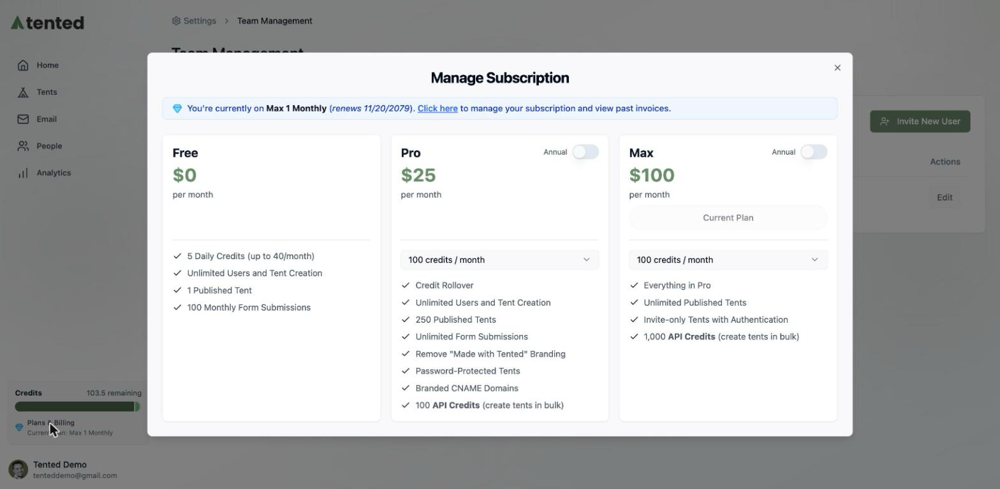

## Plans Overview

Tented has three plans. Every plan includes **unlimited users** and **unlimited tent creation** — the differences are in publishing limits, credits, and power features.

Open the plan picker anytime: click **Plans & Billing** in the bottom-left of the sidebar (or via **Workspace Settings > Team & Billing**).

<CardGroup cols={3}>

<Card title="Free — $0" icon="seedling">
  - 5 daily credits (up to 40/month)
  - Unlimited users and tent creation
  - 1 published tent
  - 100 monthly form submissions
</Card>

<Card title="Pro — $25/mo" icon="rocket">
  - Selectable credits per month, with **credit rollover**
  - 250 published tents
  - Unlimited form submissions
  - Remove "Made with Tented" branding
  - Password-protected tents
  - Branded CNAME domains
  - Verified email sending domains
  - 100 API credits
</Card>

<Card title="Max — $100/mo" icon="bolt">
  - Everything in Pro
  - **Unlimited** published tents
  - 1,000 API credits
  - Priority support
</Card>

</CardGroup>

<Note>
  **What's a credit?** Credits power AI generation — creating and iterating on tents and emails. Pro and Max let you choose your monthly credit allotment, and unused Pro/Max credits roll over.
</Note>

## How to Upgrade

1. Click **Plans & Billing** in the sidebar.
2. Pick your plan — and flip the **Annual** toggle if you prefer annual billing.
3. On Pro and Max, choose your **credits per month** tier.
4. Complete checkout. Your new limits and features are available immediately.

## Which Plan Is Right?

- **Free** — trying Tented out, or running a single evergreen page.
- **Pro** — marketing teams shipping campaigns: multiple live pages, unlimited form capture, brand control, and custom domains.
- **Max** — high-volume teams: unlimited published tents, heavy API usage, and priority support.

<Card
  title="Next: Managing Your Subscription"
  icon="arrow-right"
  href="/billing-subscriptions/managing-subscription"
>
  Change plans, view invoices, and manage billing details.
</Card>
