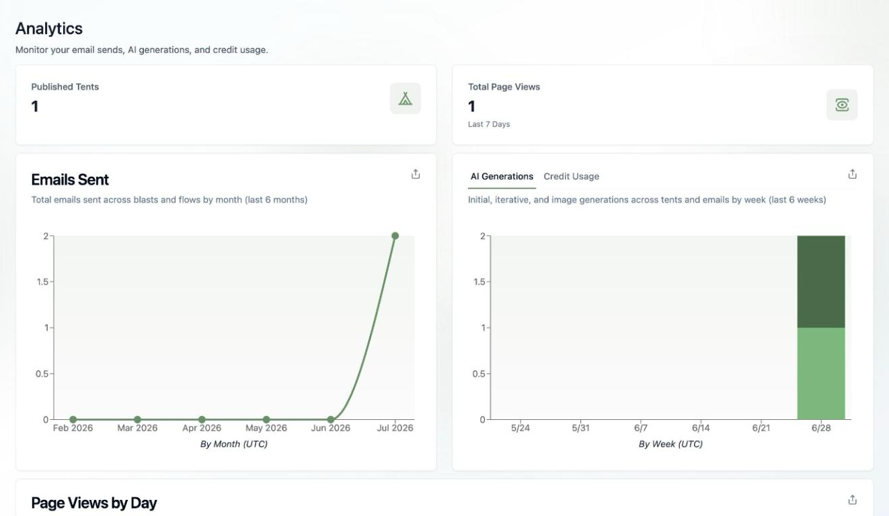

## Three Places to Check Usage

### 1. The sidebar credits meter

The **Credits** bar at the bottom-left of every page shows your remaining AI credits at a glance. Hover it for the details — plan credits left and your current billing period.

### 2. Workspace Settings

The **Usage** card in [Workspace Settings](/configuring-tented/workspace-settings) shows your headline numbers against plan limits:

- **Published Tents** — live tents vs. your plan's limit
- **Daily Free Credits Used** — today's free credits
- **Plan Credits Used** — paid credits used this billing period

### 3. The Analytics area

For trends over time, click **Analytics** in the sidebar. It's your workspace-wide dashboard:

- **Published Tents** and **Total Page Views** (last 7 days)
- **Emails Sent** — total emails across [blasts](/email/email-blasts) and [flows](/email/triggered-flows) by month
- **AI Generations / Credit Usage** — initial, iterative, and image generations across tents and emails by week, with a tab to see the same data as credits
- **Page Views by Day** — traffic across all your tents

Each chart has an export button, so you can pull the data into your own reporting.

## What Uses Credits?

AI generation: creating and iterating on tents, emails, and templates, plus [AI image generation](/working-with-tents/generating-images) (0.5 credits per image). Viewing, publishing, sending, and collecting form submissions don't consume AI credits (form submissions have their own monthly limit on the Free plan).

<Tip>
  Consistently running out of credits? Pro and Max plans let you pick a larger monthly credit tier — and unused credits roll over. See [Upgrading Your Plan](/billing-subscriptions/upgrading-plan).
</Tip>
