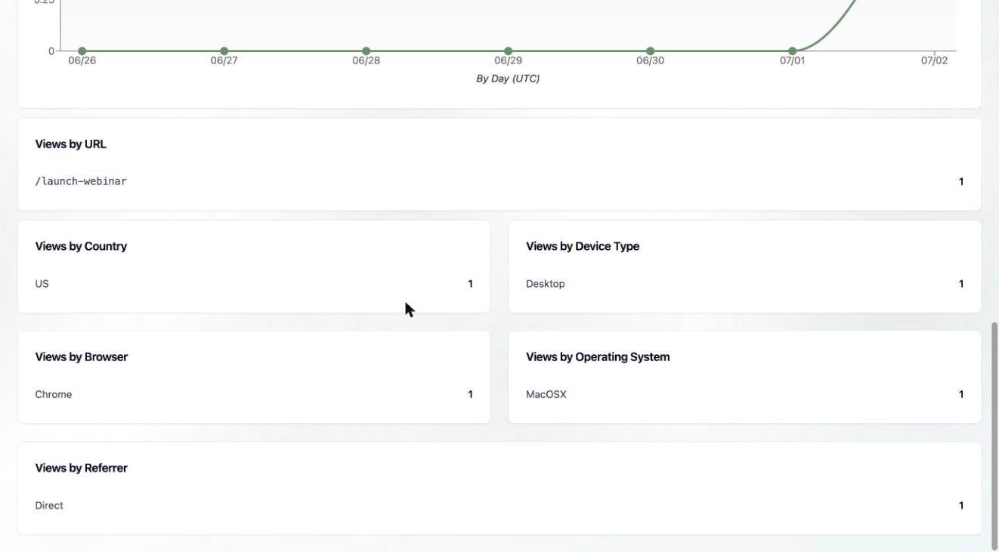

## The Analytics area

Click **Analytics** in the sidebar for a workspace-wide dashboard covering three things: how your published tents are performing, how much email you're sending, and how you're using AI credits.

<Note>
  This is the *workspace* view. For a single tent's numbers, use **View Tent Analytics** on its [Tent Details](/working-with-tents/viewing-tent-details) page; for a specific campaign, open the [blast](/email/email-blasts) or [flow](/email/triggered-flows).
</Note>

## Traffic

At the top you'll find **Published Tents** and **Total Page Views** (last 7 days), plus a **Page Views by Day** chart. Below that, traffic is broken down every way you'd want:

- **Views by URL** — which of your pages get the traffic
- **Views by Country**, **Device Type**, **Browser**, and **Operating System** — who's visiting and on what
- **Views by Referrer** — where they came from (Direct, a social network, a search engine, etc.)

## Email

- **Emails Sent** — total emails across [blasts](/email/email-blasts) and [flows](/email/triggered-flows), by month, so you can see your sending volume trend.

## AI usage

- **AI Generations** — initial, iterative, and image generations across tents and emails, by week.
- **Credit Usage** — the same activity expressed as credits (plan credits vs. free daily credits), by month. This is the best place to understand where your [credits](/billing-subscriptions/viewing-usage) go.

## Exporting

Every chart has a share icon in its corner — click it to download that chart as a PNG for a report or deck.

<Card
  title="Related: Viewing Current Usage"
  icon="gauge"
  href="/billing-subscriptions/viewing-usage"
>
  Check credits, sends, and limits against your plan.
</Card>
