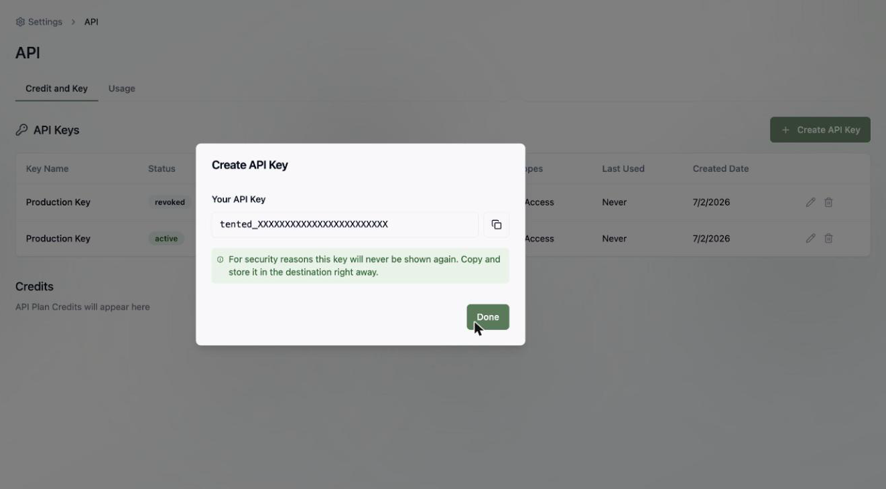
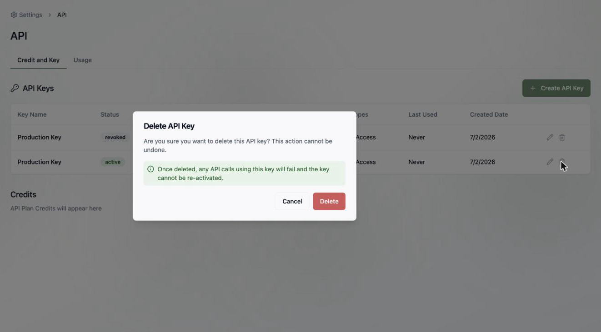
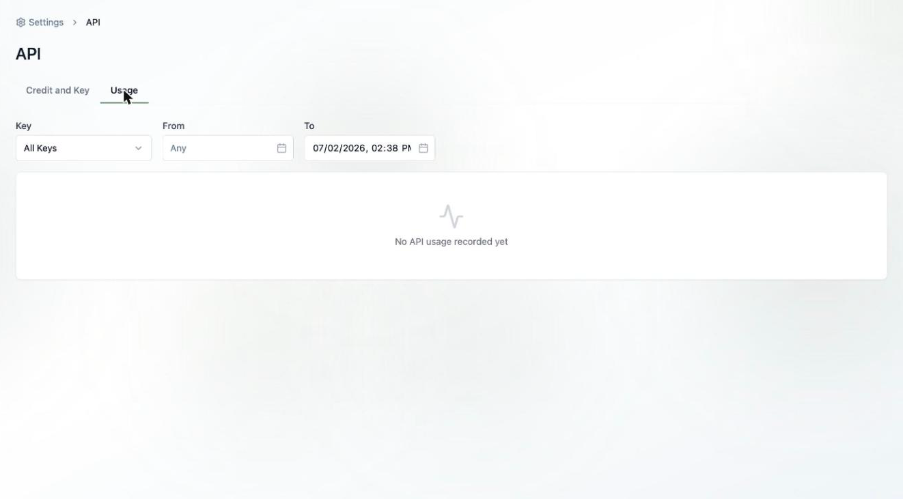

## About the API

Tented has a public API for creating and managing tents and contacts programmatically — handy for bulk-generating personalized pages or syncing your CRM. Everything starts with an **API key**. Manage keys and watch usage under **Settings > API**.

<Note>
  API access is a paid-plan feature: Pro includes 100 API credits/month and Max includes 1,000. See [Upgrading Your Plan](/billing-subscriptions/upgrading-plan).
</Note>

## Creating an API key

On the **Credit and Key** tab, click **Create API Key**, give it a name (like "Production" or "Zapier"), and confirm. The key currently has **All Access** scope.

Tented shows you the key **once**:

<Warning>
  Copy your key and store it somewhere safe **right away** — for security, Tented will never show the full value again. If you lose it, just delete the key and create a new one.
</Warning>

Use the key as a bearer token in your API requests. See the [API Reference](/api-reference/authentication) for details.

## Managing keys

Back on the **Credit and Key** tab, each key shows its name, status, a masked prefix, scope, last-used time, and creation date.

- **Rename** a key with the pencil icon.
- **Delete** a key with the trash icon — this can't be undone, and any requests using it will immediately start failing. Deleting is how you revoke a key you think may be exposed.

## Monitoring usage

The **Usage** tab logs every API request. Filter by key and date range to see method, status code, response time, and credits consumed per request — useful for debugging an integration or tracking what's eating your API credits.

<Card
  title="Explore the API Reference"
  icon="terminal"
  href="/api-reference/introduction"
>
  Authentication, creating tents, managing contacts, and more.
</Card>
