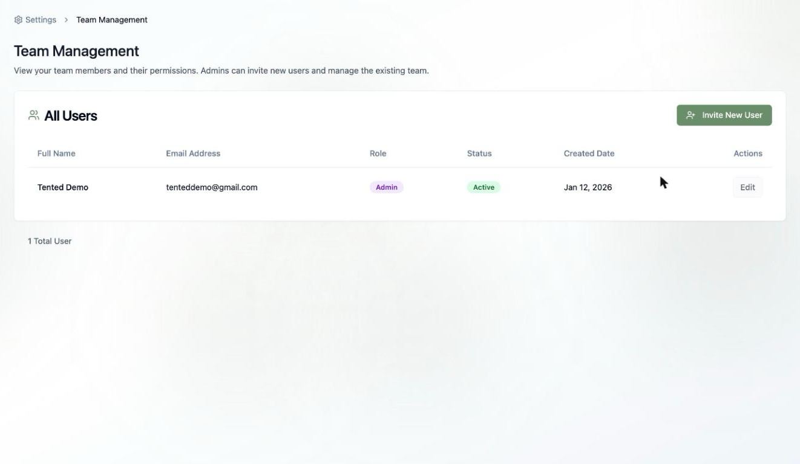
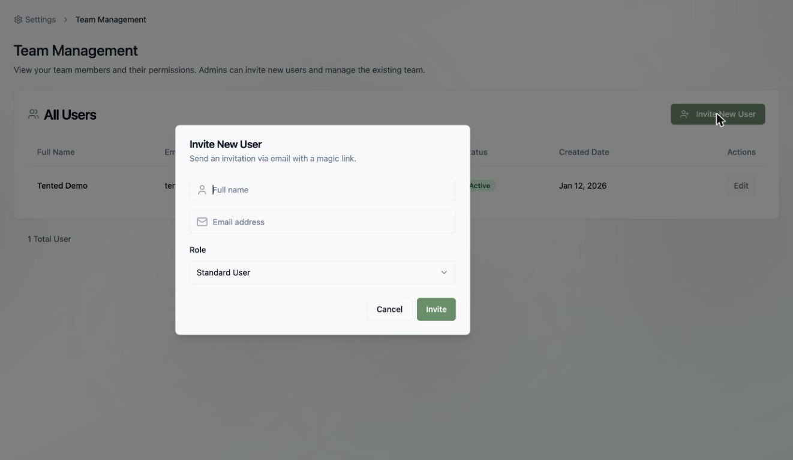

## Inviting Users Overview

Tented workspaces are built for teams — invite as many teammates as you need (every plan includes unlimited users). Admins handle invitations from **Team Management**.

## Sending an Invitation

1. Click your **profile icon** in the bottom-left corner and select **Workspace Settings**.
2. In the **Team & Billing** card, click **Manage Users** to open **Team Management**.
3. Click **Invite New User**.

4. Fill in the invitation:
   - **Full name** — how they'll appear in the workspace
   - **Email address** — where the invitation is sent
   - **Role** — **Standard User** or **Admin** (see [User Permissions](/configuring-tented/user-permissions))
5. Click **Invite**.

Your teammate receives an email with a **magic link** — no password setup required. One click and they're in.

## After the Invite

New users appear in the **All Users** table with their role and status. From there you can [manage them](/configuring-tented/managing-users) — change roles or update details with the **Edit** action.

<Tip>
  Not sure which role to pick? Default to **Standard User** — you can always promote someone to **Admin** later.
</Tip>

<Card
  title="Next: Managing Users"
  icon="arrow-right"
  href="/configuring-tented/managing-users"
>
  Learn how to manage existing users in your workspace.
</Card>
