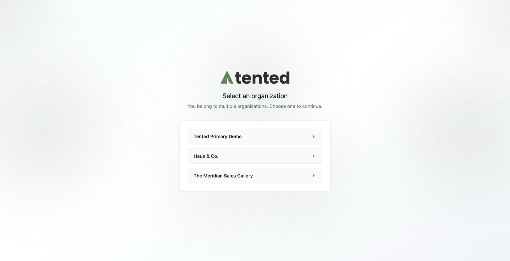
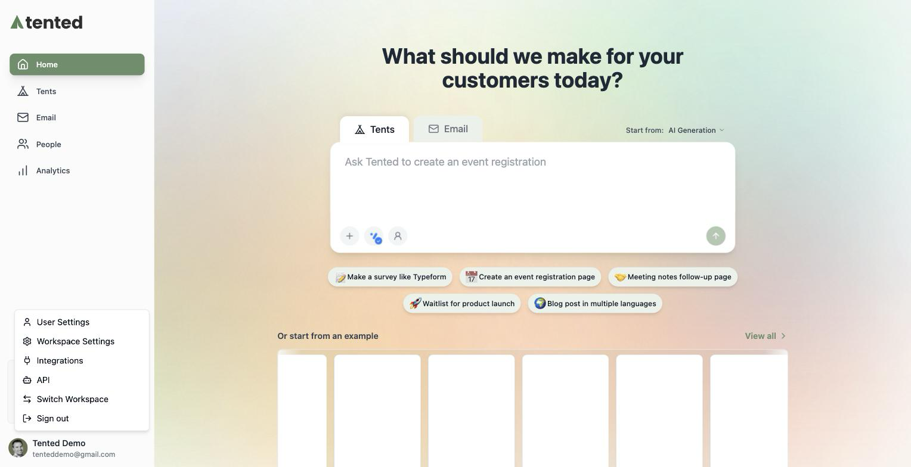
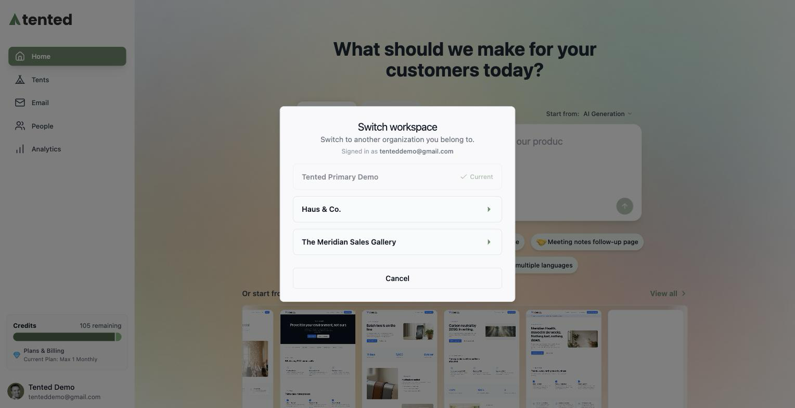

## Workspaces Overview

Your Tented account (your email address) can belong to more than one workspace — for example, your own company's workspace plus a client workspace you've been [invited to](/configuring-tented/inviting-new-users). Each workspace keeps its own tents, contacts, emails, branding, team, and plan.

## Choosing a Workspace at Login

If your email belongs to multiple workspaces, Tented asks which one you want to use right after you log in. Pick a workspace from the list and you'll land in it.

## Switching While Logged In

If you belong to more than one workspace, you don't need to sign out to move between them:

Click your **profile icon** in the bottom-left corner of the sidebar, and select **Switch Workspace** from the menu (just above **Sign out**):

Then pick the workspace you want from the list. Your current workspace is marked **Current** and can't be re-selected:

Tented switches your session to the selected workspace and reloads the app, so everything you see — tents, people, emails, analytics, and settings — belongs to that workspace.

<Note>
  **Switch Workspace** only appears when your email address belongs to more than one workspace, and only those workspaces appear in the list. If a workspace is missing, ask an admin of that workspace to [invite you](/configuring-tented/inviting-new-users); once you're invited it shows up automatically.
</Note>

## Roles Are Per Workspace

Your [role](/configuring-tented/user-permissions) is set independently in each workspace — you can be an Admin in one and a Standard User in another. After switching, you have the role that workspace assigned to you.

<Card
  title="Next: Workspace Settings"
  icon="arrow-right"
  href="/configuring-tented/workspace-settings"
>
  Configure workspace-wide branding, company info, and more.
</Card>
