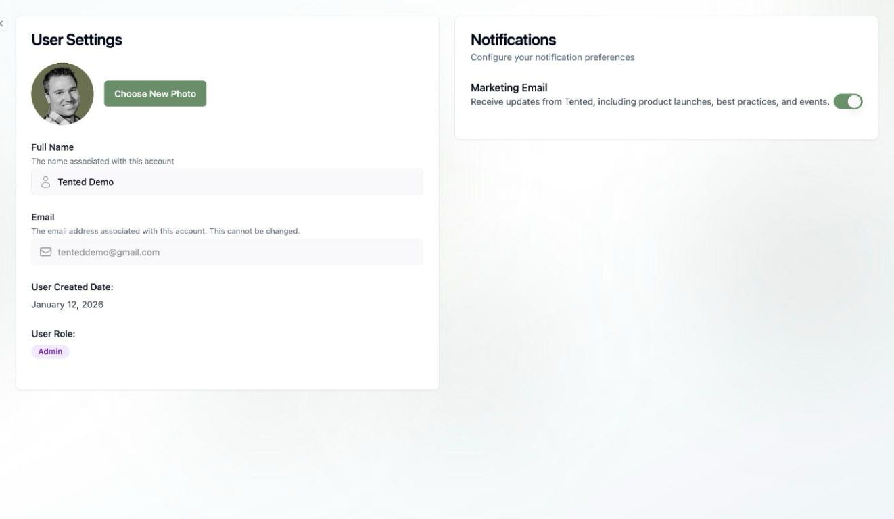

## User Settings Overview

User Settings is your personal corner of Tented — separate from workspace-wide settings. Open it by clicking your **profile icon** in the bottom-left corner and selecting **User Settings**.

## Profile

- **Profile photo** — click **Choose New Photo** to upload one.
- **Full Name** — the name associated with your account, shown across the workspace.
- **Email** — the address you signed up with. This can't be changed.
- **User Created Date** — when your account was created.
- **User Role** — your current role badge ([Admin or Standard User](/configuring-tented/user-permissions)).

## Notifications

The **Notifications** panel controls your personal preferences:

- **Marketing Email** — toggle whether you receive product updates, best practices, and event announcements from Tented.

<Note>
  Looking for form-submission notifications? Those are configured per tent as [form automations](/working-with-tents/form-automations), not here.
</Note>

<Card
  title="Next: Workspace Settings"
  icon="arrow-right"
  href="/configuring-tented/workspace-settings"
>
  Configure workspace-wide branding, company info, and more.
</Card>
