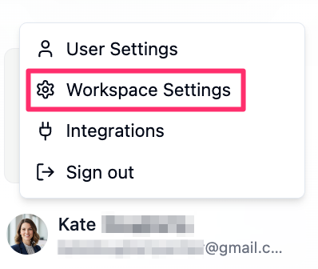
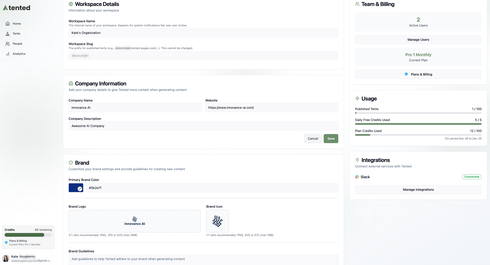
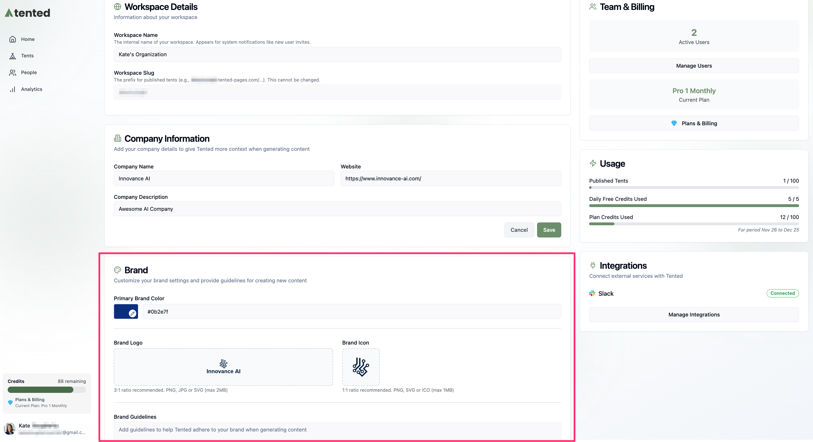

## Workspace Settings Overview

Workspace settings control your company information, integrations, and Tented plan. You can also view your usage from this page. 

Workspace settings are accessible from any page other than the tent editor. Click on your **profile icon** in the bottom-left corner, then select **Workspace Settings** from the menu that opens.

  

This page describes the various sections of the **Workspace Settings** page and the options available in each section.

  

**Workspace Details:**
- **Workspace Name:** Set or update your workspace name.
- **Workspace Slug:** A unique identifier for your workspace. Thiis is used as a prefix in URLs and cannot be changed.

**Company Information:**
- **Company Name:** Set or update your company name.
- **Website:** Add your company website.
- **Company Description**: Provide a brief description of your company.

**Brand:**
 - **Primary Brand Color**: Your main brand color. This color is used for buttons.
 - **Brand Logo**: The logo that represents your brand. It should be a PNG or SVG file with a 3:1 aspect ratio and a transparent background.
 - **Brand Icon**: A smaller icon version of your logo. It should be a PNG or SVG file with a 1:1 (square) aspect ratio and a transparent background.
 - **Brand guidelines**: Some brief information to help the AI understand your brand personality. For example, "professional and modern" or "playful and creative".

 **Billing:**
  - **Current Plan**: Displays your current Tented plan.
  - **Plans & Billng**: View available plans, check your renewal date, manage your subscription, and view past invoices.

**Usage:**
- **Published Tents**: Displays the number of published tents in your workspace.
- **Daily Free Credits Used:** Shows the number of free AI generation credits used today.
- **Plan Credits Used:** Shows the number of paid AI generation credits used this month.

**Integrations:**
This section shows the third-party services connected to your Tented workspace. You can also connect or disconnect services here by clicking **Manage Integrations**. Supported integrations include:
- **Slack**: [Connect your Slack account](../integrations/connecting-slack) to receive notifications about form submissions.
- **Microsoft Teams**: [Connect your Microsoft Teams account](../integrations/connecting-microsoft-teams) to receive notifications about form submissions.

<Card
  title="Next: Custom Domains"
  icon="arrow-right"
  href="/configuring-tented/custom-domains"
>
  Learn how to configure custom domains and DNS redirects for your tents.
</Card>
