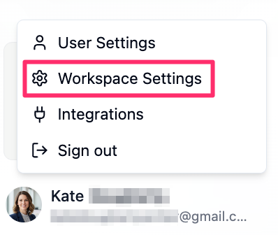
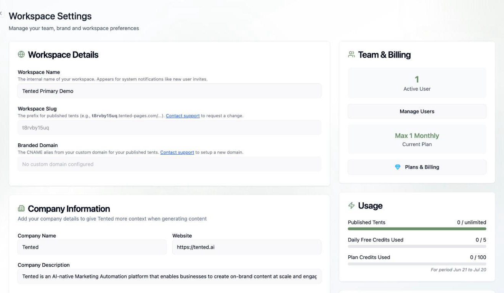
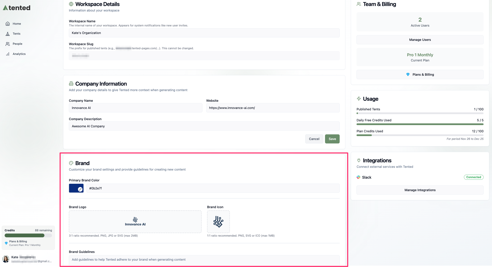

## Workspace Settings Overview

Workspace settings control your company information, branding, team, integrations, and Tented plan — everything shared by your whole workspace.

Click your **profile icon** in the bottom-left corner, then select **Workspace Settings** from the menu that opens.

## Workspace Details

- **Workspace Name**: The internal name of your workspace, used in system notifications like user invites.
- **Workspace Slug**: A unique identifier used as the prefix for your published tents (e.g., `t8rvby15uq.tented-pages.com/...`). Contact support to request a change.
- **Branded Domain**: The CNAME alias from your custom domain for published tents. See [Custom Domains](/configuring-tented/custom-domains).

## Company Information

Give Tented context for on-brand AI generation:

- **Company Name** and **Website**
- **Company Description**: A brief description of what your company does.

## Brand

- **Primary Brand Color**: Your main brand color (used for buttons and accents).
- **Brand Logo**: PNG, JPG, or SVG with a 3:1 aspect ratio and transparent background (max 2MB).
- **Brand Icon**: PNG, SVG, or ICO with a 1:1 (square) aspect ratio (max 1MB).
- **Brand Guidelines**: Free-text guidance the AI follows when generating content — fonts to prefer, tone, things to avoid.

## People

A quick view of your contact database, with **People database size** and **Custom fields used**. Click **Manage Fields** to add and manage [standard and custom contact fields](/people/contact-fields).

## Email

Shows your email sending status (with a **Verified** badge once your domain checks out). Click **Manage Email** to configure your sending domain, sender profile, default headers, and unsubscribe footer — the full walkthrough is in [Setting Up Email](/configuring-tented/email-setup).

## Team & Billing

- **Active Users** and **Manage Users** — open [Team Management](/configuring-tented/managing-users) to invite and manage teammates.
- **Current Plan** and **Plans & Billing** — see [Managing Your Subscription](/billing-subscriptions/managing-subscription).

## Usage

- **Published Tents**: How many tents you've published against your plan's limit.
- **Daily Free Credits Used**: Free AI generation credits used today.
- **Plan Credits Used**: Paid AI credits used this billing period.

For deeper usage analytics, see [Viewing Current Usage](/billing-subscriptions/viewing-usage).

## API

Click **Manage API** to create API keys and monitor credits for REST API and agent access. See the [API Reference](/api-reference/introduction).

<Card
  title="Next: Setting Up Email"
  icon="arrow-right"
  href="/configuring-tented/email-setup"
>
  Verify your sending domain and sender details for marketing email.
</Card>
