## What's an A/B test?

An **A/B test** takes the guesswork out of a blast: instead of betting the whole audience on one subject line (or send time, or sender), Tented sends **up to five variations** to a small sample, measures which one performs best, and delivers the winning version to everyone else — automatically, or on your say-so.

Every A/B test lives inside an [email blast](/email/email-blasts). Open a draft blast, head to the **Schedule** step, and find **AB Test** under **Additional Settings**. Click **Add Test**.

<Note>
  Once a test is active, the blast's schedule follows the **test's** start time, and **Send now** is unavailable — a test needs time to collect results before the winner can go out.
</Note>

## Choose what to test

The **What should we test?** dropdown offers five test types:

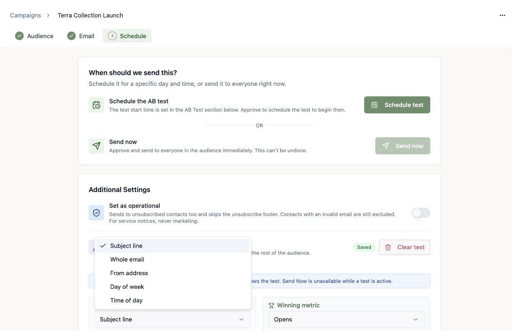

| Test type | Each variation is… | Good for |
|---|---|---|
| **Subject line** | A different subject on the same email | The classic — biggest lever on opens |
| **Whole email** | A different **approved** email entirely | Layout, copy, or offer showdowns |
| **From address** | A different from name, from address, and reply-to | "Founder vs. brand" sender tests |
| **Day of week** | The same local time on a different weekday | Finding your audience's day |
| **Time of day** | A different local time | Morning vs. evening sends |

<Warning>
  Changing the test type starts a fresh set of variations — your existing variation setup is discarded.
</Warning>

## Build the variations

**Variation A** is always the **control**: your campaign's current setup. Add up to four more with **Add variation** (a test needs at least two).

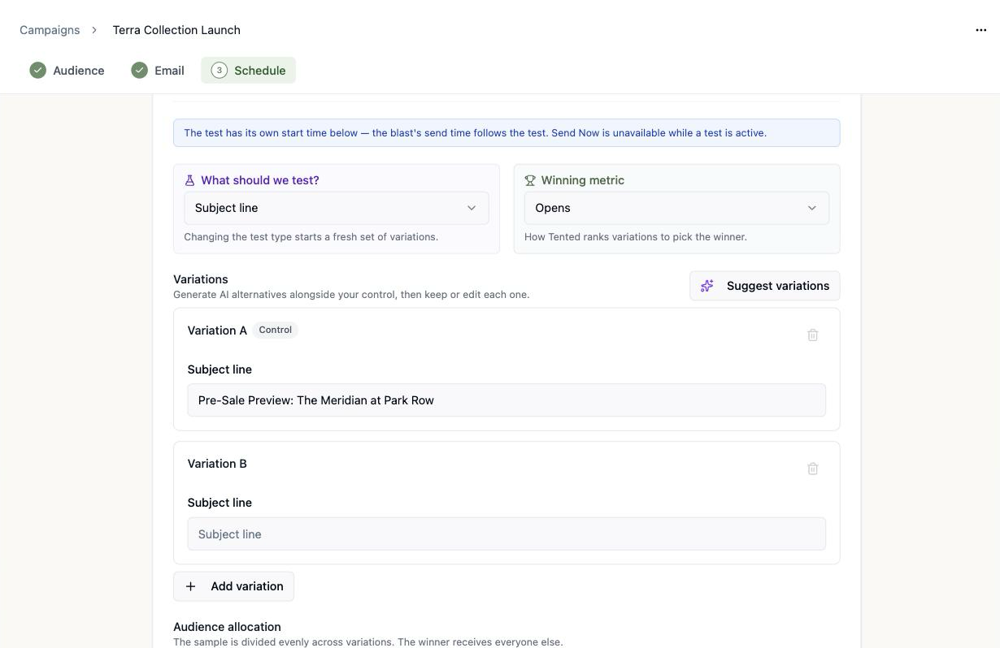

### Let AI write the alternatives

For **Subject line** and **From address** tests, click **Suggest variations** and Tented generates alternatives alongside your control — each with a one-line rationale explaining what it's testing, so the test is a real experiment rather than five shots in the dark. Keep them, edit them, or **Regenerate variations** for a new set.

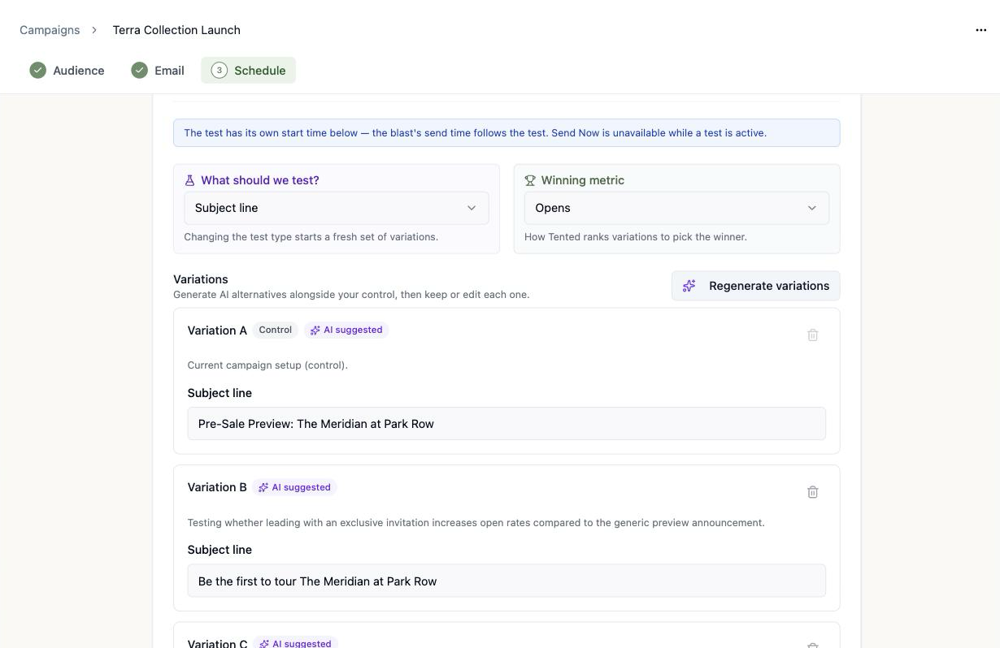

### Whole-email variations

For a **Whole email** test, Variation A sends the approved campaign email. For each other variation, pick another **approved** email — or click **Clone original email** to duplicate the control and edit the copy in the email editor. Clones must be approved before the test can be saved.

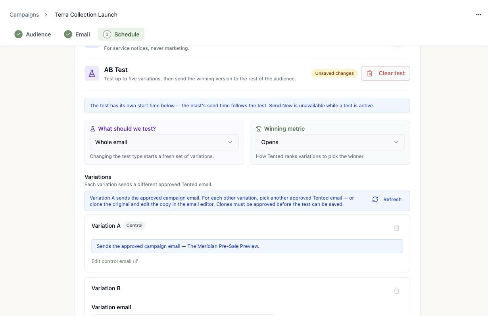

### Timing variations

- **Day of week** — set one **Send time for every variation**, then give each variation its own weekday.
- **Time of day** — give each variation its own local time, interpreted as wall-clock time in the test's timezone. A **Winner delivery weekdays** setting controls which days the winning time may be delivered on — after winner selection, delivery waits for the winning local time on an eligible weekday.

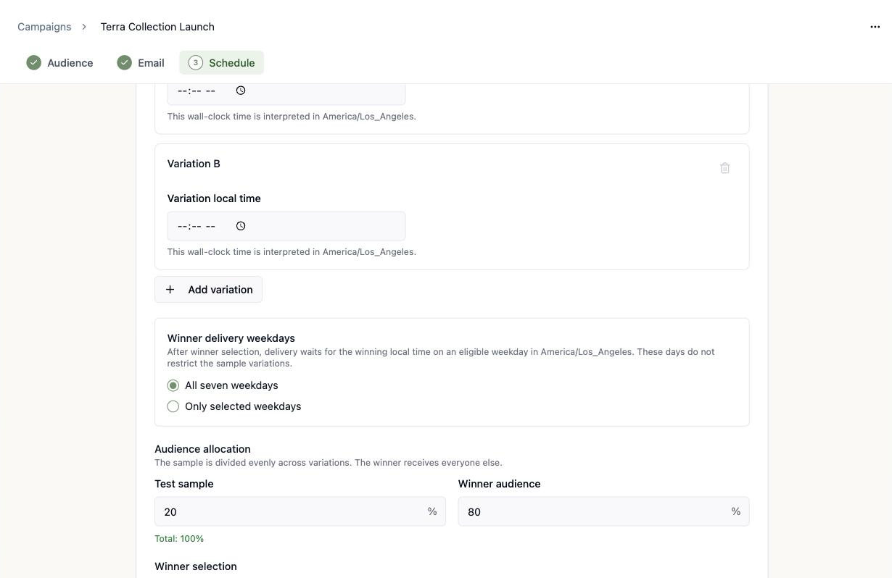

## Split the audience

**Audience allocation** decides how much of the audience is the experiment and how much gets the winner:

- **Test sample** (default **20%**) — divided **evenly** across your variations.
- **Winner audience** (default **80%**) — held back until a winner is chosen, then receives the winning version.

The two always total 100% (editing one rebalances the other), and both must be whole percentages between 1 and 99.

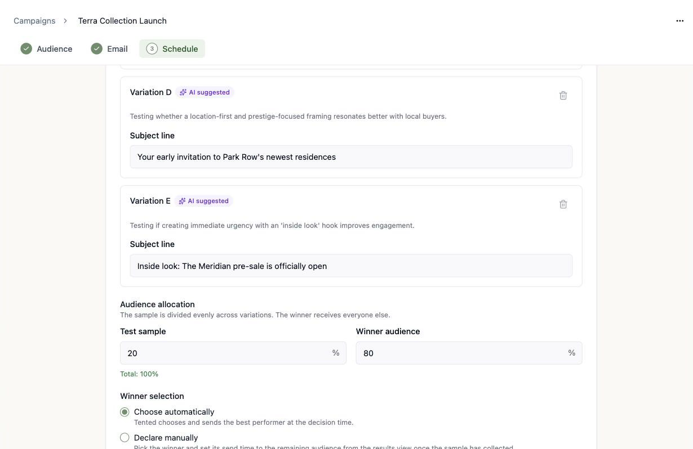

<Note>
  The audience needs at least **one more qualified contact than you have variations** — every variation gets at least one sample recipient, and at least one contact is always held back for the winner send.
</Note>

## Pick the winner (or let Tented)

**Winning metric** is how variations are ranked:

| Metric | Measured as |
|---|---|
| **Opens** | Unique opens ÷ delivered |
| **Clicks** | Unique clicks ÷ delivered |
| **Click-to-open** | Unique clicks ÷ unique opens |

**Winner selection** has two modes:

- **Choose automatically** — at the **Winner decision time**, Tented ranks the variations by your metric and sends the best performer to the winner audience. On a perfect tie, the variation with more data wins, and the control wins over a challenger that merely matched it.
- **Declare manually** — you pick the winner yourself from the results view once the sample has collected. Tented emails you reminders after 6 and 24 hours, and a final reminder after 48 hours. The winner audience waits until you declare — nothing is sent without your pick.

## Set the timing

Two datetime fields close out the setup:

- **Test start time** — when the sample sends go out. This *is* the blast's send time. It can stay blank while you draft, but scheduling requires a start at least **2 minutes** in the future.
- **Winner decision time** (automatic selection only) — when Tented evaluates results and sends the winner. It must land **after every variation has sent**. For subject-line, whole-email, and from-address tests the winner goes out right at decision time; day-of-week and time-of-day winners wait for the next eligible occurrence of the winning slot.

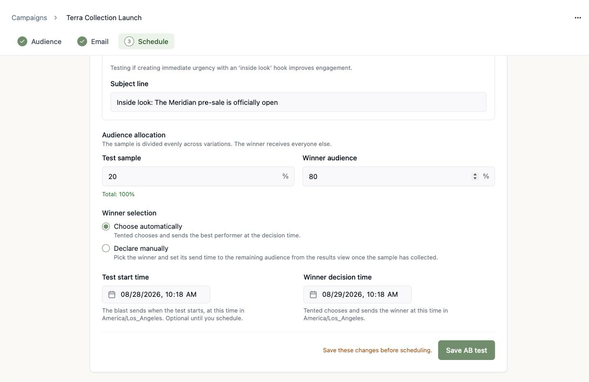

## Save it, then schedule it

Click **Save AB test** — the badge in the AB Test header flips from **Unsaved changes** to **Saved**. Then launch from the top of the Schedule step, where the usual Schedule send button now reads **Schedule test**: it approves the blast and schedules the test to begin at your start time.

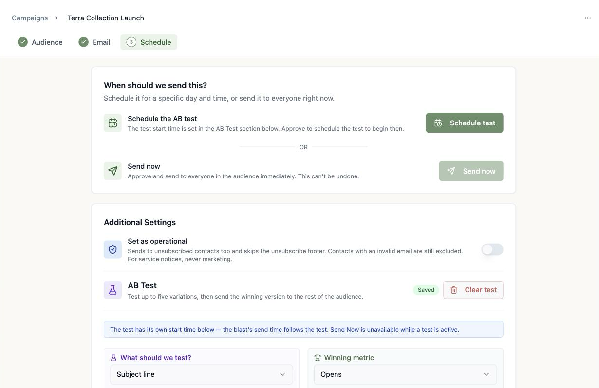

Back on the **Campaigns** tab, blasts with a test carry a violet **AB TEST** badge next to their status:

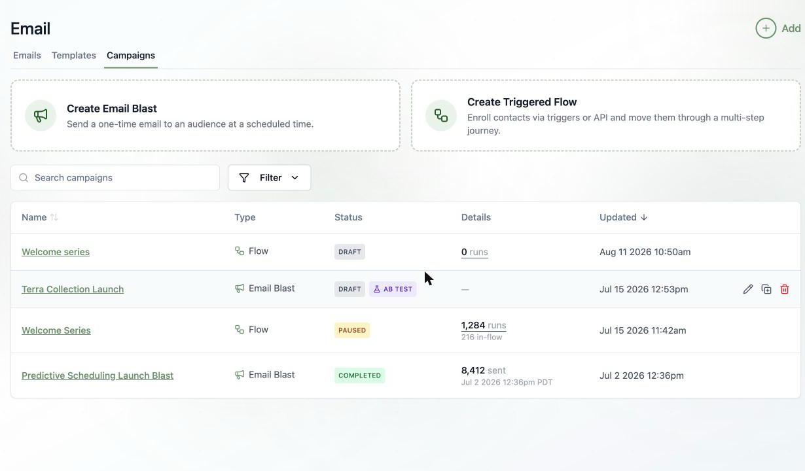

## Watch the results roll in

Once scheduled, the campaign page gains an **AB Test** card that tracks the whole lifecycle — it refreshes itself, so you can leave it open:

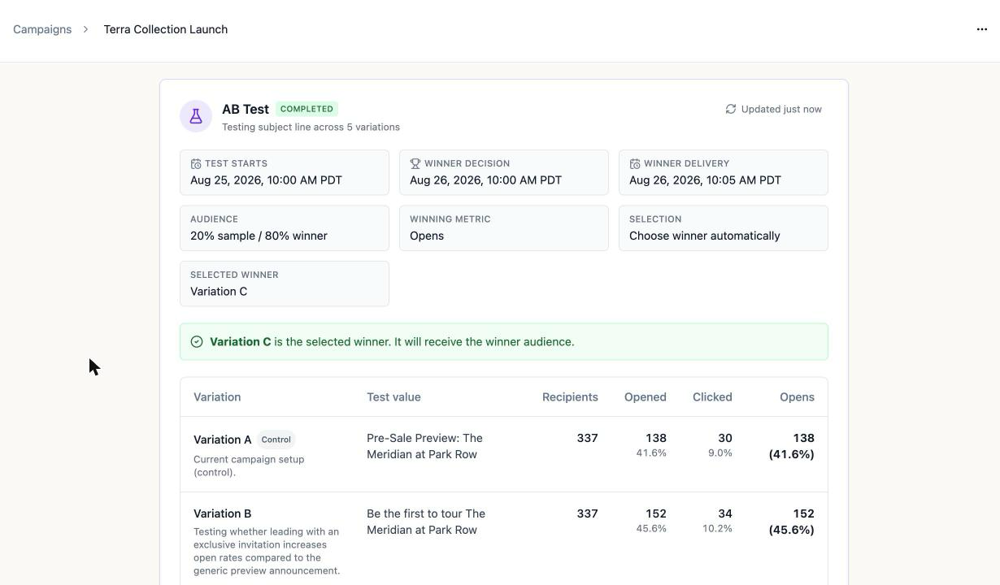

| Status | What's happening |
|---|---|
| **Scheduled** | Waiting for the test start time |
| **Sending test** | Sample sends are going out |
| **Collecting results** | Samples landed; opens and clicks are accumulating |
| **Winner scheduled** | A winner is chosen and its send is queued |
| **Sending winner** | The winning version is going to the winner audience |
| **Completed** | Done — the winner reached everyone else |

The results table shows every variation with its recipients, opens, clicks, and your winning metric. The winner is tinted green and wears the trophy:

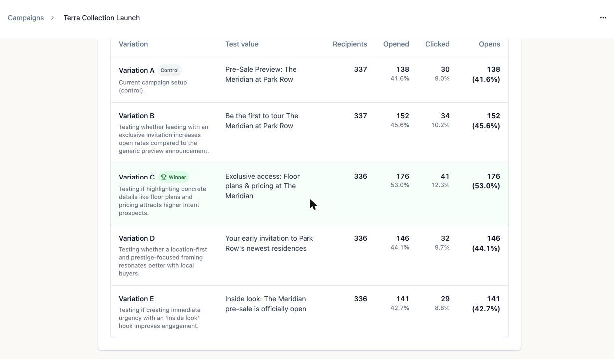

For a **Declare manually** test, each row gains a **Declare winner** button once results are collecting. Declaring sends that variation to the winner audience — for content tests you also pick the **Send winner at** time. The choice can't be changed after winner selection.

<Tip>
  Second thoughts mid-test? **Cancel winner send** is available while the test is sending, collecting, or has a winner scheduled. The remaining audience simply never receives the blast, and the test completes with the sample results only — this can't be undone.
</Tip>

The blast's regular [results dashboard](/email/email-blasts#watch-the-results-roll-in) keeps working throughout, aggregating the sample sends and the winner send together, with every metric clickable for a per-contact drill-down.

<Warning>
  **Free plan:** the daily 100-email limit and 1,000-contact allowance are re-checked at each send moment — the sample sends and the winner send each count against the day they fire.
</Warning>

## What's next?

<Card
  title="Next: Track Email Performance"
  icon="arrow-right"
  href="/email/email-performance"
>
  See how an email performed across every blast and flow it was sent in.
</Card>
