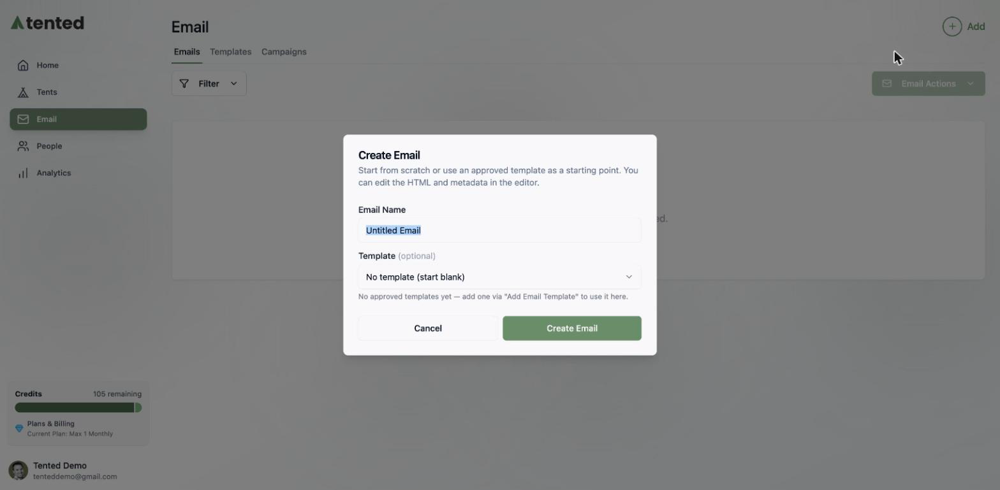
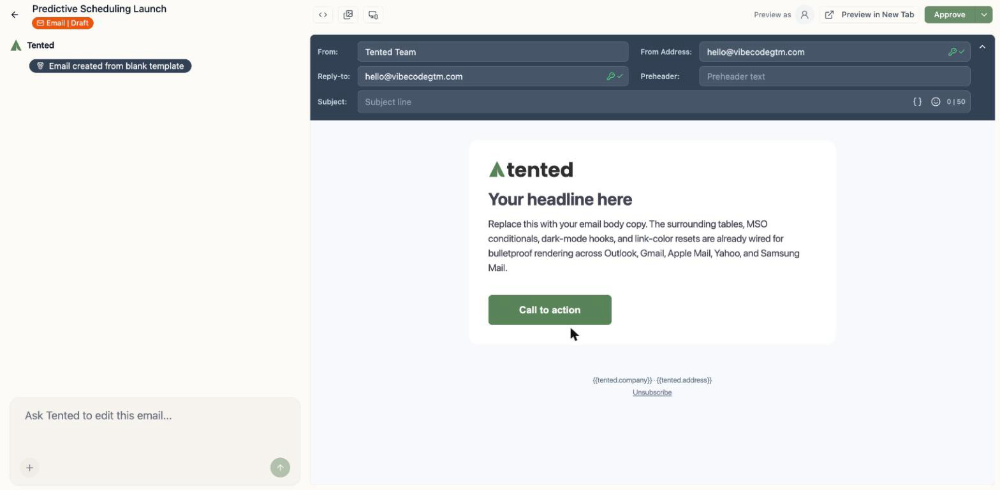
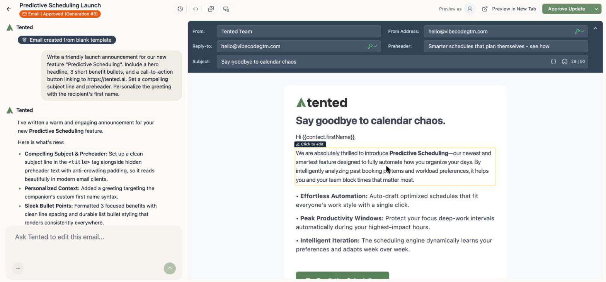
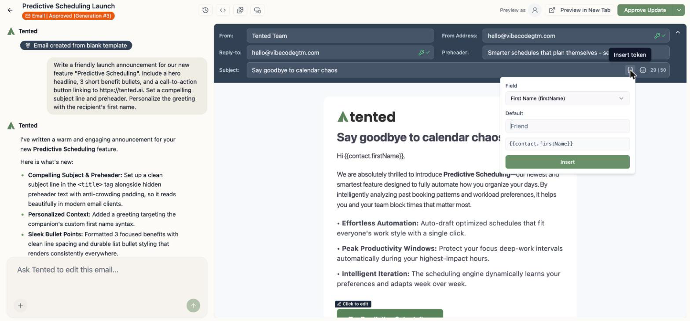
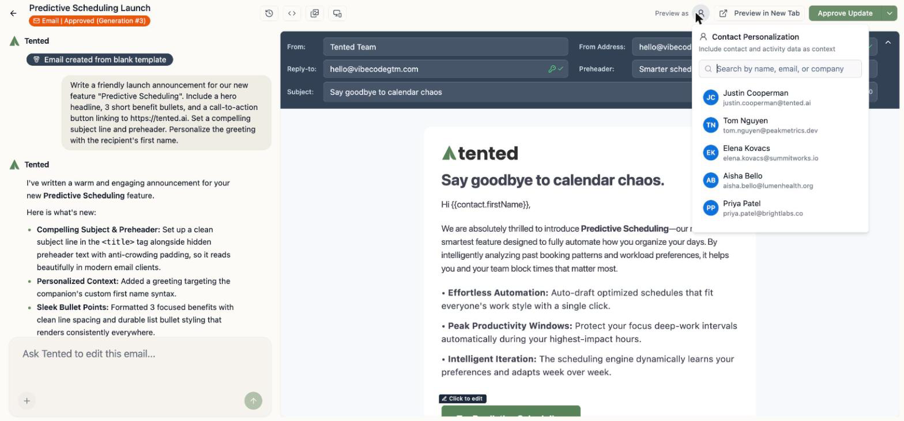
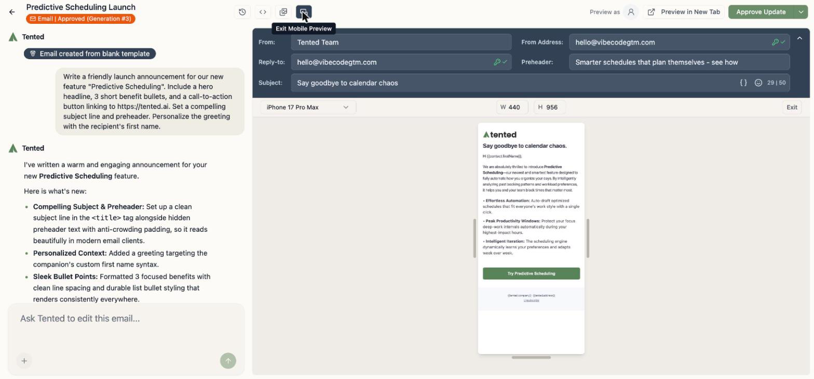
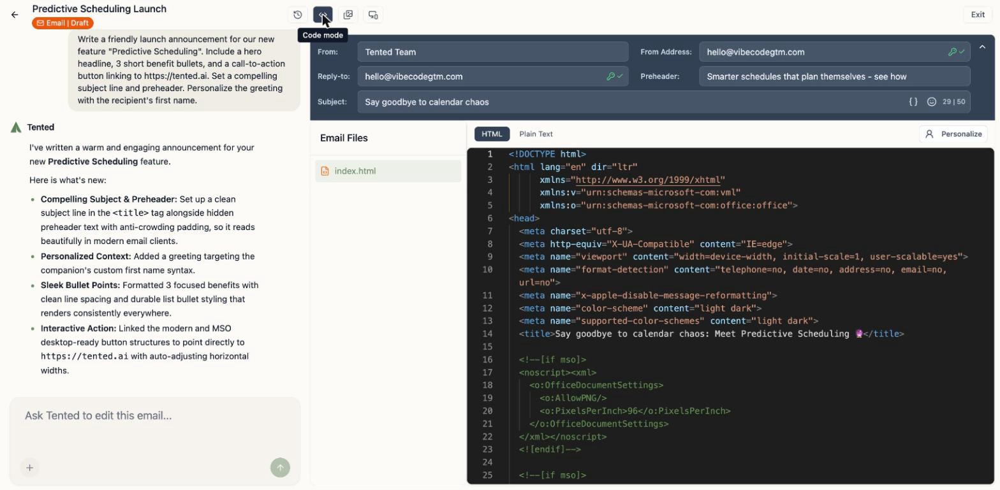
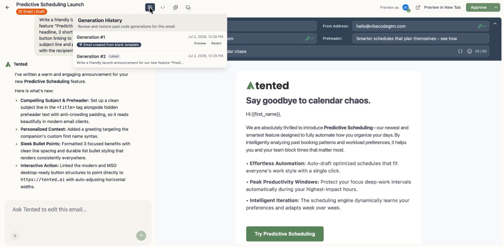
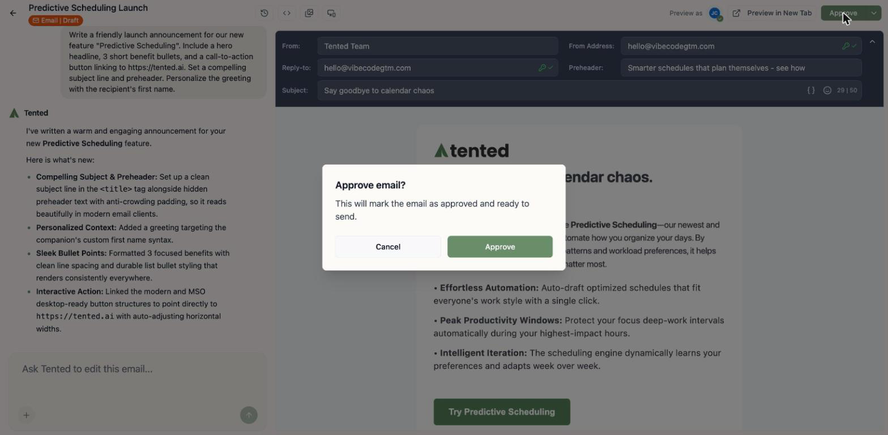
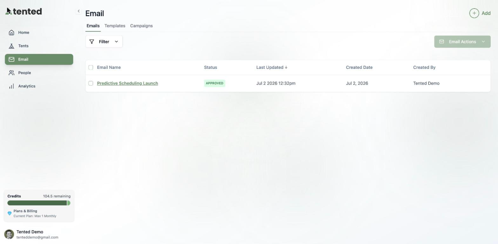

## Emails, the Tented way

If you've built a tent, you already know how to build an email: describe what you want, iterate in chat, and watch the preview update live. Every email Tented generates uses battle-tested HTML — bulletproof tables, MSO conditionals for Outlook, dark-mode hooks — so it renders cleanly across Gmail, Outlook, Apple Mail, Yahoo, and friends.

## Create your first email

1. Go to **Email** in the sidebar.
2. Click **Add > Create Email**.
3. Name your email, and optionally pick an [approved template](/email/email-templates) as your starting point.

You'll land in the email editor: chat on the left, live preview on the right, with your default from name and address already filled in from [email settings](/email/email-setup).

## Ask for what you want

Describe the email in the chat box, the same way you'd brief a colleague:

> "Write a friendly launch announcement for our new feature 'Predictive Scheduling'. Include a hero headline, 3 short benefit bullets, and a call-to-action button linking to our site. Personalize the greeting with the recipient's first name."

Keep chatting to refine it — "make the tone more playful," "swap the bullets for a comparison table," "add a P.S. line." Each request creates a new generation you can review or roll back.

### Edit sections directly

Hover over any part of the email and you'll see **Click to edit** — handy for quick text tweaks without a round-trip through the AI.

## Subject lines, preheaders, and personalization

Fill in the **Subject** and **Preheader** fields in the header bar. A few niceties built in:

- The subject field has a **50-character guide** — stay under it and your subject won't get clipped on mobile.
- The `{}` **Personalize** button inserts **personalization tokens** — any standard or [custom contact field](/people/contact-fields), in the form `{{contact.firstName}}`. They work in the subject, preheader, and anywhere in the body. (Full token reference: [Personalization Tokens](/email/personalization).)
- Tokens resolve to an empty string when a contact is missing the value, so add a fallback for anything visible: `{{contact.firstName:default=there}}` renders as "there" when there's no first name.
- Per-email **From/Reply-to overrides**: any email can use its own sender details instead of the workspace defaults.

Click **Personalize** and you'll get a small builder — pick the field, set an optional default, and it inserts the token for you:

To see personalization with real data, click **Preview as** and pick a contact — Tented uses their contact and activity data as context.

## Check it on mobile (and in code)

- The **mobile preview** button renders your email at real device dimensions, with a device picker.
- **Code mode** (`<>`) shows the full HTML and a plain-text view. Advanced users can edit the code directly.

<Tip>
  The truest test is a real inbox: click **Send Sample** in the top bar to send yourself a one-off copy — see [Sending Sample Emails](/email/sample-emails).
</Tip>

## Generation history

The clock icon opens **Generation History** — every AI generation of this email, with **Preview** and **Revert** so you can compare and restore past versions, just like tents.

## Approve it

Here's the one concept that's different from tents: **emails must be approved before they can send**. Approval freezes a known-good version — the one your blasts and flows will actually deliver.

Click **Approve** in the top-right corner and confirm.

A few things to know about approval:

- Your Emails list shows each email's status — **Draft** or **Approved**.
- After approving, you can keep editing safely: draft changes **aren't included in sends** until you click **Approve Update**.
- Blasts and flows only offer approved emails (or brand-new ones you compose inline).

## What's next?

<Columns cols={2}>
  <Card
    title="Send it to an audience"
    icon="bullhorn"
    href="/email/email-blasts"
  >
    Pick a list, pick a time, and launch your first email blast.
  </Card>
  <Card
    title="Automate it"
    icon="diagram-project"
    href="/email/triggered-flows"
  >
    Send it automatically when contacts hit a trigger, as part of a multi-step flow.
  </Card>
</Columns>
