## What's a blast?

An **email blast** is a one-time send to an audience: product launches, newsletters, event invites, announcements. You pick who gets it, what they get, and when — Tented handles delivery, unsubscribes, and the results dashboard.

<Note>
  First time sending? Make sure your sending domain is verified — see [Setting Up Email](/email/email-setup).
</Note>

Head to **Email > Campaigns** and click **Create Email Blast**. Name your blast (this is just for your team — recipients never see it), and you're dropped into a three-step wizard: **Audience → Email → Schedule**. Your progress saves automatically as you go.

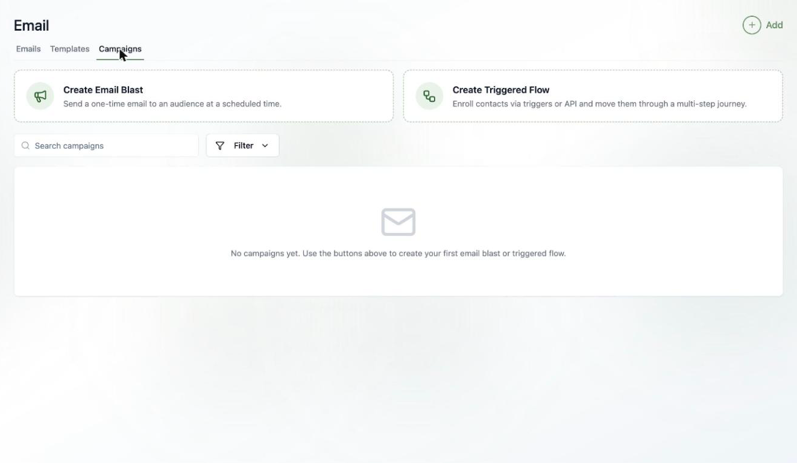

## Step 1: Pick the audience

Choose an existing [static or dynamic list](/people/working-with-lists), or build a one-off list just for this blast (it's deleted along with the blast, keeping your Lists page tidy).

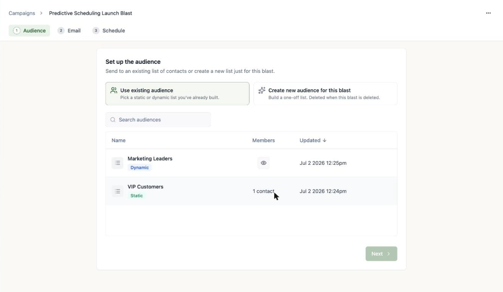

Once you pick a list, Tented shows you the **qualified** count (people who will actually receive the email) and the **blocked** count (people excluded because they've unsubscribed). Click **View all** to inspect exactly who qualifies.

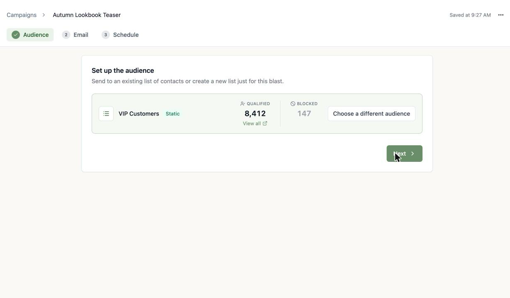

## Step 2: Pick the email

Use an existing **approved** email, or compose a one-off email inline just for this blast.

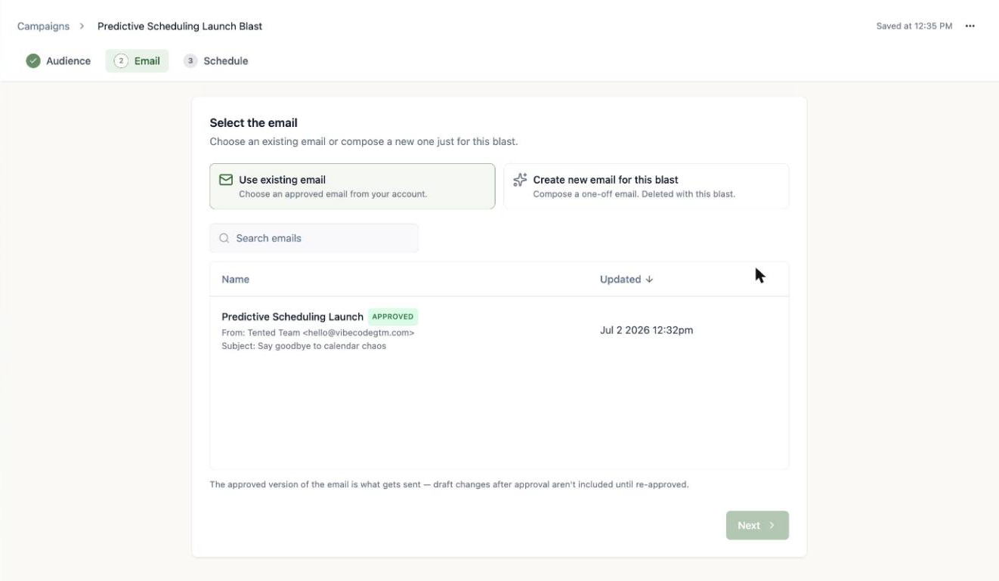

<Warning>
  Blasts send the **approved version** of an email. If you've made draft edits since approving, they won't go out until you click **Approve Update** on the email.
</Warning>

## Step 3: Schedule it (or don't)

Two ways to launch:

- **Schedule send** — pick a day and time; the blast is approved now and sends automatically.
- **Send now** — confirm, and it goes to everyone qualified immediately. This can't be undone, so the confirmation shows you the exact recipient count first.

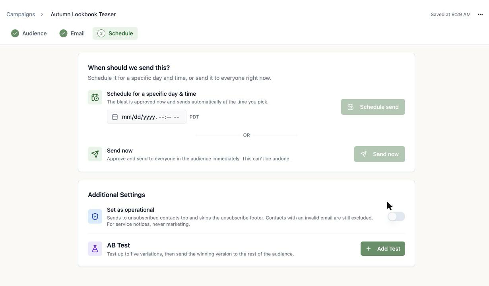

<Note>
  **Set as operational** is for service notices — password resets, security announcements, terms changes. Operational sends go to unsubscribed contacts too and skip the unsubscribe footer — though contacts whose email was marked invalid by a hard bounce are still excluded (that address can't receive mail). Never use it for marketing.
</Note>

### Or make it a test

Not sure which subject line (or send time, or sender) will win? The **AB Test** section under Additional Settings turns the blast into an experiment: up to five variations go to a sample of the audience, and the winner is sent to everyone else. See [A/B Testing](/email/ab-testing).

<Tip>
  Scheduled the wrong thing? A scheduled blast can be **unscheduled** any time before it sends — it returns to draft (with your original send time remembered) so you can edit the audience or email and reschedule.
</Tip>

<Note>
  A single blast can reach up to **250,000 recipients**. If your audience is larger, the schedule step warns you before you launch — trim the list or split the send.
</Note>

<Warning>
  **Free plan:** you can send up to **100 emails per day**. The Audience and Schedule steps remind you of this — and it's checked again when a scheduled blast actually fires. If at that moment the recipient count exceeds what's left of the day's allotment (or your People database is over the free plan's 1,000-contact allowance), the blast is **automatically cancelled** and nothing is sent: the campaigns list shows it as Cancelled with "0 sent (Daily Usage Limit)", and its Results card explains what happened with an upgrade option. **Send now** is friendlier — it warns you up front instead of cancelling anything.
</Warning>

## Watch the results roll in

The moment a blast sends, its page becomes a live results dashboard: recipients, sent, delivered, opened, clicked, bounced, unsubscribed, and spam reports.

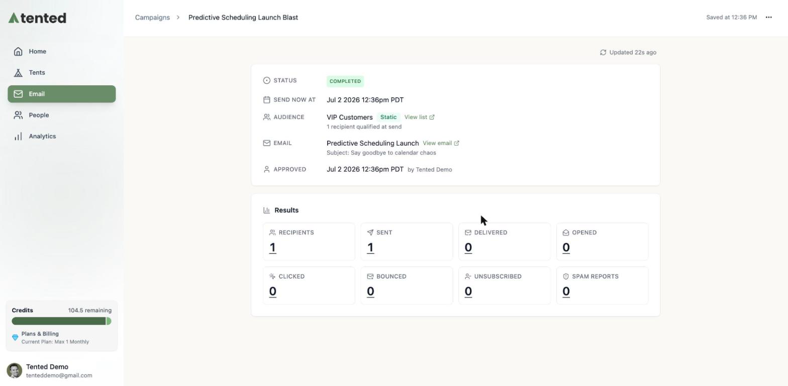

### Drill into any metric

Every number on the dashboard is clickable. Click a metric — say **Delivered** or **Bounced** — to open the **Activity** view: the exact contacts in that bucket, with timestamps (delivered at, opened at, and so on). A left-hand rail lets you jump between buckets, and there's a search box to find a specific person.

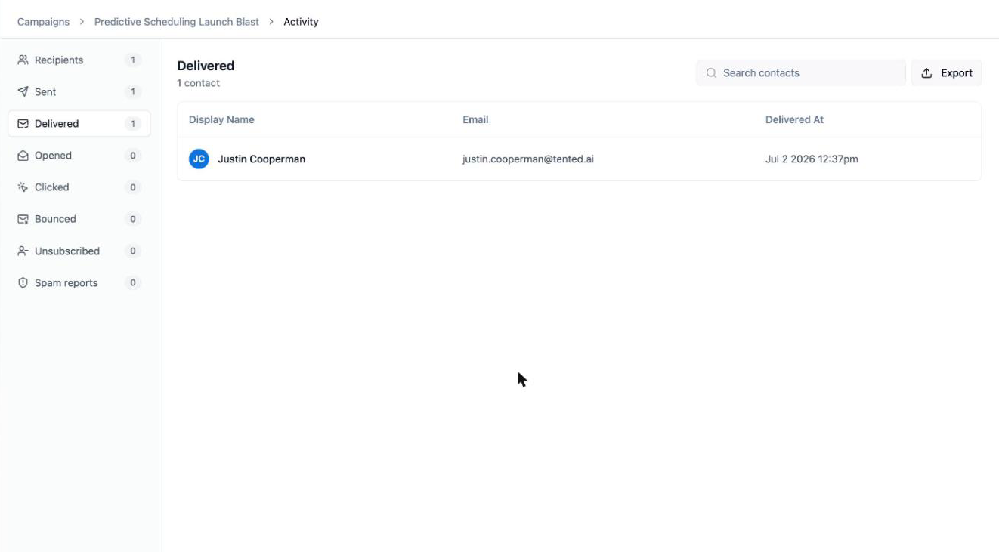

Click **Export** to download the contacts in the current bucket as a CSV — handy for pulling your bounced addresses for cleanup, or your openers for a follow-up.

All your blasts (and flows) live together on the **Campaigns** tab, with status and headline results at a glance.

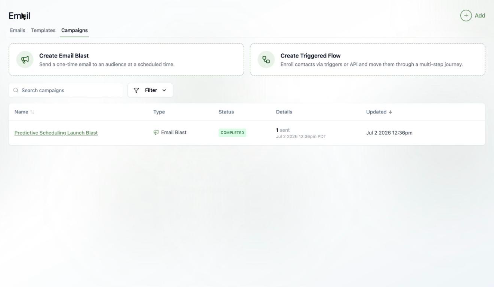

## Clone a blast

Running the same newsletter every month? Clone last month's instead of rebuilding it: hover a blast in the Campaigns list and click the **Clone** icon, or use the **⋯ menu > Clone campaign** inside the blast.

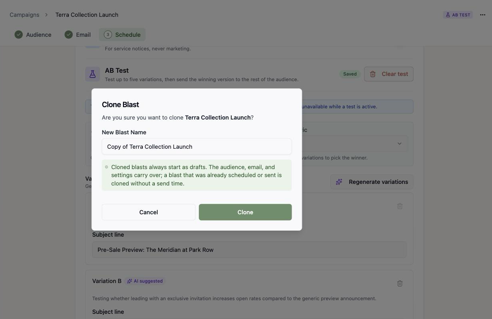

Cloned blasts **always start as drafts** — the audience, email, and settings carry over, but a blast that was already scheduled or sent is cloned *without* a send time, so nothing fires until you schedule it. Cloning works from any state, including completed and archived blasts, and drops you straight into the new draft.

## Archive a campaign

Campaigns that have actually run aren't deleted — they're **archived**, so their send history stays intact. Hover a completed (or failed) blast in the Campaigns list and click the **Archive Campaign** icon, or use **⋯ menu > Archive campaign** on the campaign's page.

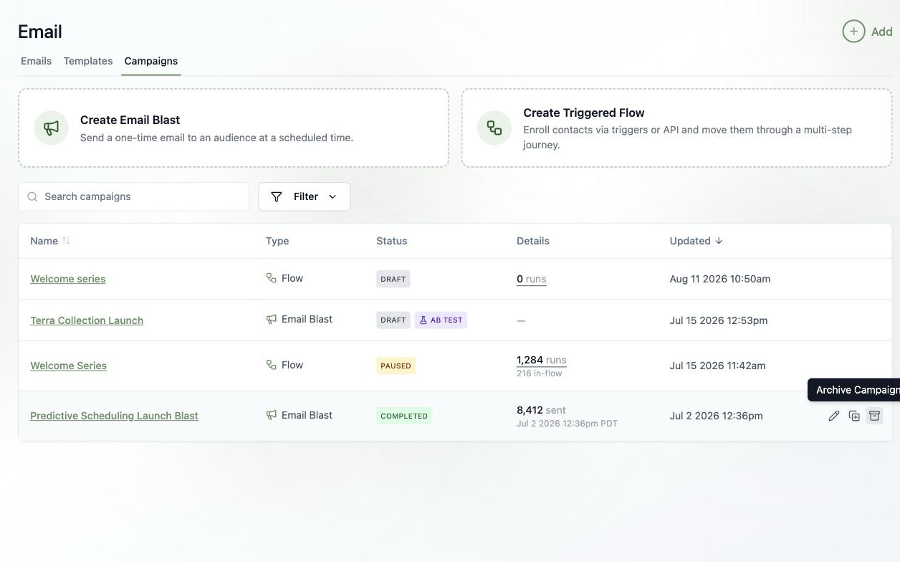

Confirm, and the campaign moves out of your campaigns list — its results are preserved and it stays reachable forever:

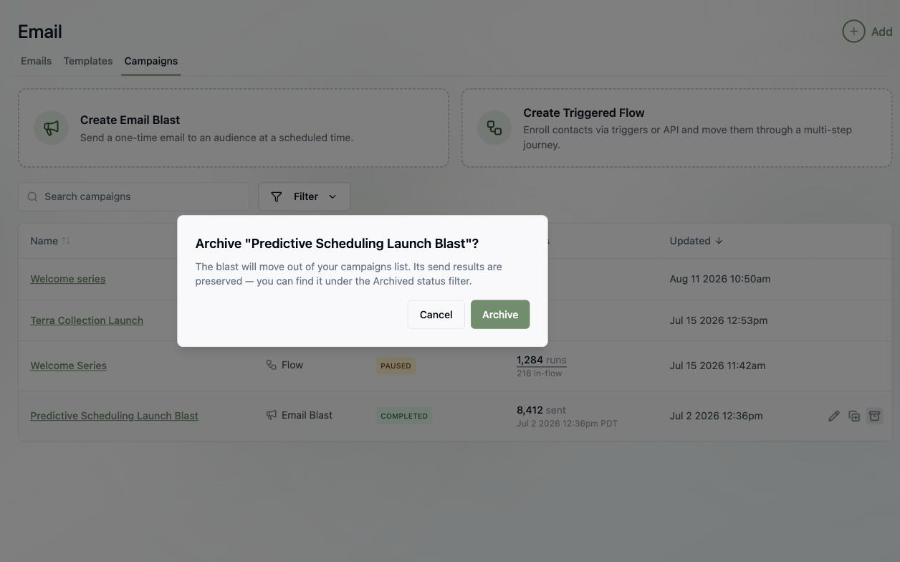

To find archived campaigns, open **Filter**, pick a **Type** first, then choose **Archived** under Status:

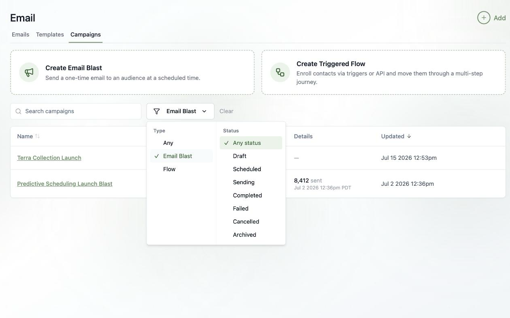

A few rules worth knowing:

- **Drafts delete, ran-campaigns archive.** A blast that never sent (and a flow nobody entered) offers **Delete** instead — there's no history to preserve.
- **In-flight blasts offer neither.** A scheduled blast must be unscheduled first, and a blast that's mid-send can't be touched.
- **Flows archive too** — a [triggered flow](/email/triggered-flows) that has run contacts is archived once it's paused. Active flows must be paused first.
- **Archiving is permanent.** There's no unarchive — but everything about the campaign stays viewable under the Archived filter, and you can [clone](#clone-a-blast) an archived blast into a fresh draft any time.

## What's next?

<Card
  title="Next: Triggered Flows"
  icon="arrow-right"
  href="/email/triggered-flows"
>
  Go beyond one-time sends — build multi-step journeys that run automatically.
</Card>
