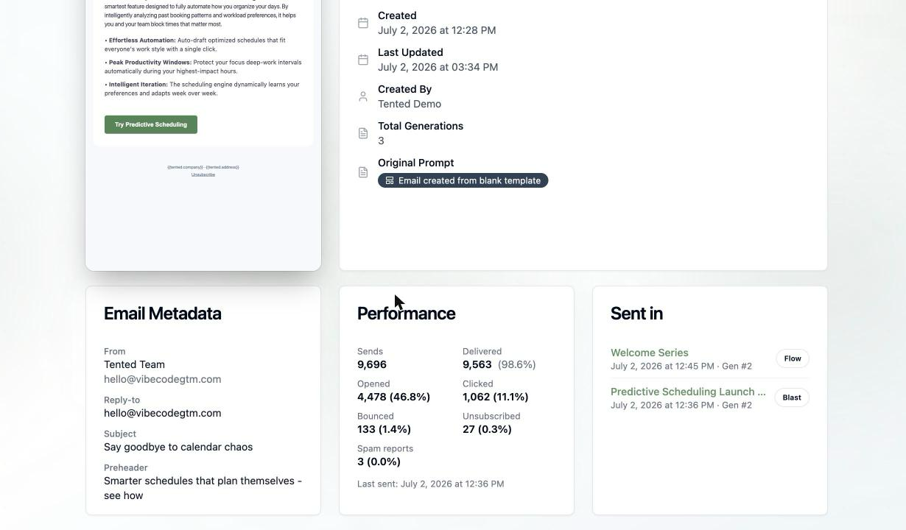

## One email, every send

Campaign dashboards tell you how a *send* went. The email's own detail page answers a different question: **how has this email performed across everything it's ever been sent in?**

Open **Email > Emails** and click an email's name (not Edit) to land on its detail page. Alongside the preview and metadata you'll find two cards built from the email's full sending history:

## The Performance card

Lifetime totals for this email, rolled up across every blast and triggered-flow send:

| Metric | Rate shown as a percent of |
|---|---|
| **Sends** | — |
| **Delivered** | Sends |
| **Opened** | Delivered |
| **Clicked** | Delivered |
| **Bounced** | Sends |
| **Unsubscribed** | Delivered |
| **Spam reports** | Delivered |

The same denominators apply everywhere results appear in Tented: delivery outcomes are measured against what was sent, engagement against what actually reached an inbox. A **Last sent** line at the bottom tells you how fresh the numbers are; an email that's never gone out shows *"This email hasn't been sent yet."*

<Note>
  [Sample emails](/email/sample-emails) don't count here — their opens and clicks are deliberately excluded from results, so testing your own email doesn't pollute the stats.
</Note>

## The Sent in card

**Sent in** lists every campaign that delivered this email, newest first. Each row shows:

- The campaign name, linking straight to its results
- A **Blast** or **Flow** badge
- The send date and **Gen #N** — which approved generation of the email actually went out

That generation stamp matters: emails send their **approved version**, so if you've iterated since a campaign ran, Gen #2 in the list and Gen #5 in your editor are different emails. The [generation history](/email/creating-emails#generation-history) in the editor lets you view any past version.

## Drilling into a specific send

For per-campaign numbers and per-contact activity, click through to the campaign itself:

- **Blasts** open a [results dashboard](/email/email-blasts#watch-the-results-roll-in) where every metric is clickable — see exactly who opened, clicked, bounced, or unsubscribed, with timestamps, and export any bucket as a CSV.
- **Flows** show per-step stats on their [Overview tab](/email/triggered-flows#track-performance), plus a per-contact run history.

## What's next?

<Card
  title="Next: A/B Testing"
  icon="arrow-right"
  href="/email/ab-testing"
>
  Stop guessing — test up to five variations and send the winner automatically.
</Card>
