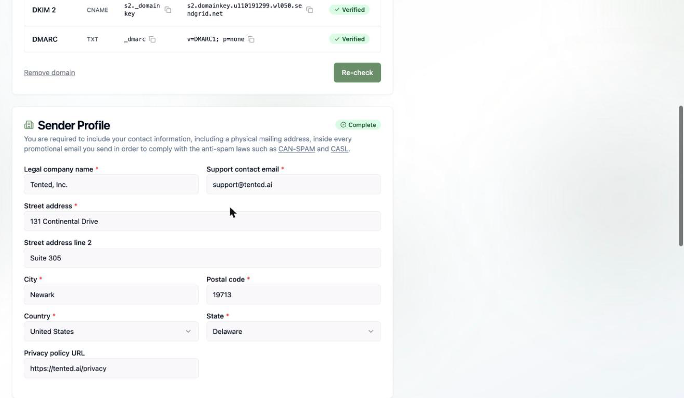
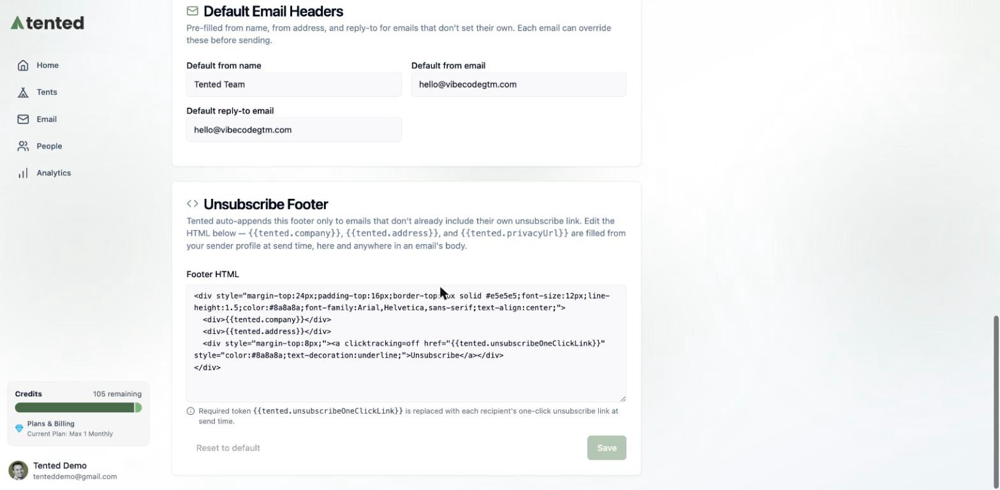

## Before you send

Tented sends marketing email from **your own domain** — which means better deliverability and emails that are unmistakably yours. Before your first campaign, there's a one-time setup: verify a sending domain and fill out your sender profile. Sending is blocked until your domain is verified, so this is step one.

Everything lives in one place: click your profile in the bottom-left corner, choose **Workspace Settings**, then click **Manage Email** (or go straight to **Settings > Email**).

## 1. Verify your sending domain

Add a domain you own, and Tented generates the DNS records that let mailbox providers verify your email is legit — SPF, DKIM, and DMARC.

<Note>
  Sending domains are available on **Pro and Max** plans. On the Free plan you'll see an **Upgrade to Unlock** prompt in place of the domain form — see [Upgrading Your Plan](/billing-subscriptions/upgrading-plan).
</Note>

1. Enter your domain (for example, `yourcompany.com`).
2. Copy each generated record — a few CNAMEs and a TXT — into your DNS provider (GoDaddy, Cloudflare, Namecheap, etc.).
3. Click **Re-check**. DNS changes can take a little while to propagate, so don't panic if it's not instant.

Once every record shows **Verified**, you can send from any address on that domain — `hello@yourcompany.com`, `news@yourcompany.com`, whatever fits.

<Warning>
  Sending is blocked until your domain is fully verified. If a record stays unverified, double-check for typos and make sure your DNS provider isn't proxying the CNAME records.
</Warning>

## 2. Complete your sender profile

Anti-spam laws like CAN-SPAM and CASL require every promotional email to include your contact information — including a physical mailing address. Your sender profile is where Tented gets it:

- **Legal company name** and **support contact email**
- **Street address**, city, postal code, state, and country
- **Privacy policy URL** (optional, but a nice touch)

These details are automatically merged into your email footers at send time, so you're compliant without thinking about it.

## 3. Set your default email headers

Save yourself some typing: set a default **from name**, **from address**, and **reply-to**. Every new email starts pre-filled with these, and you can always override them on a specific email before sending.

## 4. Review the unsubscribe footer

Marketing emails must include a working unsubscribe link. Tented auto-appends a footer to any email that doesn't already include its own — and you can customize its HTML here.

The footer supports tokens that are filled from your sender profile at send time:

- `{{tented.company}}` — your legal company name
- `{{tented.address}}` — your mailing address
- `{{tented.privacyUrl}}` — your privacy policy URL
- `{{tented.unsubscribeOneClickLink}}` — **required** — each recipient's personal one-click unsubscribe link

<Note>
  When a contact unsubscribes, Tented flips their **Unsubscribed** field and quietly excludes them from future marketing sends. You don't need to manage suppression lists yourself.
</Note>

## Deliverability & suppression

A few behaviors worth knowing so your sends stay healthy:

- **Unsubscribes are honored automatically.** An unsubscribed contact is excluded from every future marketing blast and flow — you'll see them counted as **blocked** when you pick an audience. There's no re-subscribe flow, so if someone opts out, it sticks (they can be re-added only with fresh consent on your side).
- **Bounces and spam reports are tracked.** They show up in your [blast](/email/email-blasts) and flow results so you can spot problem addresses, and you can export the bounced bucket to clean your list.
- **One-click unsubscribe** is built in via the `List-Unsubscribe` header, so Gmail and Apple Mail show their native unsubscribe button — which protects your sender reputation.
- **Operational sends bypass suppression** by design (password resets, security notices). Keep that toggle off for anything promotional.

## You're ready to send 🎉

<Card
  title="Next: Creating Emails with AI"
  icon="arrow-right"
  href="/email/creating-emails"
>
  Describe the email you want and watch Tented write and design it for you.
</Card>
