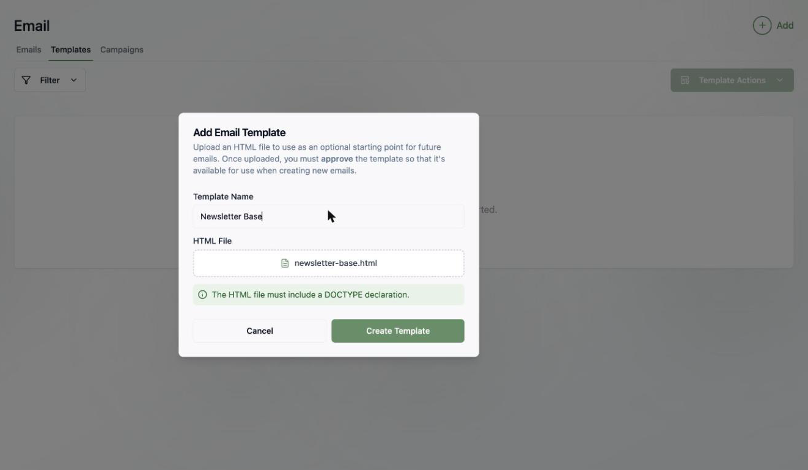
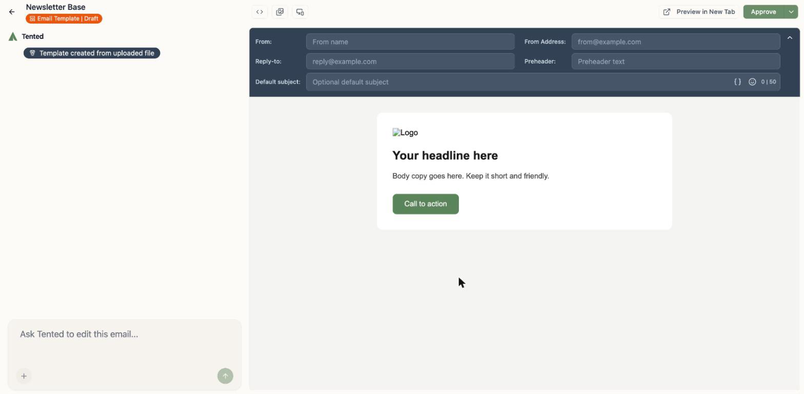
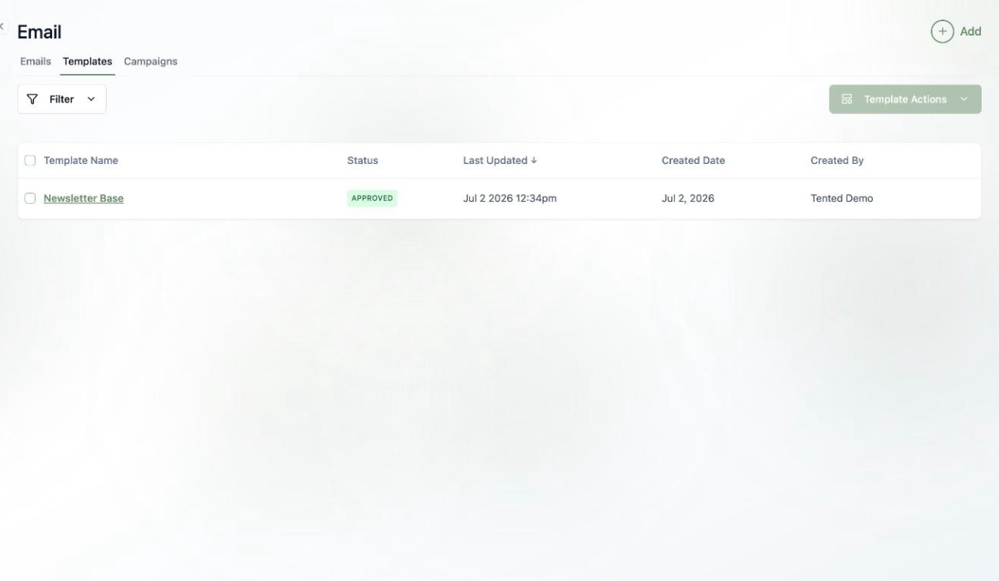

## Why templates?

If your team sends a lot of email, you probably don't want every message starting from a blank canvas. **Email templates** let you upload a designed HTML shell once — your header, footer, colors, and layout — and use it as the starting point whenever anyone creates a new email.

Find them under **Email > Templates**, alongside the built-in [Tented example template collection](/email/creating-emails#tented-example-templates), which automatically renders every starter design in your branding.

## Adding a template

1. Click **Add > Add Email Template**.
2. Name your template.
3. Upload your HTML file.

<Note>
  The HTML file must include a `<!DOCTYPE>` declaration. If you don't have a designed template handy, create an email you love in the [email editor](/email/creating-emails) first, grab its HTML from code mode, and upload that.
</Note>

## Editing and approving

Your template opens in the same AI editor used for emails — chat to refine it, edit the code directly, and set optional **default headers** (from name, from address, reply-to, and a default subject) that flow into every email created from it.

Templates follow the same **approval** model as emails: click **Approve** when it's ready, and only approved templates show up in the template picker when creating a new email.

<Tip>
  Want to see the template in a real inbox before your team builds on it? Click **Send Sample** in the template editor's top bar — see [Sending Sample Emails](/email/sample-emails).
</Tip>

## Using a template

When you create a new email (**Add > Create Email**), the **Choose Email Template** gallery opens. Your approved templates appear in its **My Templates** section, next to [Tented's example templates](/email/creating-emails#tented-example-templates). Pick one, name the email, and click **Create Email**. The new email inherits the template's layout and default headers. You customize from there with chat, and the template stays untouched.

## What's next?

<Card
  title="Next: Email Blasts"
  icon="arrow-right"
  href="/email/email-blasts"
>
  Send a one-time email to a list — scheduled, or right now.
</Card>
