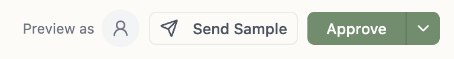
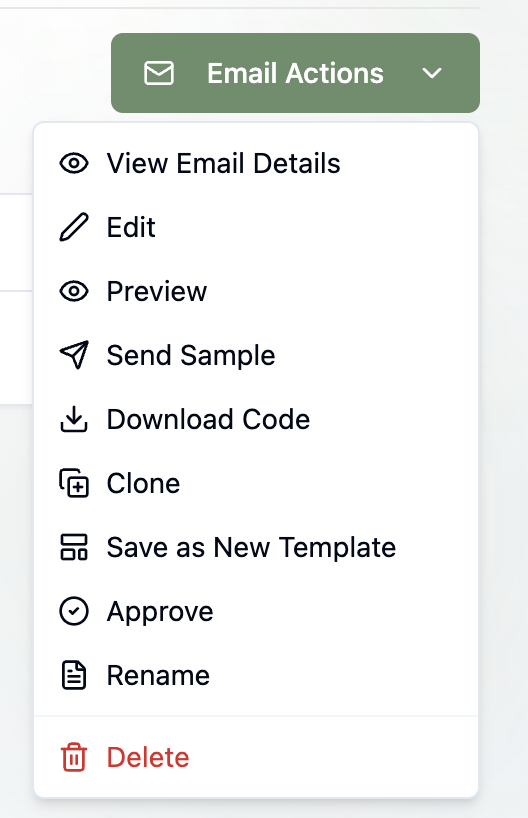
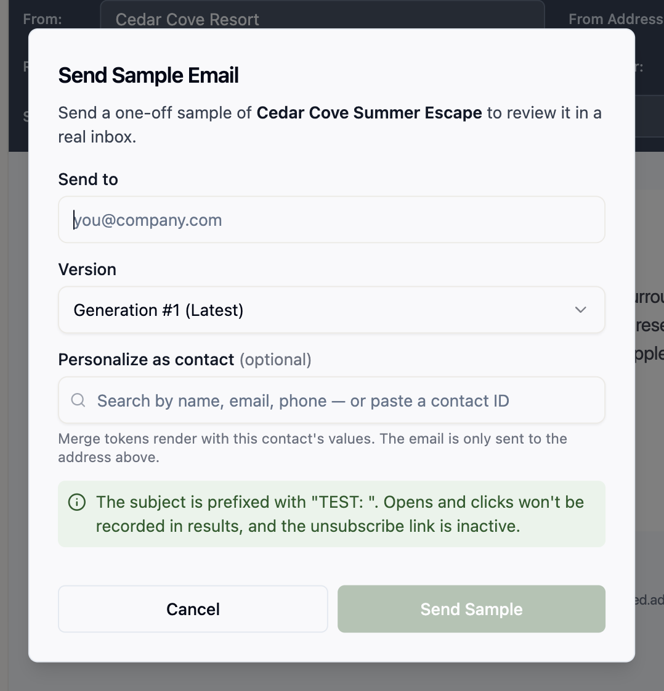

## Why send a sample?

The editor's preview is faithful, but nothing beats the real thing: your actual mail client, your actual dark mode, your actual spam filter. **Send Sample** delivers one copy of an email — or an [email template](/email/email-templates) — to any address you choose, so you can look it over in a real inbox before a [blast](/email/email-blasts) or [flow](/email/triggered-flows) sends it to people who matter.

## Where to find it

The same dialog is available wherever you work with emails and templates.

For emails:

- **Email editor** — the **Send Sample** button in the top bar, next to **Approve**.
- **Emails list** — select an email, then choose **Send Sample** from the **Email Actions** dropdown.
- **Email details page** — the **Email Actions** dropdown, top-right.

For templates:

- **Template editor** — the **Send Sample** button in the top bar.
- **Templates list** — select a template, then choose **Send Sample** from the **Template Actions** dropdown.

<Tip>
  Reviewing an old version in **Generation History**? The history toolbar has its own **Send Sample** — it opens the dialog with that generation pre-selected. This works in both the email and template editors.
</Tip>

## Send a sample

1. **Send to** — enter any email address. It doesn't need to belong to a contact.
2. **Version** — defaults to the latest generation. Pick any past generation from the dropdown; your approved version is marked **Approved**.
3. **Personalize as contact** *(optional)* — search by name, email, or phone — or paste a contact ID — and [personalization tokens](/email/personalization) render with that contact's real values. The sample still goes only to the **Send to** address, never to the contact.

Without a contact, tokens render the way they would for a contact with no data: defaults like `{{contact.firstName:default=there}}` kick in, and everything else renders blank.

Click **Send Sample**, and go check the inbox.

## Drafts welcome

Samples work for **drafts and approved emails** alike — no need to approve first. Two things to know:

- If a draft doesn't have a from address yet, the sample falls back to your workspace's [default email headers](/email/email-setup).
- A **verified sending domain** is still required. Samples travel the same delivery pipeline as real sends — that's what makes them a meaningful test — so an unverified domain blocks them too. See [Setting Up Email](/email/email-setup).

## Sampling a template

Templates don't send to audiences, but a sample is a great way to check how one renders in a real inbox before your team builds emails on top of it. Since a template only carries optional [default headers](/email/email-templates), the sample resolves its subject and sender in two steps:

1. The template's own defaults — default subject, from name, from address, and reply-to — are used wherever you've set them.
2. Your workspace's [default email headers](/email/email-setup) fill in anything left blank.

If neither the template nor your workspace defaults provide a from address, the send is blocked until you add one. Everything else — [personalization tokens](/email/personalization), sender-profile tokens, the version picker — works exactly as it does for email samples.

## How a sample differs from a real send

A sample is built to match a real send as closely as possible — same footer, same link handling, same rendering. The differences:

- **The subject is prefixed with "TEST: "** so nobody mistakes it for the real thing.
- **Opens and clicks are never recorded.** Links are still rewritten through your click-tracking domain — so you can verify they work end to end — but nothing ever shows up in a results dashboard.
- **The unsubscribe link is inert.** It's present and clickable, but leads to a page explaining that unsubscribe is not supported for sample emails. Clicking it never unsubscribes anyone.
- **The view-as-webpage link is inert too.** If the email uses [`{{tented.viewAsWebpageLink}}`](/email/personalization#the-view-as-webpage-link), the sample's link opens a page explaining that web copies aren't created for sample emails — in a real send it opens an exact hosted copy of the delivered email.
- **Nothing is counted.** Samples don't count toward your send usage, and they never appear in campaign metrics.

## What's next?

<Card
  title="Ready for a real audience?"
  icon="bullhorn"
  href="/email/email-blasts"
>
  Pick a list, pick a time, and launch your first email blast.
</Card>
