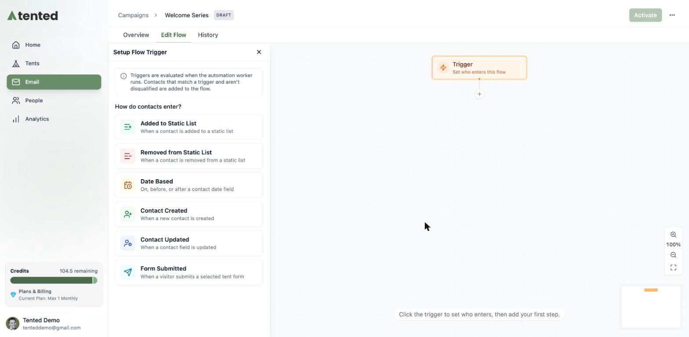
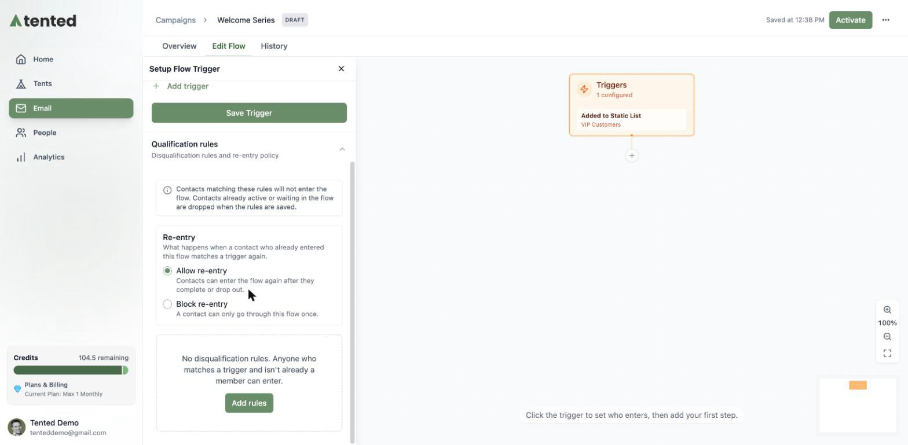
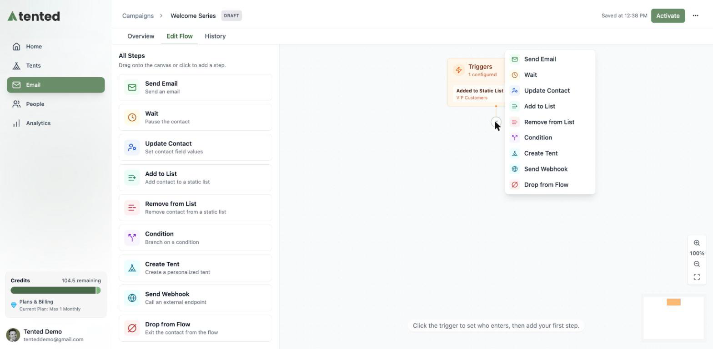
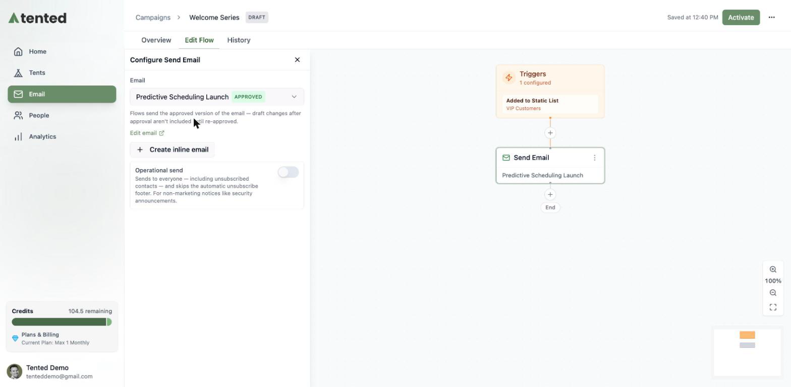
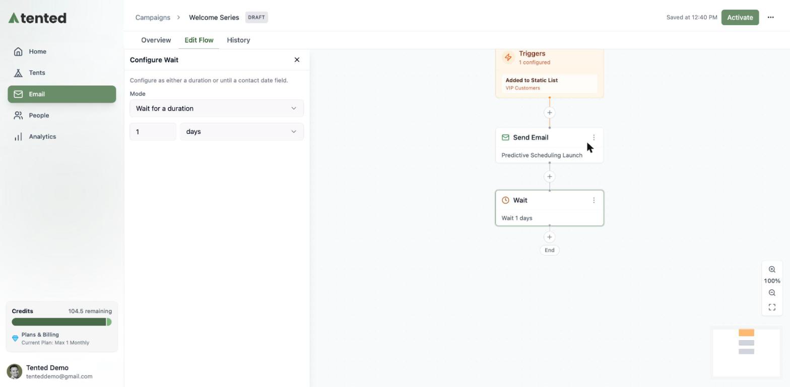
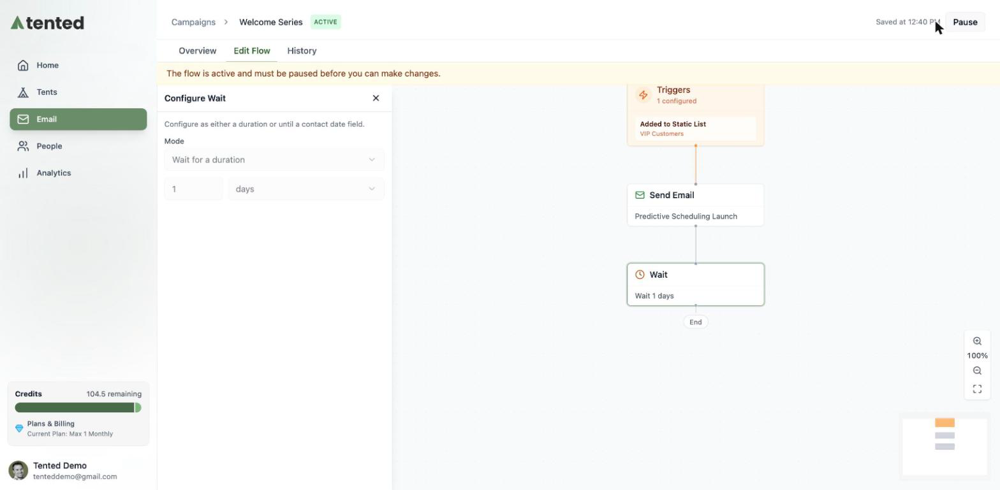
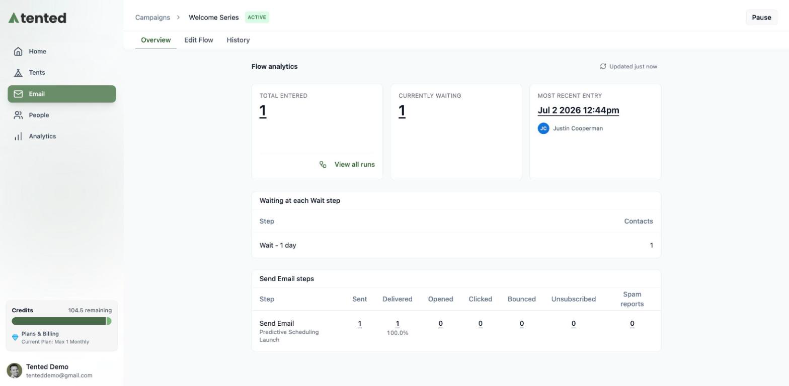

## What's a triggered flow?

A **triggered flow** is marketing automation on autopilot: contacts enter when they match a trigger, then move through the steps you've laid out — sending emails, waiting, branching, updating fields — until they reach the end. Welcome series, onboarding sequences, re-engagement campaigns: this is where they live.

Head to **Email > Campaigns** and click **Create Triggered Flow**. Name it, and you land on the visual flow builder with three tabs: **Overview** (analytics), **Edit Flow** (the canvas), and **History**.

## Set the trigger

Click the **Trigger** node to choose how contacts enter:

- **Added to Static List** — the classic welcome-series trigger
- **Removed from Static List**
- **Date Based** — on, before, or after a contact date field
- **Contact Created** — the moment someone new hits your database
- **Contact Updated** — when a contact field changes
- **Form Submitted** — when a visitor submits a form on one of your tents 🏕️

You can stack multiple triggers on one flow with **+ Add trigger**.

### Qualification rules

Below the triggers you'll find **Qualification rules** — the fine print of who gets in:

- **Re-entry policy**: allow contacts to go through the flow again after they finish (or block them to once ever).
- **Disqualification rules**: audience rules that keep matching contacts *out* — for example, exclude anyone whose lifecycle stage is already "Customer" from a lead-nurture flow.

## Build the steps

Click **+** anywhere on the canvas to add a step. You've got a full automation toolkit:

| Step | What it does |
|---|---|
| **Send Email** | Send an approved (or inline) email |
| **Wait** | Pause for a duration, or until a contact date field |
| **Update Contact** | Set contact field values |
| **Add to List / Remove from List** | Manage static list membership |
| **Condition** | Branch the journey based on audience rules |
| **Create Tent** | Generate a personalized landing page for the contact |
| **Send Webhook** | Call an external endpoint |
| **Drop from Flow** | Exit the contact early |

For a Send Email step, pick any **approved** email — the same approval rule as blasts — or compose one inline. There's also an operational-send toggle for non-marketing notices.

Wait steps keep journeys humane — space your sends out instead of firing everything at once:

## Activate it

Click **Activate** and your flow goes live: from now on, contacts matching a trigger are enrolled automatically and start moving through the steps.

<Note>
  Active flows are locked for editing — hit **Pause** first if you need to make changes, then reactivate. Triggers fire on *new* events after activation; contacts already on a list won't enter an "Added to Static List" flow retroactively.
</Note>

## Track performance

The **Overview** tab shows your flow's vitals: total contacts entered, how many are currently waiting, the most recent entry, who's parked at each Wait step, and per-email stats (sent, delivered, opened, clicked, bounced, unsubscribed, spam). **View all runs** gives you the contact-by-contact detail.

## Flow or blast?

Reach for a **blast** when it's one message, one audience, one moment — a launch, a newsletter issue. Reach for a **flow** when the sending should happen *by itself* whenever someone qualifies — welcomes, nurtures, onboarding. Most teams end up with both.
