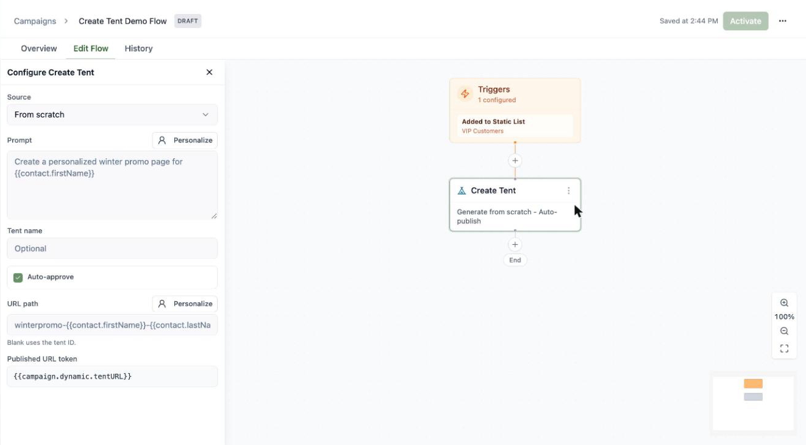
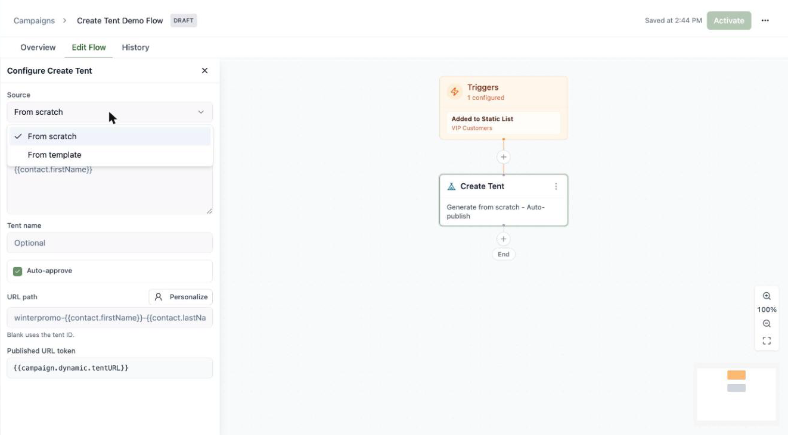
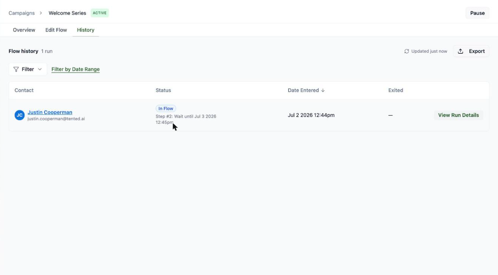
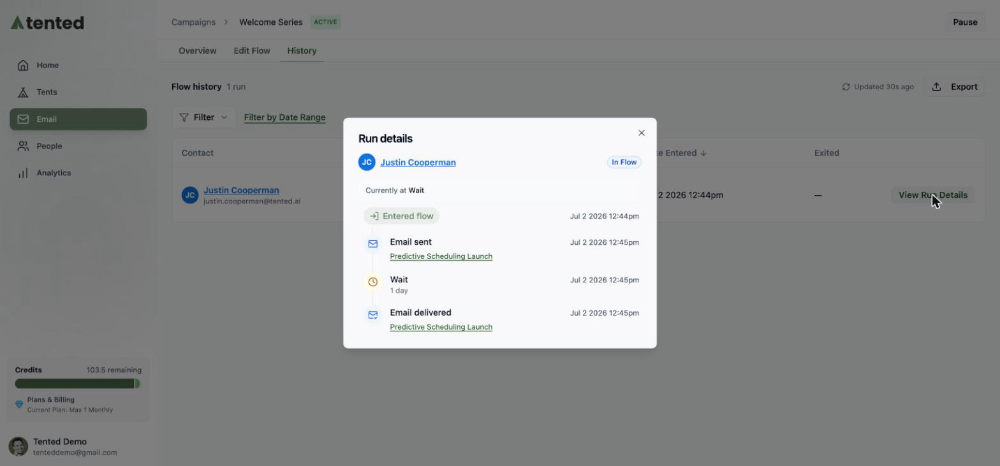

## What's a triggered flow?

A **triggered flow** is marketing automation on autopilot: contacts enter when they match a trigger, then move through the steps you've laid out — sending emails, waiting, branching, updating fields — until they reach the end. Welcome series, onboarding sequences, re-engagement campaigns: this is where they live.

Head to **Email > Campaigns** and click **Create Triggered Flow**. Name it, and you land on the visual flow builder with three tabs: **Overview** (analytics), **Edit Flow** (the canvas), and **History**.

## Set the trigger

Click the **Trigger** node to choose how contacts enter:

- **Added to Static List** — the classic welcome-series trigger
- **Removed from Static List**
- **Date Based** — on, before, or after a contact date field
- **Contact Created** — the moment someone new hits your database
- **Contact Updated** — when a contact field changes
- **Form Submitted** — when a visitor submits a form on one of your tents 🏕️. Each answer is also handed to the run as a [`{{campaign.dynamic.*}}` token](/email/personalization#campaign-dynamic-tokens-flows-only), so later emails can echo what was submitted.
- **Tented API** — an external system enrolls the contact by [calling the public API](/api-reference/managing-triggered-flows#trigger-a-flow-api-trigger), optionally passing values that become `{{campaign.dynamic.*}}` tokens (a coupon code, an order number, …)

You can stack multiple triggers on one flow with **+ Add trigger**.

### Qualification rules

Below the triggers you'll find **Qualification rules** — the fine print of who gets in:

- **Re-entry policy**: allow contacts to go through the flow again after they finish (or block them to once ever).
- **Disqualification rules**: audience rules that keep matching contacts *out* — for example, exclude anyone whose lifecycle stage is already "Customer" from a lead-nurture flow.

## Build the steps

Click **+** anywhere on the canvas to add a step. You've got a full automation toolkit:

| Step | What it does |
|---|---|
| **Send Email** | Send an approved (or inline) email |
| **Wait** | Pause for a duration, or until a contact date field |
| **Update Contact** | Set contact field values |
| **Add to List / Remove from List** | Manage static list membership |
| **Condition** | Branch the journey based on audience rules |
| **Create Tent** | Generate a personalized landing page for the contact |
| **Send Webhook** | Call an external endpoint |
| **Drop from Flow** | Exit the contact early |

For a Send Email step, pick any **approved** email — the same approval rule as blasts — or compose one inline. There's also an operational-send toggle for non-marketing notices.

Wait steps keep journeys humane — space your sends out instead of firing everything at once:

### The Create Tent step

The **Create Tent** step generates a *personalized landing page for each contact* as they pass through the flow — a unique page per person, built from their contact data.

Configure it with:

- **Source** — **From scratch** (generate with AI from a prompt) or **From template** (copy an approved tent template, no generation credits).

  

- **Prompt** — what to generate. Click **Personalize** to drop in [contact tokens](/email/creating-emails#subject-lines-preheaders-and-personalization) like `{{contact.firstName}}`, so every contact gets a page tailored to them.
- **Tent name** and **URL path** — both optional and both personalizable; a blank URL path falls back to the tent ID.
- **Auto-approve** — publish the generated tent automatically, so it's live the moment it's created.

<Tip>
  **Use the new page's URL in a later email.** When **Auto-approve** is on, the step publishes the tent and stores its live URL in a token — shown in the panel as the **Published URL token**, `{{campaign.dynamic.tentURL}}`. Reference that token in any **Send Email** step *after* the Create Tent step, and each contact's email links to their own personalized page.

  A typical shape: **Create Tent** (auto-approve, prompt personalized with `{{contact.firstName}}`) → **Send Email** whose CTA links to `{{campaign.dynamic.tentURL}}`. If you have more than one Create Tent step, the second becomes `{{campaign.dynamic.tentURL2}}`, and so on.
</Tip>

## Activate it

Click **Activate** and your flow goes live: from now on, contacts matching a trigger are enrolled automatically and start moving through the steps.

<Note>
  Activating flows requires a **Pro or Max** plan. On the Free plan you can build, edit, and save flows — the canvas shows a reminder, and an **Upgrade to Unlock** gem appears in place of the Activate button. If a workspace downgrades to Free, its active flows are **paused automatically** (members stay put, and resume if you upgrade and reactivate). See [Upgrading Your Plan](/billing-subscriptions/upgrading-plan).
</Note>

<Note>
  Active flows are locked for editing — hit **Pause** first if you need to make changes, then reactivate. Pausing doesn't kick anyone out: contacts already in the flow simply wait, and pick up where they left off when you reactivate. Triggers fire on *new* events after activation (evaluated about once a minute); contacts already on a list won't enter an "Added to Static List" flow retroactively.
</Note>

## Track performance

The **Overview** tab shows your flow's vitals: total contacts entered, how many are currently waiting, the most recent entry, who's parked at each Wait step, and per-email stats (sent, delivered, opened, clicked, bounced, unsubscribed, spam).

### See every run

The **History** tab lists every contact who's been through the flow — their status (In Flow, Completed, Exited), when they entered, and when they left. Filter by status or date range, and click **Export** for a CSV.

Click **View Run Details** on any run to see that contact's exact path through the flow — a step-by-step timeline of what happened and when (entered flow, email sent, wait, email delivered), with the contact's current position highlighted.

## Flow or blast?

Reach for a **blast** when it's one message, one audience, one moment — a launch, a newsletter issue. Reach for a **flow** when the sending should happen *by itself* whenever someone qualifies — welcomes, nurtures, onboarding. Most teams end up with both.
