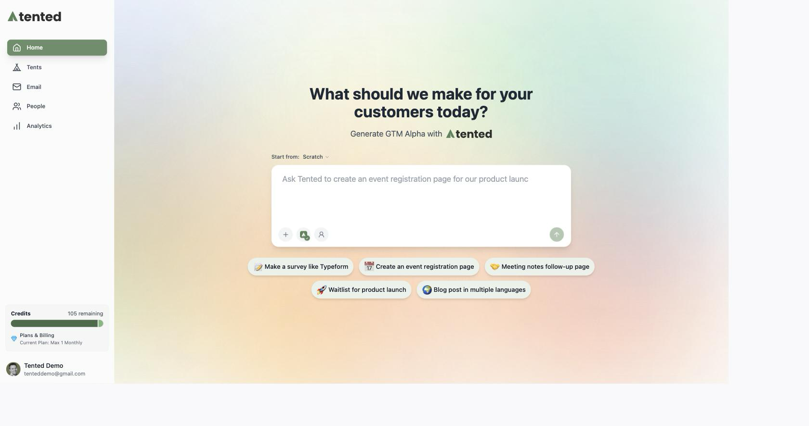
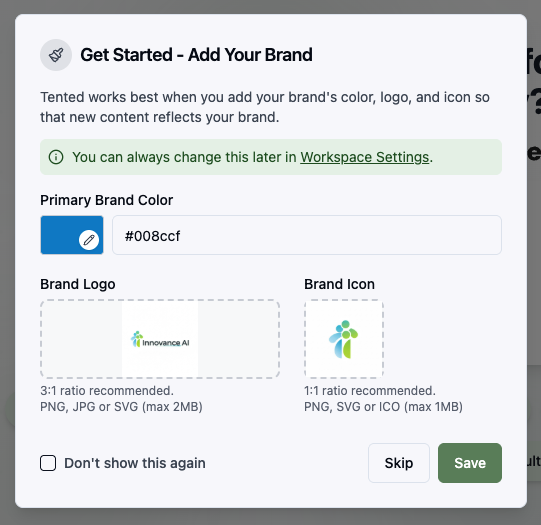
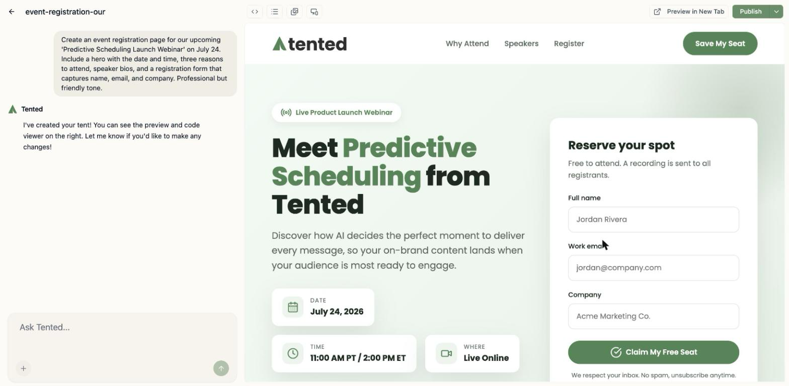
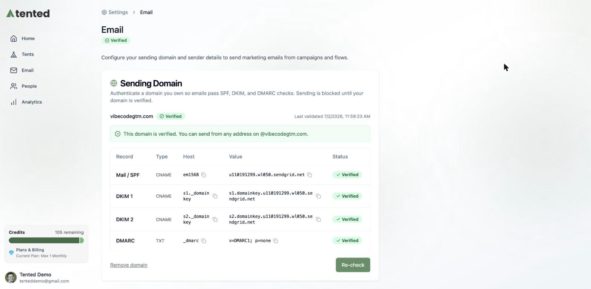
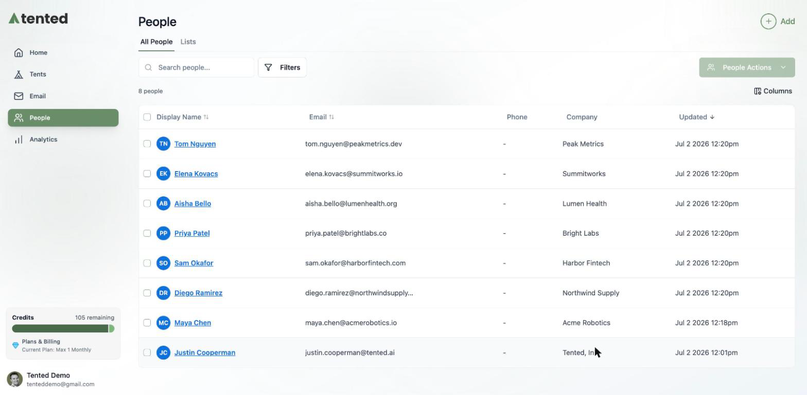

## Welcome to Tented 🏕️

Tented is an AI marketing automation platform: instant landing pages, AI-written marketing email, a built-in contact database, and automated campaigns — all driven by natural language. This guide gets you from a fresh account to a live page *and* your first email campaign.

## The lay of the land

Your sidebar has everything:

- **Home** — the prompt box. Describe something and Tented builds it.
- **Tents** — your AI-generated landing pages. (A **tent** is a complete, standalone page you can publish instantly.)
- **Email** — your emails, templates, and campaigns (blasts and triggered flows).
- **People** — your contact database and lists.
- **Analytics** — how it's all performing.

## Step 1: Add your branding

Upload your logo, icon, and brand color when prompted at signup (or anytime in [Workspace Settings](configuring-tented/workspace-settings)). Tented uses them everywhere — tents *and* emails — so everything comes out on-brand automatically.

## Step 2: Create your first tent

On the **Home** page, describe the landing page you want:

> "Generate a landing page for our new feature, 'Predictive Scheduling'. The page must be high-converting and focused solely on capturing early access signups. Include a hero section, features, and pricing."

Tented generates a complete, responsive page in about a minute. Refine it by chatting ("make the CTA bigger", "add testimonials"), then click **Publish** to put it live on the web.

For the full tour — editing, code mode, form submissions, publishing — see [Creating Tents](working-with-tents/creating-tents).

## Step 3: Set up email

One-time setup, about ten minutes, and most of that is waiting for DNS:

1. Go to **Settings > Email** and add your **sending domain**. Copy the generated DNS records into your DNS provider and verify.
2. Fill out your **sender profile** (company name and mailing address — required by anti-spam law).
3. Set your **default from name and address**.

Full walkthrough: [Setting Up Email](email/email-setup).

## Step 4: Add your people

Head to **People** and bring in your contacts — one at a time with **Quick Add**, or in bulk with **Import from CSV** (Tented auto-maps your columns). Then organize them into [lists](people/working-with-lists): hand-picked **static lists**, or rule-based **dynamic lists** that keep themselves current.

<Tip>
  Tents and People are connected: form submissions from your published tents can flow straight into your contact database.
</Tip>

## Step 5: Send your first campaign

1. Go to **Email > Add > Create Email**, and describe the email you want — Tented writes and designs it, personalization tokens and all.
2. Click **Approve** when you're happy (only approved emails can send).
3. Go to **Campaigns > Create Email Blast**: pick your list, pick your email, and **Send now** (or schedule it).

Then watch opens, clicks, and deliveries roll in on the blast's results dashboard.

## Step 6: Put it on autopilot

Once the manual version feels good, automate it: [triggered flows](email/triggered-flows) enroll contacts automatically — when they're added to a list, submit a tent form, or hit a date — and walk them through multi-step journeys with emails, waits, and branches.

## Where to next?

<Columns cols={2}>
  <Card
    title="Working with Tents"
    icon="tent"
    href="/working-with-tents/creating-tents"
  >
    Master the tent editor, publishing, and form submissions.
  </Card>
  <Card
    title="Managing Contacts"
    icon="users"
    href="/people/managing-contacts"
  >
    Everything about the People area, imports, and profiles.
  </Card>
  <Card
    title="Creating Emails"
    icon="envelope"
    href="/email/creating-emails"
  >
    The AI email editor, personalization, and approval.
  </Card>
  <Card
    title="Triggered Flows"
    icon="diagram-project"
    href="/email/triggered-flows"
  >
    Build automated journeys on the visual canvas.
  </Card>
</Columns>

<Note>
  **Need help?** Contact support at [support@tented.ai](mailto:support@tented.ai).
</Note>
