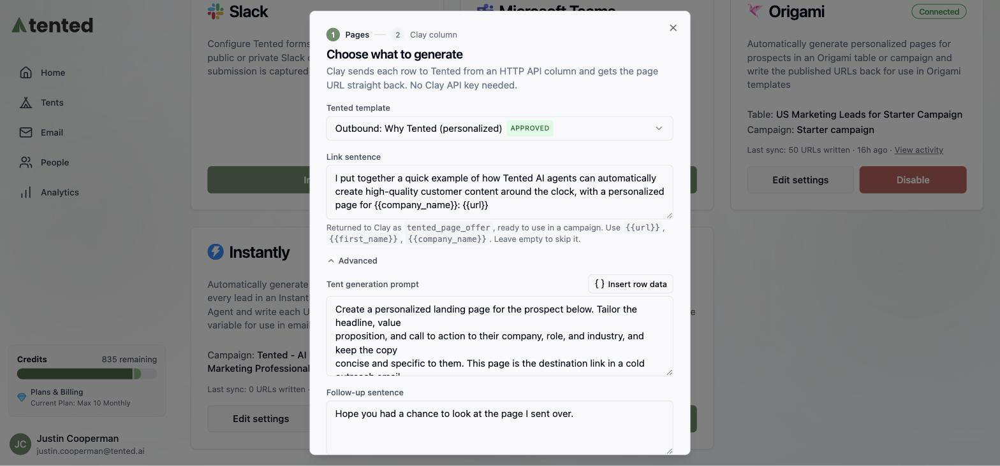
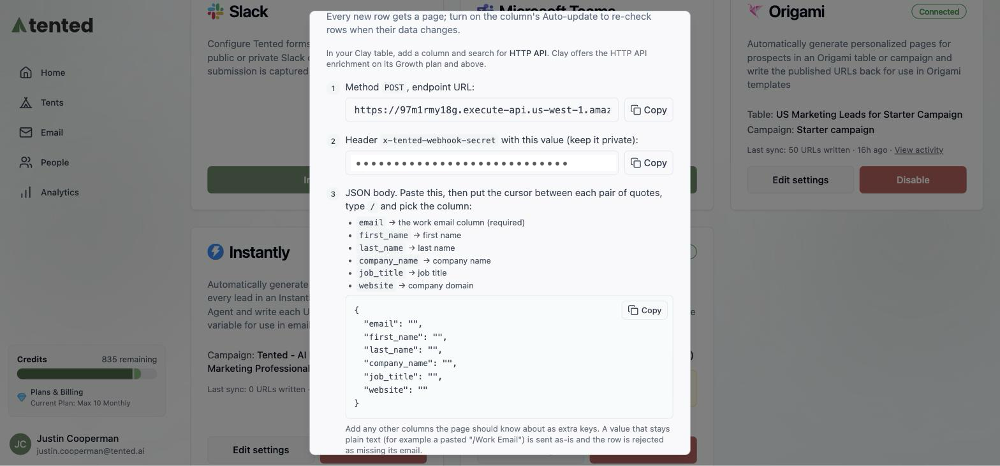

Tented connects to [Clay](https://clay.com) so every row a Clay table sends it gets a personalized landing page built from one of your approved templates. Clay does the sending: you add one **HTTP API** column to a table, and for each new row Clay calls Tented and stores the page URL it gets back in that row. Campaigns built on the table can then use the URL like any other column.

This guide covers connecting Tented, adding the column in Clay, using the link in a Clay campaign, and what to expect afterwards.

## How it works

Clay tables can't be read or updated from outside on most plans, so Tented never calls Clay. Instead Clay calls Tented:

1. A new row appears in your table (or a row's data changes, if the column auto-updates).
2. Clay's HTTP API column sends the row's fields to your Tented endpoint.
3. Tented answers immediately with the page's URL and a ready-made sentence that introduces it, then builds and publishes the page in the background. The page is live within a couple of minutes.

The URL in the response is final: the page is published at exactly that address, so a campaign can use it right away.

## Prerequisites

Before you begin, make sure you have:

- **Admin access** to your Tented workspace. Connecting, changing settings, and disconnecting are admin-only.
- **An approved tent template** in Tented. Pages are generated from a template's approved version. See [Templates](/working-with-tents/tent-templates) if you don't have one yet.
- **A Clay plan with the HTTP API enrichment.** Clay offers HTTP API on its Growth plan and above (it shows as an upgrade on the free plan).
- **AI credits**. Each generated page uses half a credit.

No Clay API key is needed.

## Step 1: Connect Clay in Tented

1. In Tented, open **Settings → Integrations**.
2. On the **Clay** tile, select **Connect**.


3. Pick the **Tented template** each page starts from and, if you like, edit the **Link sentence**, the sentence Tented returns to Clay with the URL filled in (for example `I put together a page for you here: {{url}}`). You can use `{{url}}`, `{{first_name}}`, `{{company_name}}`, `{{job_title}}`, and `{{summary}}`.


4. Under **Advanced** you can also change the **tent generation prompt** (`{{clay.rowData}}` is replaced with the row's fields) and the **Follow-up sentence** returned for later steps.



5. Select **Connect**. Tented shows the column settings for Clay: the endpoint URL, the header secret, the JSON body, and the response fields, each with a copy button.



<Note>
Each page uses half an AI credit. If your workspace runs out of credits, the integration pauses and resumes on its own once credits are available again.
</Note>

## Step 2: Add the Tented column in Clay

In the Clay table you want to enrich, select **Add column → Add enrichment**, search for **HTTP API**, and pick the **HTTP API** enrichment by Clay.


The panel opens on a **Generate** tab that asks an AI to set the call up; switch to the **Configure** tab instead and fill in the setup inputs with the values Tented shows (each has a copy button):

| Setting | Value |
|---|---|
| Method | `POST` |
| Endpoint | The per-workspace URL from the Tented dialog |
| Body | The JSON below, with each value pointed at a column |
| Headers | One key and value pair: `x-tented-webhook-secret` with the secret from the Tented dialog |
| Response values to return | The five fields listed below |

```json
{
  "email": "",
  "first_name": "",
  "last_name": "",
  "company_name": "",
  "job_title": "",
  "website": ""
}
```

Paste the body, then put the cursor between each pair of quotes, type `/` and pick the column from the menu Clay opens (for example your Work Email column for `email`). Each pick becomes a column chip inside the quotes. A value that stays plain text is sent as text, so a pasted `"/Work Email"` would not work.

<Tip>
For a waterfall column such as Clay's **Work Email**, the menu first shows the column as a group with its providers inside. Open the group and pick the plain **Work Email** entry at the bottom of the list, not one of the providers.
</Tip>


`email` is required; it is how Tented recognizes a row it has already seen. Add any other columns the page should know about (industry, LinkedIn URL, notes) as extra keys: everything in the body is given to the page generator.

Under **Headers**, select **Add a new Key and Value pair** and enter `x-tented-webhook-secret` as the key and the secret from Tented as the value. Under **Response values to return**, add the response fields you want as columns, one per tag:


| Field | Contents |
|---|---|
| `tented_url` | The row's personalized page URL, returned immediately |
| `tented_page_offer` | The link sentence with the URL filled in |
| `tented_page_reference` | The follow-up sentence |
| `tented_page_summary` | A one-line description of the page, filled in once the page is live |
| `status` | `generating` until the page is live, then `ready`; `failed` if the page could not be built |

Under **Run settings**, leave **Auto-run** on so new rows and rows whose input columns change are sent to Tented; Tented answers with the same URL for a row it has seen (and, once the page exists, the summary and `ready`).

To finish, open the arrow next to **Save** and choose **Save and don't run**, so you can try one row before the whole table runs.


Hover the new column's cell on one row and select its run button. Within a few seconds the cell shows **Status Code: 200**; select it to see what Tented returned: the page URL, the link sentence with the URL filled in, and `generating` as the status.


The Clay tile in Tented stops saying it is waiting for the first row and shows the sync. A minute or two later the page is live; run the same cell again and the status is `ready`, with the page summary filled in.


When you are happy with the result, run the column on the rest of the table (the column header's **Run column** menu, or **Save and run** next time you edit it).

<Tip>
If you close the dialog before adding the column, the Clay tile keeps a **Show the column settings** link that reopens it, including the header secret.
</Tip>

## Using the link in a Clay campaign

Clay campaigns read the table at send time, and every synced column is available as a variable. In the campaign editor, insert the `tented_page_offer` column as a **clean variable with a fallback** of an empty value: rows whose page exists get the full sentence with the link, and a row without one gets nothing rather than a broken link. Use `tented_url` directly only where you are sure every lead has a page.

Because Tented returns the URL before the page is generated, a campaign that syncs a row right after the column runs still has the right link; the page is live long before Clay's first send.

## What happens after connecting

The Clay tile shows the template, the last sync, and a **View activity** link.


**Page URLs are readable.** Each page publishes at a path built from the row's name and company, for example `https://your-domain/for-bryan-from-acme-co`. When a row has no company, the path uses the first and last name; without a first name, a short random path is used instead.

**Activity** lists each run with the pages published, rows skipped, and credits used.


**Generated tents** appear in your Tents list with "Clay Integration" as the creator. Use **Filter → Hide integration-created** to keep them out of the way while you work on other tents.


Each page is built from your template and the row's fields, so the prospect sees their own name and company:


**Re-runs never cost twice.** Clay calling again for a row that already has a page, whether from Auto-update or a manual re-run, returns the existing URL. Changing a row's data does not regenerate its page. The one exception is a row whose page could not be built: re-running that row starts a fresh attempt.

**Every row is answered once.** Two calls for the same email arriving at the same time get the same URL.

## Changing settings

Select **Edit settings** on the tile to change the template, prompt, or sentences. Changes apply to rows that arrive after the save; existing pages are left alone.

## Disconnecting

Select **Disable** on the Clay tile. Tented stops answering the column (Clay shows an error on new rows until you remove the column), releases page paths that were promised to rows whose pages never got built, and keeps every published page and every URL already stored in your tables.

Tented also remembers which rows already have a page. If you connect Clay again later and the column runs on those rows, they get their existing URL back rather than a second page.

## Troubleshooting

| What you see | What it means | What to do |
|---|---|---|
| Cell error **The row needs an email address** | The body has no `email` key, the mapped column is empty for that row, or the value is plain text instead of a column reference. | In the column's body, put the cursor inside the quotes after `"email":`, type `/` and pick the email column. |
| Cell error **Body must be a JSON object** | The body is not a JSON object (for example a bare string or a list). | Paste the JSON body from the Tented dialog again. |
| Cell error **401** | The header secret is missing or wrong. | Open **Show the column settings** in Tented and paste the header again. |
| Cell error **410** | The integration was disconnected in Tented. | Connect again and update the column with the new URL and secret. Rows that already have a page keep their URL. |
| **Paused: out of AI credits** | The workspace has no credits left for new pages. | Add credits. The integration resumes on its own. |
| **Paused: published-tent limit reached** | Your plan's limit on published tents is reached. | Unpublish tents or upgrade your plan. |
| `status` stays `generating` | The page is still being built, or its generation failed. | Wait a couple of minutes and re-run the row: a row whose page failed starts a fresh attempt on its next run. **Activity** lists the skipped row and its reason. |
| `status` is `failed` | Tented gave up on this row's page and the row has not been re-run since. | Check **Activity** for the reason, fix it (for example add credits), then re-run the row. |
