Tented connects to [Clay](https://clay.com) so every row a Clay table sends it gets a personalized landing page built from one of your approved templates. Clay does the sending: you add one **HTTP API** column to a table, and for each new row Clay calls Tented and stores the page URL it gets back in that row. Campaigns built on the table can then use the URL like any other column.

This guide covers connecting Tented, adding the column in Clay, using the link in a Clay campaign, and what to expect afterwards.

## How it works

Clay tables can't be read or updated from outside on most plans, so Tented never calls Clay. Instead Clay calls Tented:

1. A new row appears in your table (or a row's data changes, if the column auto-updates).
2. Clay's HTTP API column sends the row's fields to your Tented endpoint.
3. Tented reserves a URL and answers immediately with `status: generating`, then builds and publishes the page in the background.
4. Run the same cell again after publication. Tented checks the page and returns `status: ready`, its current URL, and a summary.

<Warning>
A URL with `status: generating` is a reserved address, not a live page. Only send or sync a lead to a campaign after a fresh check returns `status: ready` and a nonempty `tented_url`. Clay Auto-run does not poll Tented while a page is being built.
</Warning>

## Prerequisites

Before you begin, make sure you have:

- **Admin access** to your Tented workspace. Connecting, changing settings, and disconnecting are admin-only.
- **An approved tent template** in Tented. Pages are generated from a template's approved version. See [Templates](/working-with-tents/tent-templates) if you don't have one yet.
- **A Clay plan with access to the HTTP API enrichment.** Check that it is available in your workspace before connecting.
- **AI credits**. Each generated page uses half a credit.

No Clay API key is needed.

## Step 1: Connect Clay in Tented

1. In Tented, open **Settings → Integrations**.
2. On the **Clay** tile, select **Connect**.

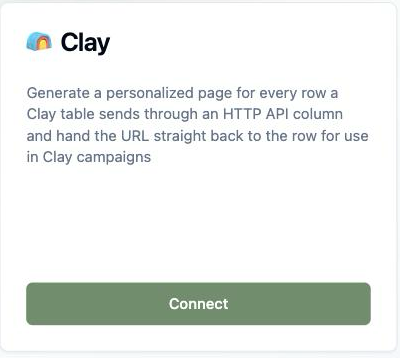

3. In **Pages**, pick the approved **Tented template** each page starts from. For custom page instructions, expand **Advanced: generation prompt**. The `{{clay.rowData}}` token is replaced with the fields your Clay column sends.

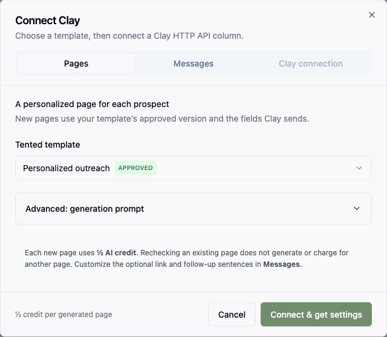

4. Optionally open **Messages** to customize the **Link sentence** and **Follow-up sentence**. Leave either blank to omit it. Supported placeholders appear below the fields; `{{summary}}` is available after publication and another run in Clay.

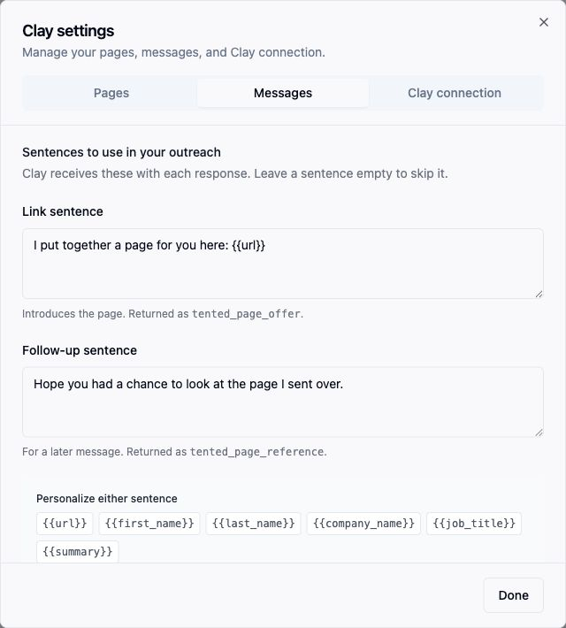

5. Select **Connect & get settings**. The **Clay connection** tab opens. **Connection details** groups the endpoint and authentication header, with the secret masked by default. Expand **Request body & response fields** for the column recipe, and scroll down for the readiness checklist.

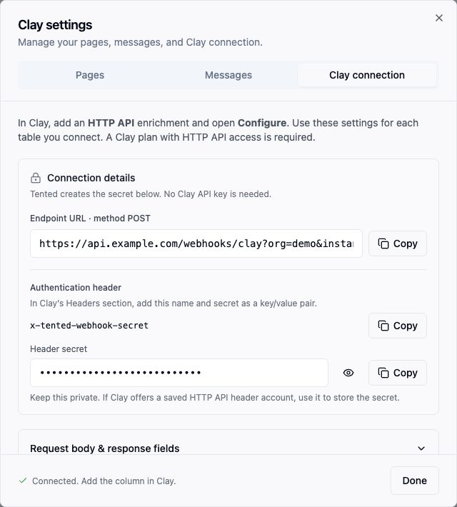

Use the endpoint and secret from your own workspace. Tented generates the secret; no Clay API key is needed.

<Note>
Each page uses half an AI credit. If your workspace runs out of credits, the integration pauses and resumes on its own once credits are available again.
</Note>

## Step 2: Add the Tented column in Clay

In the Clay table you want to enrich, select **Add column → Add enrichment**, search for **HTTP API**, and pick the **HTTP API** enrichment by Clay.

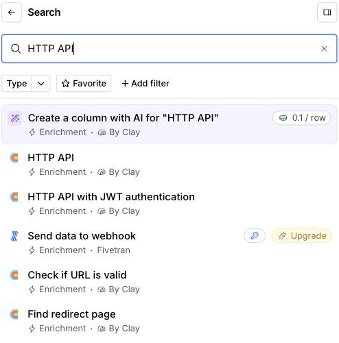

The panel opens on a **Generate** tab that asks an AI to set the call up; switch to the **Configure** tab instead and fill in the setup inputs with the values Tented shows (each has a copy button):

| Setting | Value |
|---|---|
| Method | `POST` |
| Endpoint | The per-workspace URL from the Tented dialog |
| Body | The JSON below, with each value pointed at a column |
| Headers | One key and value pair: `x-tented-webhook-secret` with the secret from the Tented dialog |
| Response values to return | The five fields listed below |

```json
{
  "email": "",
  "first_name": "",
  "last_name": "",
  "company_name": "",
  "job_title": "",
  "website": ""
}
```

Paste the body, then put the cursor between each pair of quotes, type `/` and pick the column from the menu Clay opens (for example your Work Email column for `email`). Each pick becomes a column chip inside the quotes. A value that stays plain text is sent as text, so a pasted `"/Work Email"` would not work.

<Tip>
For a waterfall column such as Clay's **Work Email**, the menu first shows the column as a group with its providers inside. Open the group and pick the plain **Work Email** entry at the bottom of the list, not one of the providers.
</Tip>

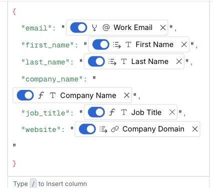

`email` is required; it is how Tented recognizes a row it has already seen. Add any other columns the page should know about (industry, LinkedIn URL, notes) as extra keys: everything in the body is given to the page generator.

Under **Headers**, select **Add a new Key and Value pair** and enter `x-tented-webhook-secret` as the key and the secret from Tented as the value. Under **Response values to return**, add the response fields you want as columns, one per tag:

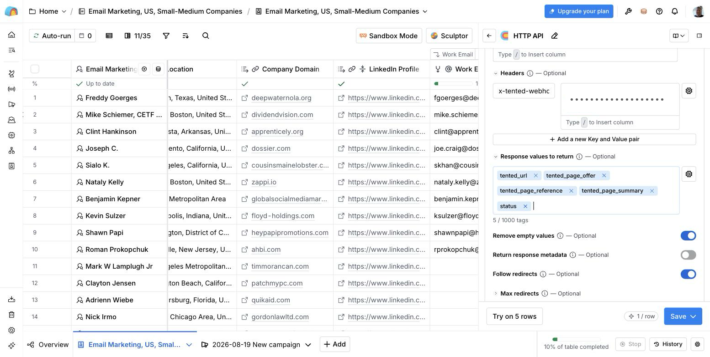

| Field | Contents |
|---|---|
| `tented_url` | A reserved URL while generating; the current published URL when ready; empty when unavailable |
| `tented_page_offer` | The link sentence with the URL filled in |
| `tented_page_reference` | The follow-up sentence |
| `tented_page_summary` | A one-line description, returned on a subsequent run after publication when available |
| `status` | `generating`, `ready`, `failed`, or `unavailable`; see the readiness steps below |

Under **Run settings**, **Auto-run** sends new rows and rows whose input columns change to Tented. It does not refresh an existing `generating` result just because Tented finished building the page. A separate run is needed to fetch the current status.

To finish, open the arrow next to **Save** and choose **Save and don't run**, so you can try one row before the whole table runs.

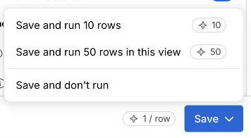

Hover the new column's cell on one row and select its run button. Within a few seconds the cell shows **Status Code: 200**; select it to see what Tented returned: the page URL, the link sentence with the URL filled in, and `generating` as the status.

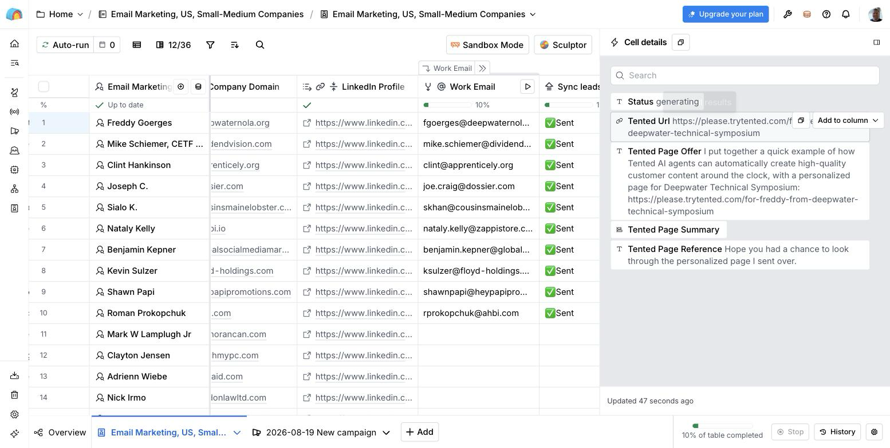

The Clay tile in Tented stops saying it is waiting for the first row and shows the sync. Watch **View activity** for progress. After the page publishes, run the same cell again to fetch `ready` and the page summary. Generation time varies with workload, credits, and publication limits.

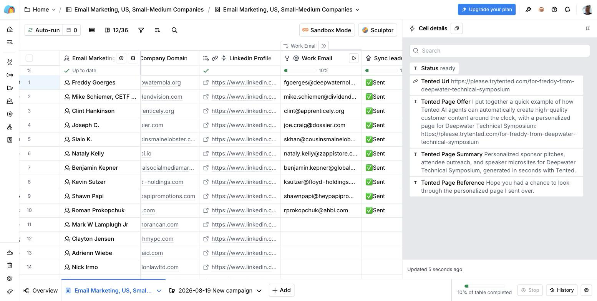

When you are happy with the result, run the column on the intended rows in the rest of the table. After those pages publish, run their existing HTTP API cells again to refresh the results. In the column header's **Run column** menu, choose a run option that includes cells with existing results; running only empty cells will not update `generating` cells. Check the row scope and downstream actions before starting a bulk run.

<Tip>
The column recipe and header secret remain available at **Edit settings → Clay connection**, including after your first row succeeds. Use the same instructions when adding another Clay table.
</Tip>

## Using the link in a Clay campaign

Before enabling a campaign sync or send action:

1. Run the Tented HTTP API column for the intended prospects and let the pages publish.
2. Re-run those cells to fetch the latest results. Recheck before each campaign batch, even if an older result says `ready`.
3. Filter the campaign input or add a condition to the downstream sync action requiring **both** `status` equal to `ready` **and** `tented_url` not empty. Keep `generating`, `failed`, and `unavailable` rows out of the campaign.
4. Preview a ready row and open its URL before starting the batch.

You can use `tented_page_offer` for a sentence containing the link, `tented_page_reference` for a follow-up, or `tented_url` for the URL alone. An empty fallback controls message formatting; it does not establish readiness, because generating rows already contain a URL and may contain a link sentence.

Keep pages published while their campaigns are running. A saved Clay result is a snapshot: unpublishing a page later does not update existing table cells or remove leads already synced to a campaign.

## What happens after connecting

The Clay tile shows the template, the last sync, and a **View activity** link.

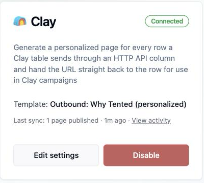

**Page URLs are readable.** Each page publishes at a path built from the row's name and company, for example `https://your-domain/for-bryan-from-acme-co`. When a row has no company, the path uses the first and last name; without a first name, a short random path is used instead.

**Activity** lists each run with the pages published, rows skipped, and credits used.

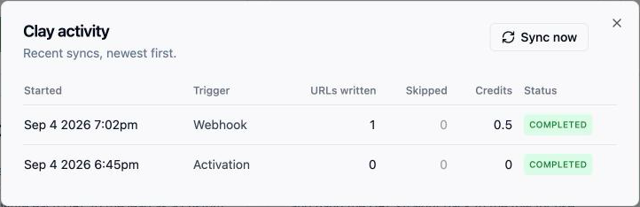

**Generated tents** appear in your Tents list with "Clay Integration" as the creator. Use **Filter → Hide integration-created** to keep them out of the way while you work on other tents.

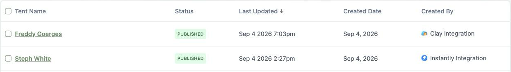

Each page is built from your template and the row's fields, so the prospect sees their own name and company:

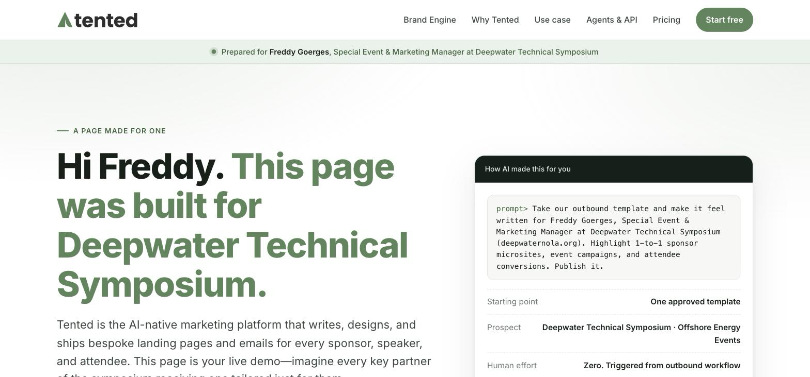

**Rechecking an existing page does not generate or charge for another page.** Changing row data does not rebuild its page. A failed attempt can be retried by running the row again: Tented resumes an existing draft when possible; if a new page must be generated, that generation uses credits.

**Email identifies the prospect across your workspace.** Calls for the same normalized email, including from different Clay tables, reuse the same page. Use a different email only for a different prospect, not as a way to refresh a page.

**Readiness reflects publication when the cell runs.** If you change a published page's alias, the next run returns its current URL. If you unpublish or delete a completed page, the next run returns `unavailable` with empty URL, sentence, and summary fields. Tented does not automatically create a replacement for an intentionally removed page. Republishing the same page restores `ready` on the next check.

## Changing settings

Select **Edit settings** on the Clay tile. The modal has three tabs:

| Tab | What you can do |
|---|---|
| **Pages** | Choose a template and expand the advanced generation prompt. These changes apply to new pages. |
| **Messages** | Edit the link and follow-up sentences returned on future Clay requests. |
| **Clay connection** | Copy the endpoint and header secret, revisit the body and response fields, and check the readiness steps. |

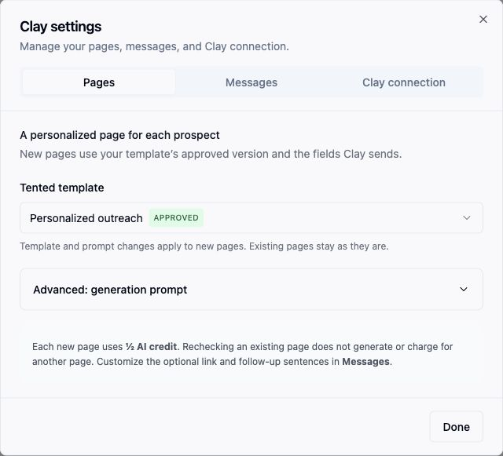

Edits stay with you when switching tabs. Select **Save changes** in the footer to apply them. Saving settings does not regenerate existing pages or update previously saved Clay responses; re-run a cell to fetch updated sentences.

## Disconnecting

Select **Disable** on the Clay tile. New requests to the old connection fail. Tented keeps published pages and releases unused reserved paths. A draft that has already claimed its path is retained so a new connection can finish publishing it; it is not reported as ready until publication is confirmed.

When reconnecting, replace the endpoint and secret in Clay with those from the new connection. Tented remembers completed pages and reuses them. Rows whose unused reservations were released can receive a new URL, so refresh their cells and check readiness again before sending.

## Troubleshooting

| What you see | What it means | What to do |
|---|---|---|
| Cell error **The row needs an email address** | The body has no `email` key, the mapped column is empty for that row, or the value is plain text instead of a column reference. | In the column's body, put the cursor inside the quotes after `"email":`, type `/` and pick the email column. |
| Cell error **Body must be a JSON object** | The body is not a JSON object (for example a bare string or a list). | Paste the JSON body from the Tented dialog again. |
| Cell error **401** | The header secret is missing or wrong. | Open **Edit settings → Clay connection** in Tented and paste the header name and secret again. |
| Cell error **410** | The integration was disconnected in Tented. | Connect again and update the column with the new URL and secret. Rows that already have a page keep their URL. |
| **Paused: out of AI credits** | The workspace has no credits left for new pages. | Add credits. The integration resumes on its own. |
| **Paused: published-tent limit reached** | Your plan's limit on published tents is reached. | Unpublish tents or upgrade your plan. |
| `status` stays `generating` | Clay may be showing an old response, or the page is still building, paused, or failed. | Check **Activity**, then re-run the existing cell. Auto-run does not poll for readiness. A retired attempt is retried on a subsequent request. Keep this row out of campaigns until it returns `ready`. |
| `status` is `failed` | Tented gave up on this row's page and the row has not been re-run since. | Check **Activity** for the reason, fix it (for example add credits), then re-run the row. |
| `status` is `unavailable` and the URL is empty | A previously completed page is unpublished or deleted. | Republish the existing page if appropriate, then re-run the cell. A deleted page is not automatically replaced. Remove or pause any campaign lead that still holds its old URL. |
