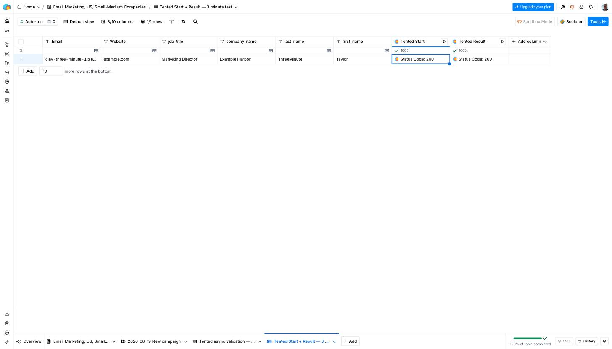
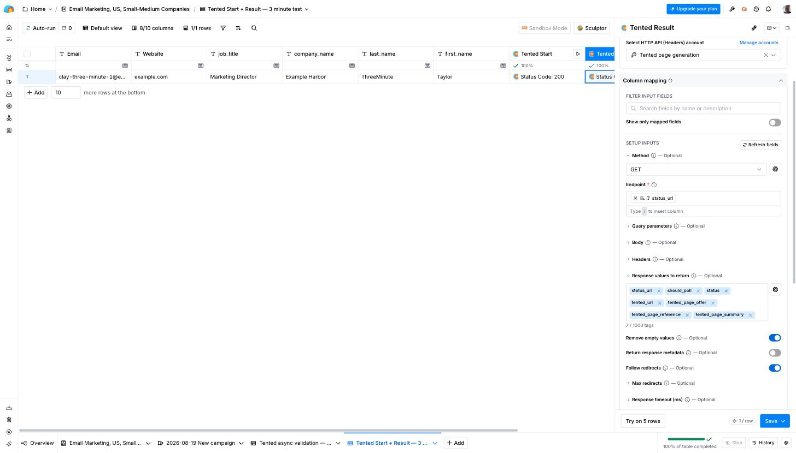
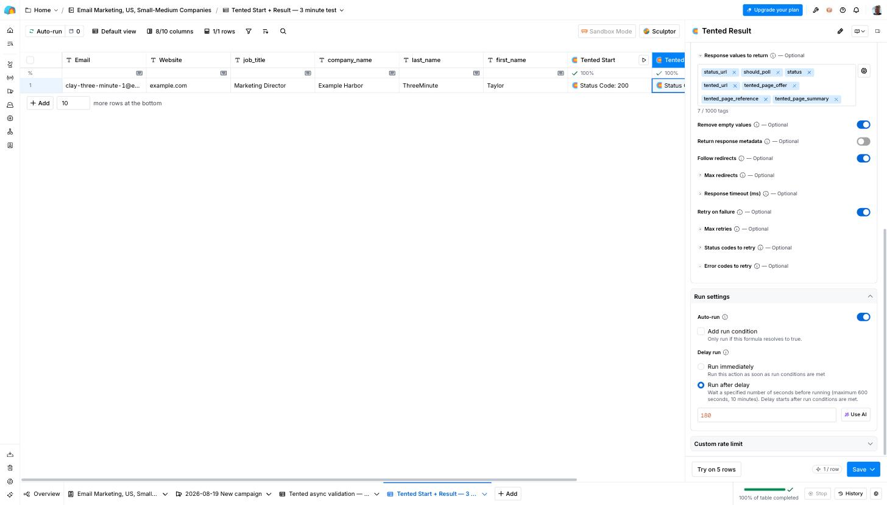
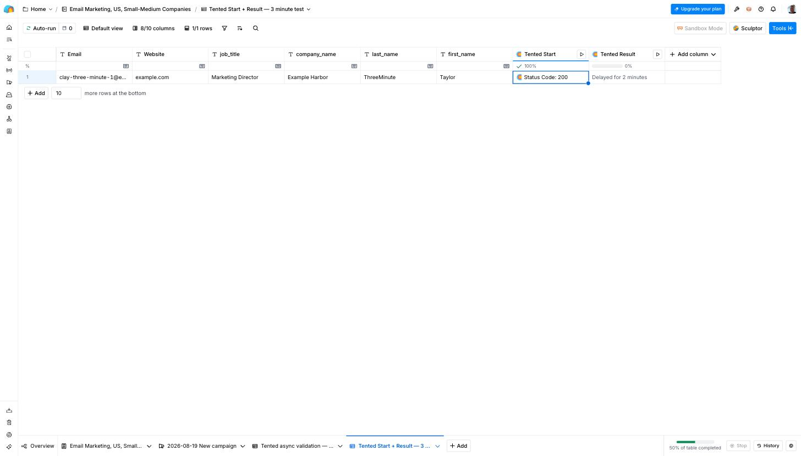
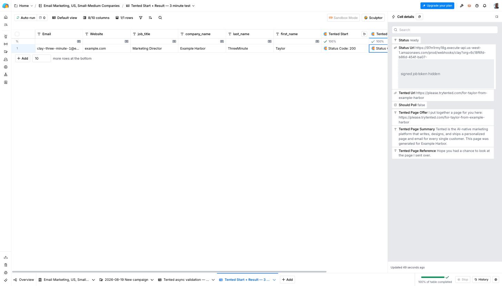

Create a personalized landing page for each Clay prospect with just **two HTTP API columns**:

| Column | What it does |
|---|---|
| **Tented Start** | Sends the prospect to Tented and starts generation. |
| **Tented Result** | Waits **180 seconds (3 minutes)** after Start, then fetches the page URL, sentences, summary, and status. |

Map campaign fields directly from **Tented Result**. No check chain or additional formula columns are needed. No Clay API key is needed.



## Before you start

You need admin access to Tented, an approved [tent template](/working-with-tents/tent-templates), AI credits, and a Clay plan with **HTTP API** and **Delay Runs**. Each new page uses **½ Tented AI credit**; fetching results uses no Tented AI credits. Clay may charge for HTTP actions under your plan.

Your Clay table needs an email column. Add first name, last name, company name, job title, and website columns if you want to personalize with those fields. Keep table Auto-run and campaign actions off while configuring the columns.

## 1. Connect Tented and save authentication

1. Open **Tented → Settings → Integrations → Clay → Connect**.


2. In **Pages**, choose an approved template. The advanced generation prompt is optional; `{{clay.rowData}}` inserts the fields sent by Clay.


3. Optionally customize the link and follow-up sentences in **Messages**. `{{summary}}` is available once the page is published.


4. Select **Connect & get settings**. The **Clay connection** tab contains the four setup steps and copy buttons for your values.


5. In Clay, open **Settings → Connections → Create → HTTP API (Headers)**. Name the account **Tented page generation**. Under **API Request Headers**, save:

| Header name | Value |
|---|---|
| `x-tented-webhook-secret` | The header secret from Tented’s Clay connection tab |

Select this saved account in both HTTP API columns. Keep the secret private. The POST endpoint belongs to your Tented connection; use the exact URL shown in your dialog.

## 2. Configure Tented Start

Select **Add column → Add enrichment**, search for **HTTP API**, and open **Configure**. Name the column **Tented Start**.


| Setting | Value |
|---|---|
| Method | **POST** |
| Endpoint | Copy **Endpoint URL** from Tented |
| Account | **Tented page generation** |
| Body | The JSON below, with mapped column references |
| Response values to return | The seven tags listed below |
| Column Auto-run | **On** |
| Run timing | **Run immediately** |

```json
{
  "email": "",
  "first_name": "",
  "last_name": "",
  "company_name": "",
  "job_title": "",
  "website": ""
}
```

Inside each pair of empty quotes, type `/` and select the matching Clay column. Each selection becomes a column chip. Keep the email reference required. Make other references optional if some prospects do not have those values, or omit unused keys. Extra keys such as industry or notes are also passed to the page generator.

For a waterfall such as **Work Email**, open its group and choose the final Work Email value, rather than a provider’s intermediate result.


Add these **Response values to return** as separate tags: type each name and press Enter. Keep the field in **Text with tokens** mode.

| Field | Contents |
|---|---|
| `status` | `generating`, `ready`, `failed`, or `unavailable` |
| `tented_url` | Reserved URL while generating; published URL when ready |
| `tented_page_offer` | Your link sentence |
| `tented_page_reference` | Your follow-up sentence |
| `tented_page_summary` | Page summary, available after publication |
| `status_url` | Complete endpoint for fetching this row’s result |
| `should_poll` | Whether generation is still in progress; no setup condition is needed for this field |


Choose **Save → Save and don’t run**.


## 3. Configure Tented Result

Add another **HTTP API** column, open **Configure**, and name it **Tented Result**.

| Setting | Value |
|---|---|
| Method | **GET** |
| Account | **Tented page generation** |
| Endpoint | Type `/`, open **Tented Start**, and select **status_url** |
| Body | Leave empty |
| Response values to return | The same seven tags as Start |
| Column Auto-run | **On** |
| Run timing | **Run after delay → 180 seconds** |
| Only run if | **Leave empty** |



Because the endpoint comes from Start, Result waits until Start has returned a status URL, then begins its delay. Use the column chip rather than pasting a literal URL or `{{...}}` text.

Result runs once after the delay, including when Start already returned `ready`. There is no conditional polling setup and no fallback formula. Request and queue time may make the result arrive slightly later than three minutes.



Choose **Save → Save and don’t run**.

## 4. Test and use the result

1. Keep downstream campaign actions off. Turn on table **Auto-run**, choosing **Keep existing results**.


2. Add one test row. Fill the name, company, and other details first; fill email last so Start receives the complete prospect.
3. Start runs automatically and returns HTTP `200`. Open it to see `status: generating` (or `ready` for an existing published page).
4. Result displays **Delayed for …**, then runs automatically after three minutes.


5. Open **Tented Result**. Confirm `status: ready`, open its `tented_url`, and check the personalized page.


6. Map your campaign’s URL, link sentence, follow-up sentence, and summary directly from **Tented Result**.

On the campaign action, open the **Only run if formula editor** and enter this condition using the named column references:

```javascript
{{Tented Result}}?.status === "ready" && !!{{Tented Result}}?.tented_url && !!{{Tented Start}}?.status_url && {{Tented Result}}?.status_url === {{Tented Start}}?.status_url
```

This checks readiness, a usable URL, and that Result belongs to the current Start. Use the formula editor, not a natural-language description box. Verify the references before enabling the campaign action.

<Note>
A successful HTTP response does not itself mean the page is ready. Always use Result’s `status`. If generation is paused or still in progress, inspect Tented Activity and rerun Result after publication. A GET never restarts generation or spends Tented AI credits.
</Note>

## Updating an existing Clay table

Keep **Tented Start** and its body/authentication. Replace the old checks with **Tented Result**, configured above with a 180-second delay and no Only run if condition. Update campaign mappings to Result and apply the readiness condition before removing obsolete check/status/summary columns.

Existing results will not update automatically just because you edited a column. With downstream actions off, run Start for your intended rows and let Result run before enabling campaigns. Recheck Result before a later campaign batch, and keep campaign pages published: saved cells are snapshots, not live publication monitors.

## What happens after connecting

The Clay tile shows the template, the last sync, and a **View activity** link.


**Page URLs are readable.** Each page publishes at a path built from the row's name and company, for example `https://your-domain/for-bryan-from-acme-co`. When a row has no company, the path uses the first and last name; without a first name, a short random path is used instead.

**Activity** lists each run with the pages published, rows skipped, and credits used.


**Generated tents** appear in your Tents list with "Clay Integration" as the creator. Use **Filter → Hide integration-created** to keep them out of the way while you work on other tents.


Each page is built from your template and the row's fields, so the prospect sees their own name and company:


**Fetching Result never starts or retries generation.** Changing row data does not rebuild an existing page. Retry a failed attempt explicitly by running **Tented Start** again: Tented resumes an existing draft when possible; if a new page must be generated, that generation uses credits.

**Email identifies the prospect across your workspace.** Calls for the same normalized email, including from different Clay tables, reuse the same page. Use a different email only for a different prospect, not as a way to refresh a page.

**Readiness reflects publication when the cell runs.** If you change a published page's alias, the next run returns its current URL. If you unpublish or delete a completed page, the next run returns `unavailable` with empty URL, sentence, and summary fields. Tented does not automatically create a replacement for an intentionally removed page. Republishing the same page restores `ready` on the next Result request.

## Changing settings

Select **Edit settings** on the Clay tile. The modal has three tabs:

| Tab | What you can do |
|---|---|
| **Pages** | Choose a template and expand the advanced generation prompt. These changes apply to new pages. |
| **Messages** | Edit the link and follow-up sentences returned on future Clay requests. |
| **Clay connection** | Follow the four setup steps: save the connection, configure Start, configure Result, and test. Copy the endpoint and header secret here. |


Edits stay with you when switching tabs. Select **Save changes** in the footer to apply them. Saving settings does not regenerate existing pages or update previously saved Clay responses; fetch a fresh result to see updated sentences.

## Disconnecting

Select **Disable** on the Clay tile. New requests to the old connection fail. Tented keeps published pages and releases unused reserved paths. A draft that has already claimed its path is retained so a new connection can finish publishing it; it is not reported as ready until publication is confirmed.

When reconnecting, replace the POST endpoint and shared authentication in Clay with those from the new connection, then run **Tented Start** to get new status URLs. Old status URLs cannot be reused. Tented remembers completed pages and reuses them. Rows whose unused reservations were released can receive a new URL, so check readiness again before sending.

## Troubleshooting

| What you see | What to do |
|---|---|
| Start needs an email address | Map the email value with a Clay column reference, and fill it in for the row. |
| HTTP 401 | Select the saved HTTP API Headers account in both columns; verify its header name and secret against Tented. |
| Body must be a JSON object | Paste the body from setup, then insert column references inside each pair of quotes. |
| `u.split is not a function` | Enter response fields as separate tags in Text with tokens mode, not as a single string. |
| Result never starts | Enable table and column Auto-run. Map Endpoint to Start’s `status_url` with a column chip, set the delay to 180 seconds, and leave Only run if empty. |
| Result remains `generating` | Check Activity for credit or publication limits. After the page publishes, rerun Result. Keep it out of campaigns until ready. |
| Result is `failed` | Fix the cause shown in Activity, then rerun Start explicitly. GET does not retry generation. |
| Result is `unavailable` | The page was unpublished or deleted. Republish it if appropriate, then rerun Result. |
| GET returns INVALID_JOB or JOB_NOT_FOUND | Use the complete current `status_url` from Start. Rerun Start if the attempt was replaced. |
| HTTP 410 | Reconnect in Tented, replace the saved authentication and Start endpoint, then rerun Start. |

The three-minute delay runs once. It does not guarantee success when generation is paused or fails. Adding credits resumes Tented’s worker, but you must rerun an already-finished Result cell to fetch the updated page.
