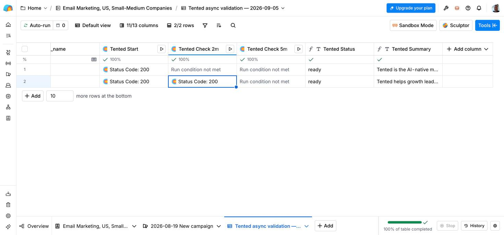
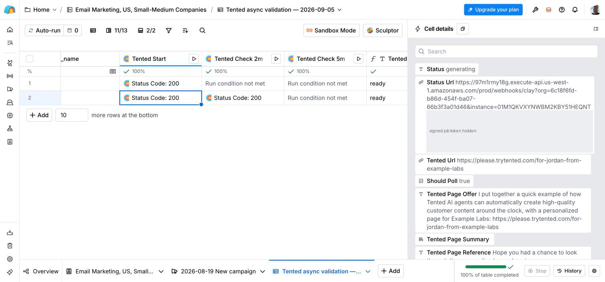
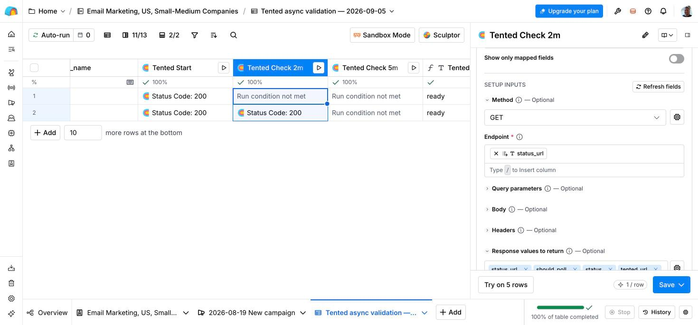
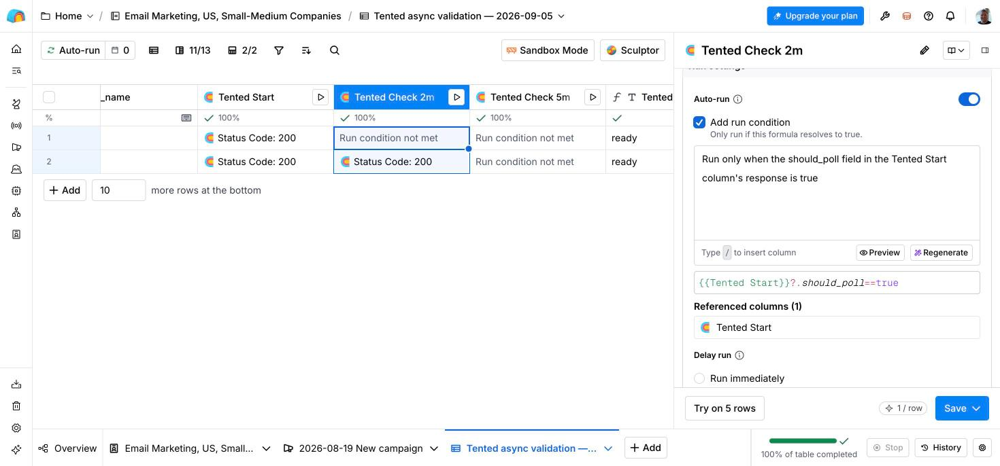
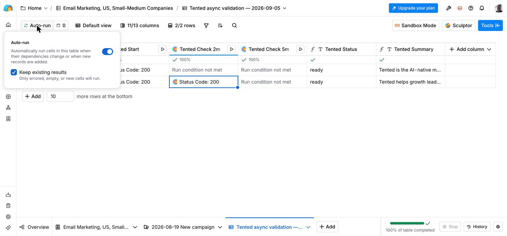
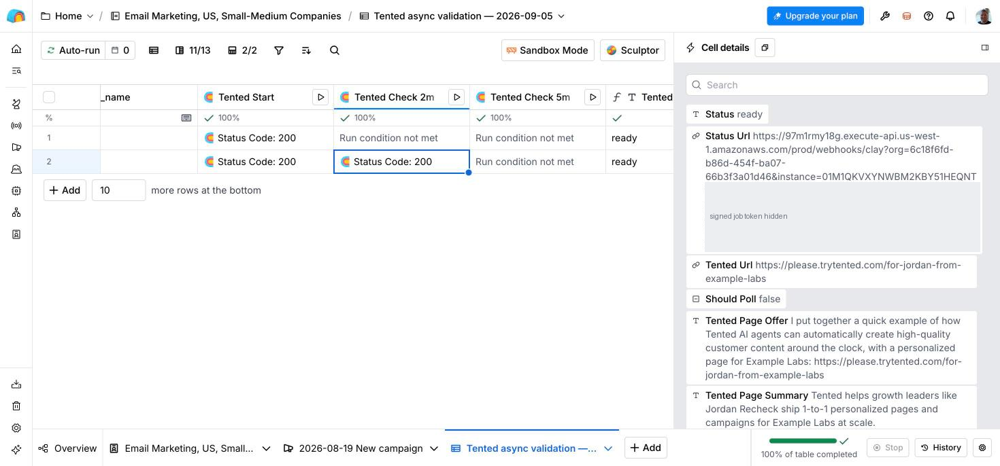

Tented connects to [Clay](https://clay.com) so each prospect gets a personalized landing page built from an approved template. One HTTP API column starts generation; two delayed HTTP API columns check for the published page automatically. Two small formula columns, **Tented Status** and **Tented Summary**, give your campaign one place to read the result.

You can copy a setup prompt from Tented into Clay's Sculptor assistant, or configure the columns manually with the steps below.

## How it works

Clay tables can't be read or updated from outside on most plans, so Tented never calls Clay. Instead Clay calls Tented:

1. **Tented Start** sends the prospect's fields in a `POST`. Tented reserves a URL and returns HTTP `200` with `status: generating`, a `status_url`, and `should_poll: true`, while generation continues in the background.
2. **Tented Check 2m** waits 120 seconds, then makes a `GET` request to that status URL.
3. If the page is still generating, **Tented Check 5m** waits another 180 seconds and checks again.
4. **Tented Status** shows the status from the latest check that ran. Campaign actions run only when it says `ready`.

Clay's [Delay Runs](https://www.clay.com/changelog/delay) support delays up to 10 minutes. The [delay starts after run conditions are met](https://university.clay.com/docs/enrichments), so **120 + 180 seconds** lands the checks at roughly 2 and 5 minutes after the start. Request and queue time may make them later. Each check runs only while the previous response says `should_poll: true`, so a row that is ready after the first check never makes the second call.



<Warning>
A URL with `status: generating` is a reserved address, not a live page. Delays automate checking; they do not guarantee publication. Rows still generating after the last check stay out of campaigns until a later check returns `ready`.
</Warning>

## Prerequisites

Before you begin, make sure you have:

- **Admin access** to your Tented workspace. Connecting, changing settings, and disconnecting are admin-only.
- **An approved tent template** in Tented. Pages are generated from a template's approved version. See [Templates](/working-with-tents/tent-templates) if you don't have one yet.
- **A Clay plan with access to the HTTP API enrichment and Delay Runs.** Check that both are available in your workspace before connecting.
- **AI credits**. Each generated page uses half a credit.

No Clay API key is needed.

## Step 1: Connect Clay in Tented

1. In Tented, open **Settings → Integrations**.
2. On the **Clay** tile, select **Connect**.


3. In **Pages**, pick the approved **Tented template** each page starts from. For custom page instructions, expand **Advanced: generation prompt**. The `{{clay.rowData}}` token is replaced with the fields your Clay column sends.


4. Optionally open **Messages** to customize the **Link sentence** and **Follow-up sentence**. Leave either blank to omit it. Supported placeholders appear below the fields; `{{summary}}` becomes available in the automatic result checks after publication.


5. Select **Connect & get settings**. The **Clay connection** tab opens. Expand **Connection details** for the endpoint and authentication header, with the secret masked by default. Three more expandable sections cover the start column, the automatic checks, and the campaign result.


Use the endpoint and secret from your own workspace. Tented generates the secret; no Clay API key is needed.

For guided setup, select **Copy** beside **Set up with Clay's assistant**, paste the prompt into Sculptor, and select your saved HTTP API Headers account when asked. The prompt contains the endpoint, column names, delays, run conditions, and formulas, but no secret. Review the generated configuration against this guide before running it. It asks Sculptor to leave table Auto-run off and existing campaign actions unchanged.

Sculptor may create suggestions in **Sandbox Mode**. Accept each upstream suggestion with **Add column** before asking it to build the next dependent column. Use **Review changes** to inspect and apply the finished configuration. Avoid **Add and run 10 rows** during setup. Existing text-column names and test-row values may need to be entered manually.

Open each suggested HTTP column's **Configure** tab before saving. Verify the selected account, request fields, response-field list, delay, and run condition in the editor; Sculptor's summary can differ from the saved configuration. Remove any generated placeholder `Authorization` header: Tented uses `x-tented-webhook-secret` through your saved account.

<Note>
Each page uses half an AI credit. If your workspace runs out of credits, the integration pauses and resumes on its own once credits are available again.
</Note>

## Step 2: Add the start column in Clay

In the Clay table you want to enrich, select **Add column → Add enrichment**, search for **HTTP API**, and pick the **HTTP API** enrichment by Clay.


For manual setup, switch to the **Configure** tab and name the column **Tented Start**. Fill in the inputs with the values Tented shows:

| Setting | Value |
|---|---|
| Method | `POST` |
| Endpoint | The per-workspace URL from the Tented dialog |
| Body | The JSON below, with each value pointed at a column |
| Account | A saved HTTP API Headers account containing `x-tented-webhook-secret` and the secret from Tented |
| Response values to return | The seven fields listed below |
| Run settings | Auto-run on, Run immediately; save without running while setting up |

```json
{
  "email": "",
  "first_name": "",
  "last_name": "",
  "company_name": "",
  "job_title": "",
  "website": ""
}
```

Paste the body, then put the cursor between each pair of quotes, type `/` and pick the column from the menu Clay opens (for example your Work Email column for `email`). Each pick becomes a column chip inside the quotes. A value that stays plain text is sent as text, so a pasted `"/Work Email"` would not work.

<Tip>
For a waterfall column such as Clay's **Work Email**, the menu first shows the column as a group with its providers inside. Open the group and pick the plain **Work Email** entry at the bottom of the list, not one of the providers.
</Tip>


`email` is required; it is how Tented recognizes a row it has already seen. Add any other columns the page should know about (industry, LinkedIn URL, notes) as extra keys: everything in the body is given to the page generator.

Select a saved [HTTP API Headers account](https://university.clay.com/docs/http-api-integration-overview) in the column's **Account** section for authentication. If that option is unavailable, add `x-tented-webhook-secret` directly under **Headers** as a key/value pair and keep it private. Reuse this authentication for all three HTTP columns.

To create the saved account, open **Clay Settings → Connections → Create → HTTP API (Headers)**. Give it a recognizable name such as **Tented page generation**, add `x-tented-webhook-secret` as the key and the secret from Tented as its value, then save. Select this account in each HTTP column; keep the secret out of Sculptor chat and formulas.

Under **Response values to return**, add each field below as a separate tag. Type the field name, press **Enter**, and verify that all seven tags appear before saving. If the field turns into a single text or formula value instead of tags, clear it, open the gear icon beside it, choose **Text with tokens**, and enter the tags again.

| Field | Contents |
|---|---|
| `status` | `generating`, `ready`, `failed`, or `unavailable`; see the readiness steps below |
| `tented_url` | A reserved URL while generating; the current published URL when ready; empty when unavailable |
| `tented_page_offer` | The link sentence with the URL filled in |
| `tented_page_reference` | The follow-up sentence |
| `tented_page_summary` | A one-line description, returned by checks after publication when available |
| `status_url` | The complete URL for a GET check; use it unchanged and supply the same authentication header. It is the same for every check of a row. |
| `should_poll` | `true` only while `status` is `generating`; the checks use it as their run condition |



Leave table Auto-run off until the full workflow is configured. Column Auto-run alone does not poll a pending response; the delayed columns below provide those checks.

To finish, open the arrow next to **Save** and choose **Save and don't run**, so you can try one row before the whole table runs.


## Step 3: Add automatic result checks

Add two more **HTTP API** columns with method **GET**, no body, the same saved header account, and the same seven response fields. Map each **Endpoint** to **Tented Start → status_url** using a Clay column chip: put the cursor in the Endpoint field, type `/`, open **Tented Start**, and pick **status_url**. Do not paste the displayed chip notation as a literal URL.



Under **Run settings**, enable column **Auto-run**, select **Add run condition**, choose **Run after delay**, and set these values:

| Column name | Delay in seconds | Only run if |
|---|---|---|
| **Tented Check 2m** | `120` | Run only when the should_poll field in the Tented Start column's response is true |
| **Tented Check 5m** | `180` | Run only when the should_poll field in the Tented Check 2m column's response is true |

The **Only run if** box is a description, not a formula field: Clay's assistant turns what you write into a formula, shown underneath with a **Will run / Will not run** preview per row. Type the description from the table, then select **Regenerate** if the formula does not update. The generated formula should reference the column, for example `{{Tented Start}}?.should_poll == true`. If it reads `false`, every row shows **Run condition not met**; rewrite the description in plain words and regenerate.



Both descriptions have copy buttons in **Edit settings → Clay connection → Automatic result checks**. `ready`, `failed`, and `unavailable` all return `should_poll: false`, which stops later checks. GET checks never retry generation or use Tented AI credits; Clay may charge for HTTP actions according to your plan.

## Step 4: Collect one result for campaigns

Clay formula columns are typed, so a check's whole response cannot be stored in one cell. Add a **Formula** column of type **Text** named **Tented Status**:

```javascript
({{Tented Check 5m}} || {{Tented Check 2m}} || {{Tented Start}})?.status
```

A skipped check is empty, so the formula falls back to the last check that ran. If Clay shows required-data toggles for the check references, turn them off so an immediately ready start still reaches the result.

If your campaign uses the page summary, add a second **Text** formula column named **Tented Summary**:

```javascript
({{Tented Check 5m}} || {{Tented Check 2m}} || {{Tented Start}})?.tented_page_summary
```

Map `tented_url`, `tented_page_offer`, and `tented_page_reference` straight from **Tented Start**; they do not change after the start. On the downstream campaign sync or send action, describe the **Only run if** condition as:

```text
Run only when the Tented Status column is "ready"
```

Keep campaign actions disabled while configuring and testing. An empty fallback in a message controls formatting; it does not establish readiness, because a generating result already contains a reserved URL.

## Step 5: Test and enable the workflow

1. Turn on table Auto-run from the run-mode button at the top left of the table (it reads **Manual** until then). Confirm **Turn on auto-run** with **Keep existing results** checked, so only new, empty, or errored cells run.



2. Add one safe test row with downstream campaign actions disabled. Fill the name and company columns first and the email last: the start column runs as soon as its inputs are complete. HTTP `200` confirms acceptance; open the cell to see `status: generating` and `should_poll: true` (or `ready` if this prospect already has a published page).
3. **Tented Check 2m** shows **Delayed for …** while it counts down, then makes its GET request. Watch **View activity** in Tented meanwhile. Generation time varies with workload, credits, and publication limits.
4. Verify that **Tented Status** becomes `ready` and **Tented Summary** fills in. **Tented Check 5m** should show **Run condition not met** when the page was ready at the first check. Open the URL and preview your campaign mappings before enabling the campaign action.



5. Run **Tented Start** on the intended remaining rows. With Auto-run on, new and changed rows follow the same automatic check chain.

If a row remains `generating` after the last check, inspect Tented activity. Once the underlying issue is resolved, run its latest GET cell again. A failed job requires an explicit POST retry. The workflow does not poll indefinitely or automatically spend credits retrying failures.

<Tip>
The column recipe and header secret remain available at **Edit settings → Clay connection**, including after your first row succeeds. Use the same instructions when adding another Clay table.
</Tip>

## Existing tables and later campaign batches

If you already use a single Tented HTTP column, keep its POST body and authentication, rename it **Tented Start**, and add the two metadata response fields: `status_url` and `should_poll`. Add the checks and formula columns described above, then update your campaign mappings and condition. Existing saved responses do not gain the new fields automatically: run the start column for the intended rows with downstream actions disabled to initialize the new workflow.

Recheck before a later campaign batch, even if a saved result says `ready`. Running **Tented Start** again returns the current publication state; an existing completed page is reused without generating or charging for another page. Failed rows may retry generation, so inspect the scope of a bulk POST run. A GET against a `status_url` only reads the result.

Keep pages published while their campaigns are running. A saved Clay result is a snapshot: unpublishing a page later does not update existing table cells or remove leads already synced to a campaign.

## What happens after connecting

The Clay tile shows the template, the last sync, and a **View activity** link.


**Page URLs are readable.** Each page publishes at a path built from the row's name and company, for example `https://your-domain/for-bryan-from-acme-co`. When a row has no company, the path uses the first and last name; without a first name, a short random path is used instead.

**Activity** lists each run with the pages published, rows skipped, and credits used.


**Generated tents** appear in your Tents list with "Clay Integration" as the creator. Use **Filter → Hide integration-created** to keep them out of the way while you work on other tents.


Each page is built from your template and the row's fields, so the prospect sees their own name and company:


**GET checks never start or retry generation.** Changing row data does not rebuild an existing page. Retry a failed attempt explicitly by running **Tented Start** again: Tented resumes an existing draft when possible; if a new page must be generated, that generation uses credits.

**Email identifies the prospect across your workspace.** Calls for the same normalized email, including from different Clay tables, reuse the same page. Use a different email only for a different prospect, not as a way to refresh a page.

**Readiness reflects publication when the cell runs.** If you change a published page's alias, the next run returns its current URL. If you unpublish or delete a completed page, the next run returns `unavailable` with empty URL, sentence, and summary fields. Tented does not automatically create a replacement for an intentionally removed page. Republishing the same page restores `ready` on the next check.

## Changing settings

Select **Edit settings** on the Clay tile. The modal has three tabs:

| Tab | What you can do |
|---|---|
| **Pages** | Choose a template and expand the advanced generation prompt. These changes apply to new pages. |
| **Messages** | Edit the link and follow-up sentences returned on future Clay requests. |
| **Clay connection** | Copy the setup prompt, endpoint, and header secret, or expand the start, check, and campaign instructions. |


Edits stay with you when switching tabs. Select **Save changes** in the footer to apply them. Saving settings does not regenerate existing pages or update previously saved Clay responses; fetch a fresh result to see updated sentences.

## Disconnecting

Select **Disable** on the Clay tile. New requests to the old connection fail. Tented keeps published pages and releases unused reserved paths. A draft that has already claimed its path is retained so a new connection can finish publishing it; it is not reported as ready until publication is confirmed.

When reconnecting, replace the POST endpoint and shared authentication in Clay with those from the new connection, then run **Tented Start** to get new status URLs. Old status URLs cannot be reused. Tented remembers completed pages and reuses them. Rows whose unused reservations were released can receive a new URL, so check readiness again before sending.

## Troubleshooting

| What you see | What it means | What to do |
|---|---|---|
| Cell error **The row needs an email address** | The body has no `email` key, the mapped column is empty for that row, or the value is plain text instead of a column reference. | In the column's body, put the cursor inside the quotes after `"email":`, type `/` and pick the email column. |
| Cell error **Body must be a JSON object** | The body is not a JSON object (for example a bare string or a list). | Paste the JSON body from the Tented dialog again. |
| Cell error **401** | The header secret is missing or wrong. | Open **Edit settings → Clay connection** in Tented and paste the header name and secret again. |
| Cell error **u.split is not a function** | Response values to return was saved as one text or formula value instead of tags. | Clear the field, open its gear icon, choose **Text with tokens**, and enter the seven tags again. |
| GET error **400 / INVALID_JOB** | The status URL is missing, edited, or belongs to a different connection. | Map the complete `status_url` from **Tented Start** without editing it. |
| GET error **404 / JOB_NOT_FOUND** | This attempt was replaced or removed. | Run **Tented Start** to get a current status URL. |
| Cell error **410** | The integration was disconnected in Tented. | Connect again and update the column with the new URL and secret. Rows that already have a page keep their URL. |
| **Paused: out of AI credits** | The workspace has no credits left for new pages. | Add credits. The integration resumes on its own. |
| **Paused: published-tent limit reached** | Your plan's limit on published tents is reached. | Unpublish tents or upgrade your plan. |
| **Run condition not met** on every row, including generating ones | The run condition was saved as a hard-coded `false`. Clay's **Explain** button in the cell details says so. | Edit the column, rewrite the **Only run if** description in plain words, select **Regenerate**, and confirm the formula references `should_poll`. |
| Checks never start | Table or column Auto-run is off, or the endpoint reference is misconfigured. | Check both Auto-run switches, the preceding response's `should_poll`, and the mapped `status_url`. The delay begins only after the condition is met. |
| **Tented Status** is empty after an early `ready` | A skipped check is incorrectly required by the formula. | Make the check references optional in the formula and confirm its column mappings. |
| `status` stays `generating` after the last check | The page is still building, paused, or the response is stale. | Check **Activity**. Run the latest GET cell again after resolving the issue; keep the row out of campaigns until `ready`. Adding credits resumes Tented's worker, but does not restart a finished Clay check chain. |
| `status` is `failed` | Tented retired this attempt. GET does not retry it. | Check **Activity**, fix the cause, then run **Tented Start** to retry. |
| `status` is `unavailable` and the URL is empty | A previously completed page is unpublished or deleted. | Republish the existing page if appropriate, then fetch a fresh result. A deleted page is not automatically replaced. Remove or pause any campaign lead that still holds its old URL. |
