Tented connects to [HubSpot](https://www.hubspot.com) so any contact or company can get a personalized landing page built from one of your approved templates. A rep creates a page straight from the record with the Tented card in the sidebar, or Tented creates pages automatically for every record that joins a list you choose. Either way, Tented writes the page link, a short summary, and two ready-made sentences back to the record, so sequences and emails can use them as personalization tokens.

This guide covers connecting the two, choosing what to generate, automating with lists, using the card, and what to expect afterwards.

## Prerequisites

Before you begin, make sure you have:

- **Admin access** to your Tented workspace. Connecting, changing settings, and disconnecting are admin-only.
- **An approved tent template** in Tented. Pages are generated from a template's approved version. See [Templates](/working-with-tents/tent-templates) if you don't have one yet.
- **Permission to install apps in HubSpot**. Super admins have it; other users need the **App Marketplace access** permission.
- **AI credits**. Each generated page uses half a credit.

## Step 1: Connect HubSpot

1. In Tented, open **Settings → Integrations**.
2. On the **HubSpot** tile, select **Connect**, then **Connect HubSpot**.
3. HubSpot opens in a new window. Pick the account to connect and approve access. The window closes on its own and Tented moves to the next step.

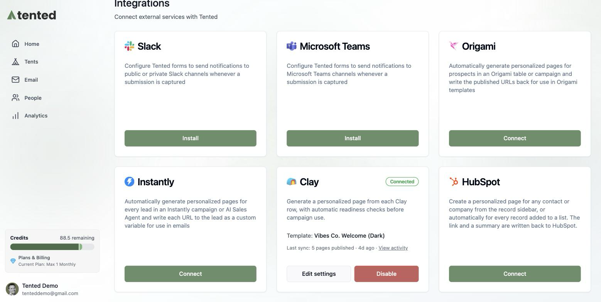

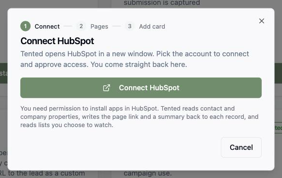

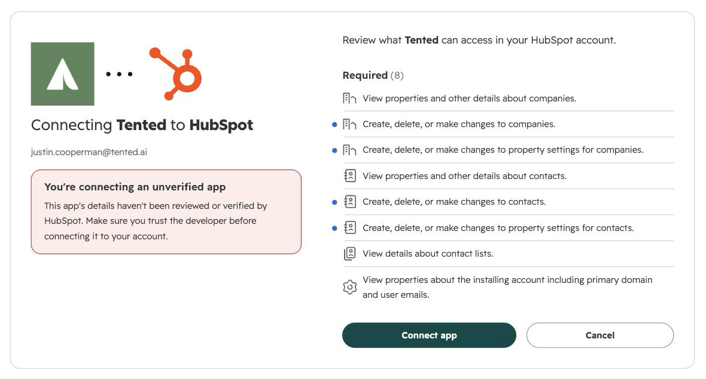

Tented asks for permission to read contact and company properties, write the page link and summary back to each record, create the six Tented properties, and read the lists you choose to watch.

<Note>
If you installed Tented from the HubSpot App Marketplace instead, HubSpot sends you to this same page in Tented with the connection already made. Sign in as a workspace admin to finish setup.
</Note>

## Step 2: Choose what to generate

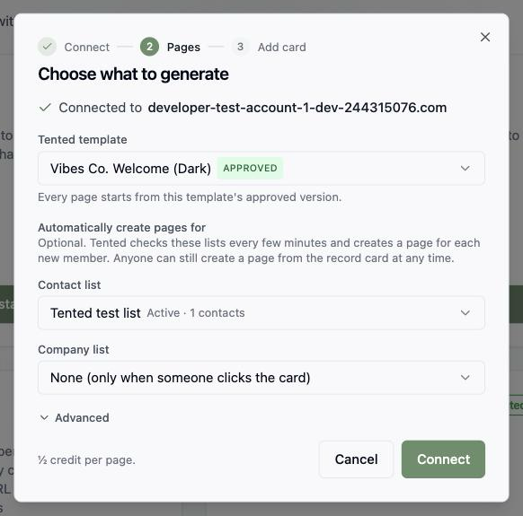

- **Tented template**: the approved template each page starts from. Tented picks your most recently approved template; change it if you like. Every page is personalized to the record using all of its properties, and for a contact, its company's properties too.
- **Automatically create pages for**: optional. Pick a **contact list** and/or a **company list**. Tented checks them about every 15 minutes (or straight away when you select **Sync now** on the tile) and creates a page for every new member. Leave both on **None** to create pages only when someone clicks the card on a record.

### Advanced

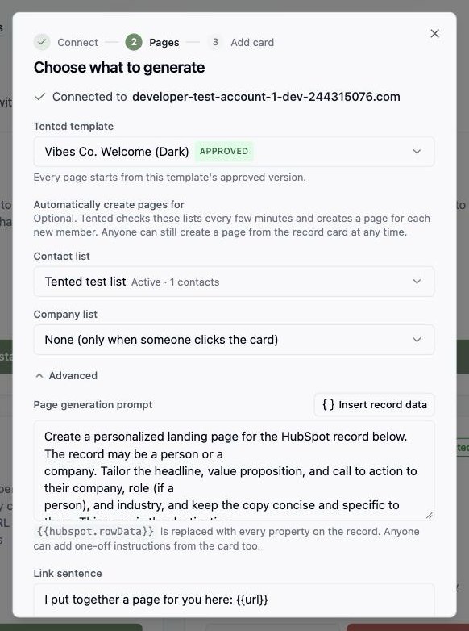

Expand **Advanced** to change the copy Tented works from:

- **Page generation prompt**: the instructions the page is generated with. `{{hubspot.rowData}}` is replaced with every property on the record. Reps can also add one-off instructions from the card for a single page.
- **Link sentence**: written to the record as `tented_page_offer`. Use `{{url}}`, `{{first_name}}`, `{{company_name}}`, `{{job_title}}`, and `{{summary}}`. Leave it empty to skip it.
- **Follow-up sentence**: written as `tented_page_reference` for a later email or sequence step.

Select **Connect**. Tented adds a **Tented** property group with six properties to contacts and companies in your HubSpot account (see [Using the fields in HubSpot](#using-the-fields-in-hubspot)), then starts watching any lists you chose.

## Syncing contact data (optional)

Tented can also keep your HubSpot contacts in **People**, so lists, flows, and emails in Tented work off the same records your team uses in HubSpot. You choose this during setup on the **Contacts** step, and can change it later with **Edit** next to **Contacts** on the HubSpot tile.

Pick one of three options:

- **Don't sync contacts.** Records stay in HubSpot. Pages still work from the card and lists.
- **Import HubSpot contacts into Tented.** HubSpot contacts appear in People and are kept up to date about every 15 minutes. Tented never writes back.
- **Keep Tented and HubSpot in sync.** Changes flow both ways: HubSpot edits come in, and Tented edits and new Tented contacts go back to HubSpot.

### Standard fields

HubSpot's standard properties (email, first and last name, company, job title, lifecycle stage, lead status, and so on) are matched to Tented's fields for you. For each one, choose what happens when a Tented contact already has a value, exactly as in a list import: **Overwrite** or **Do Nothing**. Email and phone are the match keys, so contacts are de-duplicated on them and never overwritten.

HubSpot's **Opted out of all email** flag is mapped to Tented's **Unsubscribed** by default. It only ever unsubscribes a contact in Tented; a contact who unsubscribed in Tented is never re-subscribed by HubSpot. With two-way sync on, Tented unsubscribes are written to a **Unsubscribed in Tented** property in HubSpot so you can build a list or workflow on it.

### HubSpot fields

Any other HubSpot property can come along too. Select **Add HubSpot fields**, pick the properties you want, and for each choose:

- **Read-only.** HubSpot owns the value; it shows on the contact but cannot be edited in Tented.
- **Editable.** Available with two-way sync. Edits in Tented are sent back to HubSpot.

These arrive as a **HubSpot fields** group on every contact, next to your own custom fields, and are marked as managed by HubSpot in People settings. Each one uses a custom field slot from your workspace's allowance, and the step shows how many are left. Dropdowns with more than 25 options, multiple-choice properties, and calculated properties come in as read-only text.

### Duplicates and scope

- **If a contact already exists in Tented**, choose whether to update it using the rules above or skip it entirely.
- **Only contacts in this HubSpot list** limits the sync to one list. Leave it on **All contacts** to sync the whole account.

### What happens after you save

The first sync reads every contact in the account (or the chosen list) and imports them in one run. It shows in **People → Past imports** as a HubSpot initial sync with counts, and only rows that failed or were skipped are kept for review. A million contacts take under an hour to read; the import itself runs alongside your other work without slowing it down. After that, Tented picks up changes about every 15 minutes.

Contacts created by the sync show **HubSpot** as their source. Each sync applies only the properties HubSpot changed, so an edit made in Tented survives an unrelated HubSpot change; if the same field changed on both sides between two syncs, the HubSpot value wins. Changing the mapping or the list later re-reads the account with the new settings; contacts already in Tented are updated, not duplicated.

## Step 3: Add the Tented card to records

HubSpot only shows an app's card on records after someone adds it to the record view. Tented can't do this for you, so the last step of setup in Tented walks you through it:

1. Open any contact in HubSpot.
2. Select **Customize record** at the top of the record, then **Default view**.
3. In the right sidebar, select **+** where the card should sit, choose **Tented personalized page**, and save.
4. Repeat on a company.

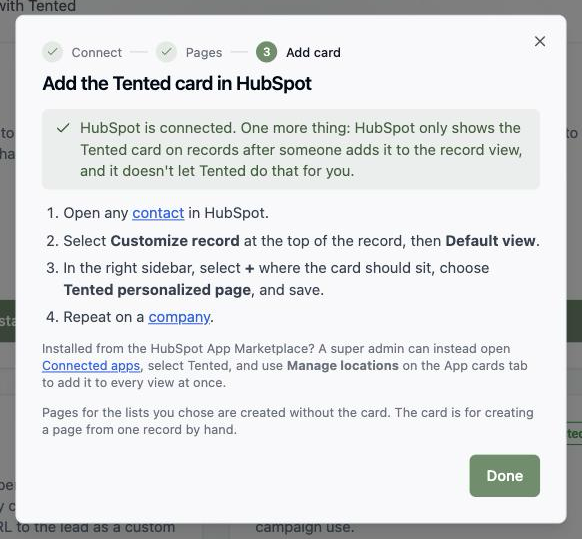

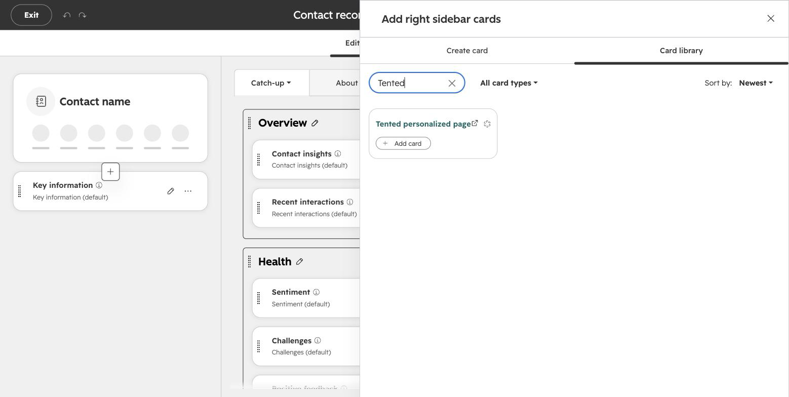

If you installed Tented from the HubSpot App Marketplace, a Super Admin can add it to every view at once instead: open **Settings → Integrations → Connected apps**, select **Tented**, open the **App cards** tab, and select **Manage locations**.

<Note>
Pages for the lists you chose in Step 2 are created without the card. The card is for creating a page from one record by hand.
</Note>

## Step 4: Create a page from a record

Open any contact or company in HubSpot. The **Tented personalized page** card sits in the right sidebar.

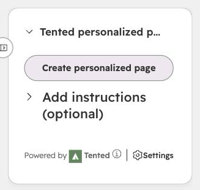

- Select **Create personalized page**. Expand **Add instructions** first if this page needs something specific, such as leading with a recent funding round.
- The card shows **Creating the page…** while Tented works, usually one to three minutes. You can leave the record; the Tented properties update when it's done.
- When the page is ready, the card shows the link, the summary, and the link sentence to paste into an email.

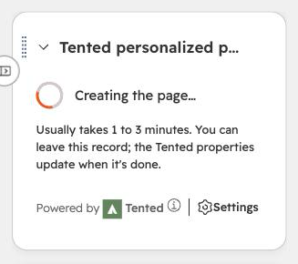

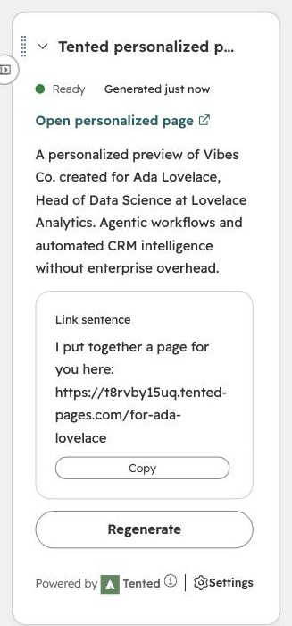

To replace a page, select **Regenerate** on the card. The record keeps its old link until the new page is ready.

<Tip>
Don't see the card? It hasn't been added to the record view yet. See [Step 3](#step-3-add-the-tented-card-to-records).
</Tip>

## Using the fields in HubSpot

Tented writes these properties to every contact or company it makes a page for:

| Property | What it holds |
| --- | --- |
| `tented_page_url` | The published page's link |
| `tented_page_summary` | A one-line description of the page |
| `tented_page_offer` | The link sentence, ready to paste |
| `tented_page_reference` | The follow-up sentence |
| `tented_page_status` | `Generating`, `Ready`, or `Failed` |
| `tented_page_generated_at` | When the page was last published |

Insert them as personalization tokens wherever HubSpot offers its **Personalize** menu, such as a sequence step, a sales email template, or a marketing email: pick the contact (or company) property named **Tented page offer**. Filter a list or branch a workflow on **Tented page URL is known** so only records with a live page get the step that links to it. Prefer the URL over **Tented page status is Ready**: while a page is being regenerated the status reads **Generating** for a few minutes even though the existing link still works.

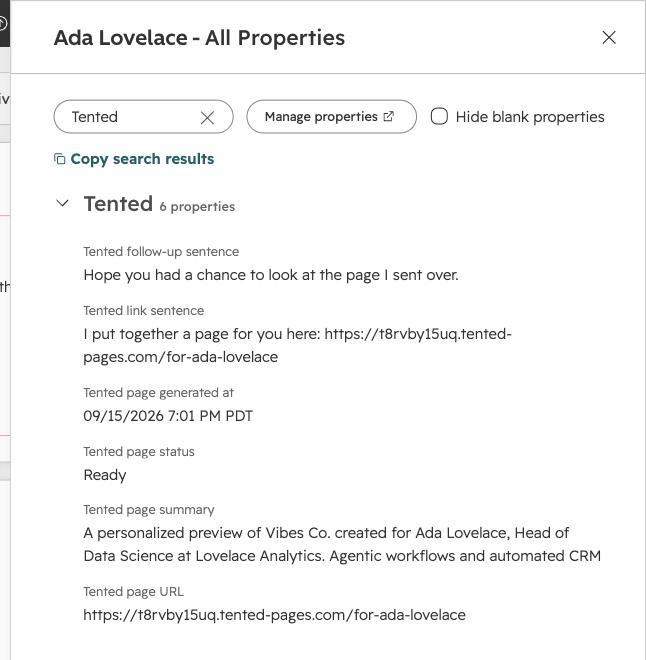

## What happens after connecting

- The HubSpot tile shows **Connected**, the account, and which lists create pages automatically.
- Pages are published at readable URLs under your Tented domain, such as `https://your-domain/for-ada-from-analytical-engines` for a contact or `https://your-domain/for-acme-co` for a company.
- Select **View activity** on the tile to see each sync, how many pages were created, and any records Tented skipped and why. **Sync now** checks your lists straight away instead of waiting for the next pass.
- Generated tents appear in your Tents list with **HubSpot Integration** as the creator. Use **Filter → Hide integration-created** to keep them out of the way.

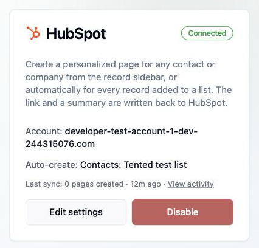

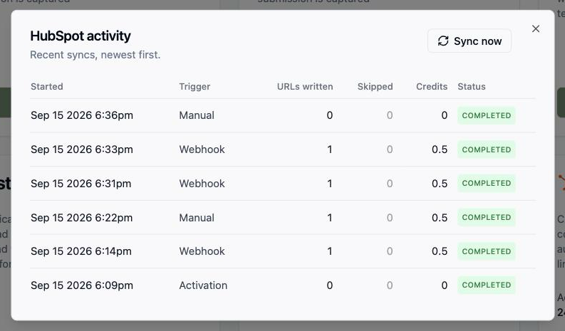

## Changing settings

Select **Edit settings** on the HubSpot tile to change the template, the watched lists, the prompt, or the sentences. Records that already have a page are not regenerated when settings change.

## Disconnecting

Select **Disable** on the HubSpot tile. Tented stops creating pages for new list members and the card in HubSpot shows as not connected. Pages already generated, and the Tented properties already written to your records, are not deleted.

If contact sync was on, the **HubSpot fields** group and its values are removed from every contact; the contacts themselves, and everything in their standard fields, stay in Tented. The confirmation names any lists or flows whose rules use those fields. Those keep running (a rule on a removed field simply matches nobody) and show **Needs attention** until you change the rule.

Uninstalling the Tented app from HubSpot (**Settings → Integrations → Connected apps**) is noticed by Tented once HubSpot's current access token expires, usually within 30 to 45 minutes: the tile shows **Paused** with **HubSpot access was revoked**, and any requests that were waiting are kept until you select **Reconnect HubSpot**. To remove the connection entirely, select **Disable** in Tented as well.

<Warning>
Uninstalling the app in HubSpot also removes the Tented card from every record view. After you reconnect or reinstall, add the card again as in [Step 3](#step-3-add-the-tented-card-to-records); the pages and properties on your records are unaffected.
</Warning>

## Troubleshooting

| What you see | What it means | What to do |
| --- | --- | --- |
| **Paused: out of AI credits** | Your workspace ran out of credits | Add credits; pages resume automatically |
| **Paused: published-tent limit reached** | Your plan's published page limit is full | Unpublish pages or upgrade |
| **Paused: HubSpot access was revoked** | The app was uninstalled in HubSpot, or the user who connected it lost access | Select **Reconnect HubSpot** on the tile |
| **Paused** with a settings message | The template or a watched list is no longer usable | Select **Review settings** |
| No Tented card on contact or company records | The card hasn't been added to the record view | Follow [Step 3](#step-3-add-the-tented-card-to-records) |
| The card says **Connect this HubSpot account to Tented** | This HubSpot account isn't connected to a Tented workspace | Connect from **Settings → Integrations** in Tented |
| **This HubSpot account is already connected to another Tented workspace** | One HubSpot account can only feed one workspace | Disconnect it there first |
| The card shows **Failed** | Generation didn't complete, or the record was deleted while it ran | Select **Try again**; check the Activity dialog for the reason |
| A list member didn't get a page | It already had one, or it joined before the list was chosen | Open the record and use the card |
| **This mapping needs N custom field slots but the workspace has M left** | Your workspace is near its custom-field allowance | Remove HubSpot fields from the mapping, or archive unused custom fields in People settings |
| **Paused** with **Contact sync: "property" no longer exists in HubSpot** | A mapped property was deleted in HubSpot | Select **Edit** next to Contacts and remove or replace the field |
| A list or flow shows **Needs attention** | A rule uses a HubSpot field that was removed when the integration was disconnected | Open the rule and replace the condition |
