Tented connects to [Origami](https://origami.chat) so every qualified prospect in an Origami lead table gets a personalized landing page, built from one of your approved templates. Tented writes each page's URL back to the table and, when you pick a campaign, adds it to the prospect's campaign record so your emails can link to it.

This guide covers connecting the two, turning on live sync, using the link in a campaign, and what to expect afterwards.

## Prerequisites

Before you begin, make sure you have:

- **Admin access** to your Tented workspace. Connecting, changing settings, and disconnecting are admin-only.
- **An approved tent template** in Tented. Pages are generated from a template's approved version. See [Templates](/working-with-tents/tent-templates) if you don't have one yet.
- **An Origami API key**. In Origami, go to **Settings → Developers → API keys** and create a key. A member key is fine.
- **AI credits**. Each generated page uses half a credit.

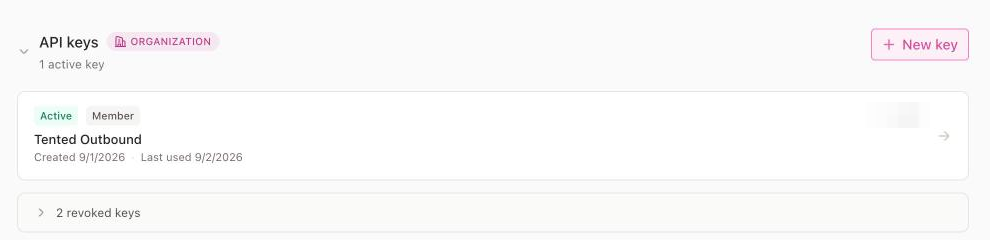

## Step 1: Connect Origami

1. In Tented, open **Settings → Integrations**.
2. On the **Origami** tile, select **Connect**.

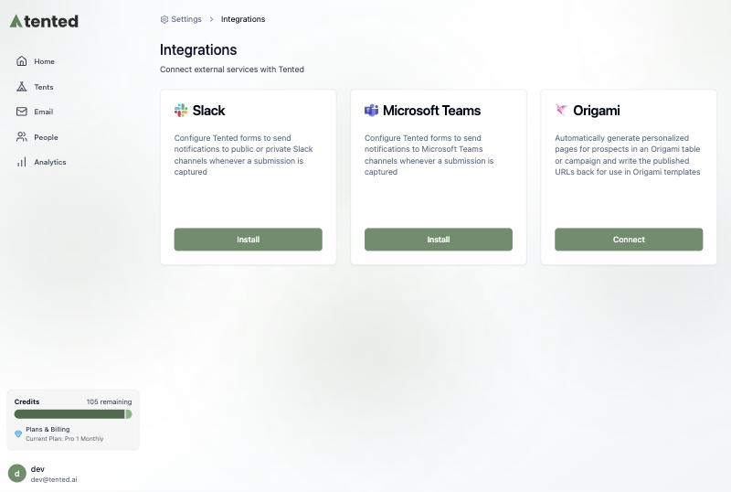

3. Paste your Origami API key and select **Continue**. Tented checks the key with Origami before moving on.

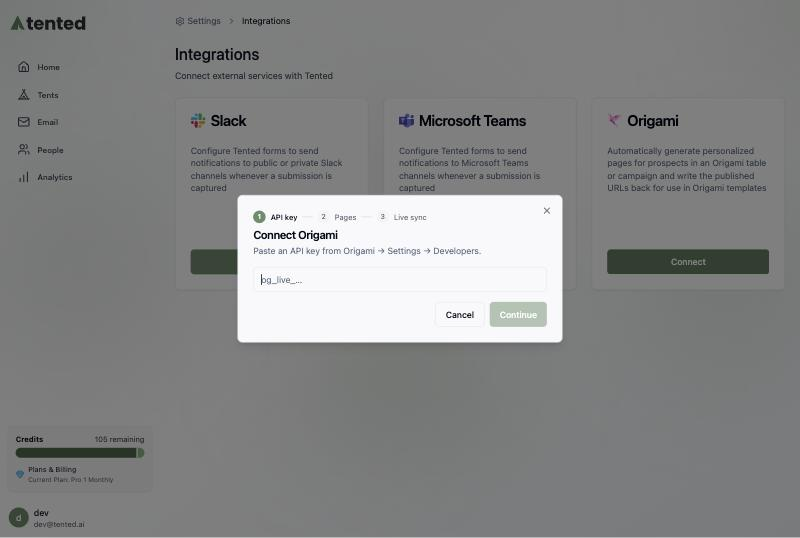

## Step 2: Choose what to generate

Pick the table to work from, the campaign to enroll into, and the template to build pages with.

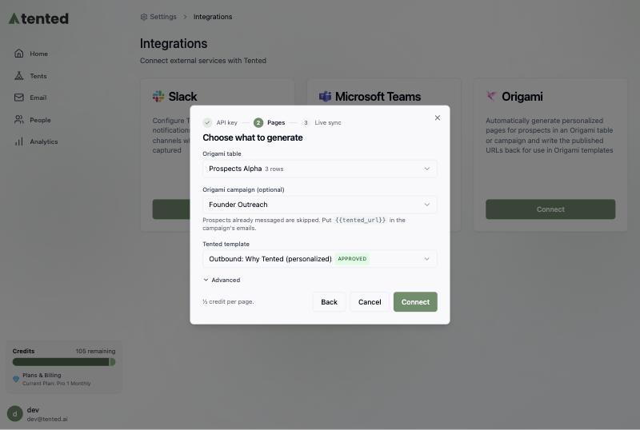

- **Origami table**: the lead table whose prospects should get pages. Tented adds two columns to it, **Tented Personalized URL** and **Tented Page Summary**, and fills them in as pages are published.
- **Origami campaign (optional)**: the campaign to enroll prospects into once their page exists. Prospects the campaign has already messaged are skipped, so connecting to a running campaign never generates pages for people who already heard from you.
- **Tented template**: the approved template each page starts from. The page is personalized to the prospect's company, role, and industry using the row's data.

Select **Advanced** to adjust two more settings:

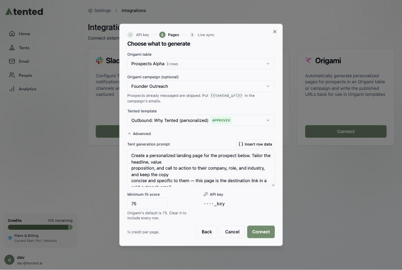

- **Tent generation prompt**: the instructions Tented gives the model for each page. `{{origami.rowData}}` is replaced with the prospect's row data; use **Insert row data** to place it.
- **Minimum fit score**: only prospects Origami scored at or above this number get a page. The default is 75, which matches Origami's own table view. Clear it to include every row.

Select **Connect**. Tented immediately starts generating pages for every qualifying prospect that doesn't have a URL yet.

<Note>
Each page uses half an AI credit. If your workspace runs out of credits, the integration pauses and resumes on its own once credits are available again.
</Note>

## Step 3: Turn on live sync

Without live sync, Tented checks the table for new prospects every 15 minutes. With live sync, Origami tells Tented the moment a table run completes, so new prospects get a page within seconds.

If your API key is an admin key, Tented registers the webhook itself and this step shows **Live sync is on**. With a member key, Tented walks you through creating the endpoint in Origami:

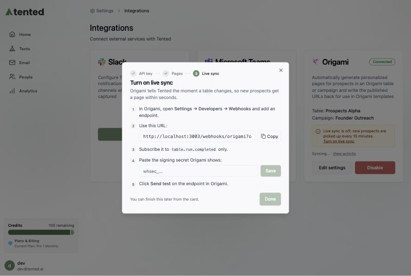

1. In Origami, go to **Settings → Developers → Webhooks** and select **New endpoint**.
2. Paste the **endpoint URL** shown in Tented (use the **Copy** button).
3. Under **Event types**, check only `table.run.completed`.

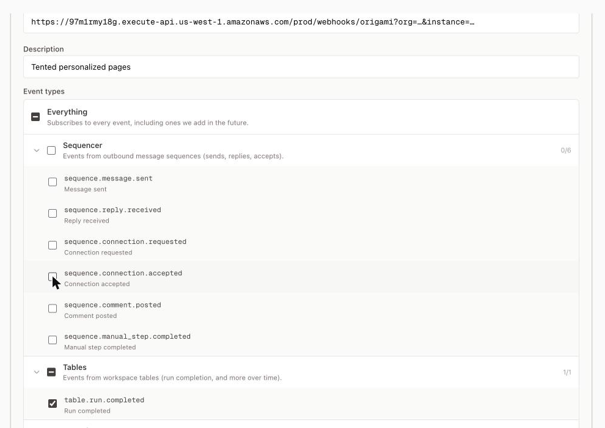

4. Select **Create endpoint**. Origami shows the endpoint's **signing secret** once. Copy it.
5. Back in Tented, paste the secret and select **Save**. Tented now waits for a test delivery.
6. In Origami, open the endpoint you just created and select **Send test**. Tented verifies the signature and the step changes to **Live sync is on**.

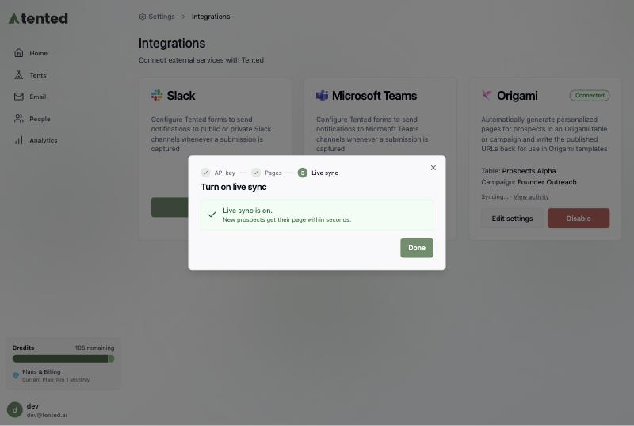

<Tip>
If you close the dialog before finishing, the Origami tile keeps a **Turn on live sync** link that reopens this step. Scheduled syncs run every 15 minutes in the meantime.
</Tip>

## Using the link in your Origami campaign

When a campaign is selected, Tented adds two fields to that campaign's person schema and fills them in for every prospect it enrolls:

| Field | Contents |
|---|---|
| `tented_url` | The prospect's personalized page URL |
| `tented_page_summary` | A one-line description of what the page shows |

Reference them in the campaign's email template like any other person field, for example:

```
I put together a quick page showing how this could look for {{company}}: {{tented_url}}
```

Two things to keep in mind:

- **Only add the link where it can't be blank.** Prospects the campaign already messaged never get a page, so put `{{tented_url}}` in the first step, or instruct Origami's writer to leave the sentence out when the field is empty.
- **Auto Lead Refill works with this.** When Origami adds a prospect to the campaign on its own, Tented fills in their URL on its next sync and asks Origami to re-render any steps that haven't been sent yet. To make sure the link exists before the first email goes out, give the first step a short delay or turn on **Approve messages before sending** in the campaign settings.

<Tip>
You can ask the Origami agent to make the template change for you. Tell it to add one sentence to step one that offers the page with `{{tented_url}}`, to use `tented_page_summary` to say what the page shows, and to omit the sentence entirely when `tented_url` is empty.
</Tip>

## What happens after connecting

The Origami tile shows the connected table and campaign, the last sync, and a **View activity** link.

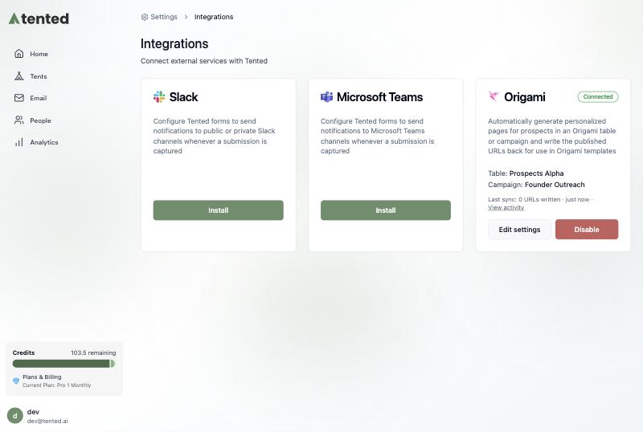

**Page URLs are readable.** Each page publishes at a path built from the prospect's name and company, for example `https://your-domain/for-bryan-from-acme-co`. When a row has no company, the path uses the first and last name instead.

**Activity** lists each sync run with the URLs written, prospects skipped, and credits used. Select a skipped count to see which prospects were skipped and why. **Sync now** starts a run immediately.

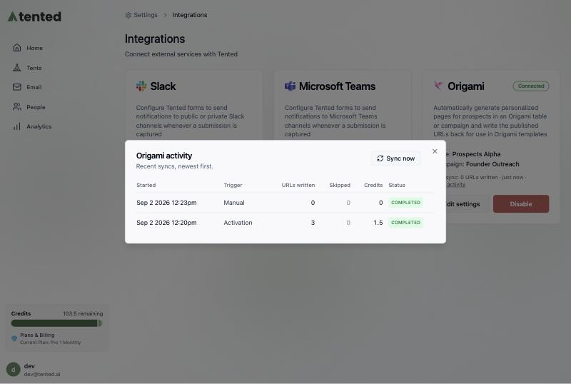

**Generated tents** appear in your Tents list with "Origami Integration" as the creator. Use **Filter → Hide integration-created** to keep them out of the way while you work on other tents.

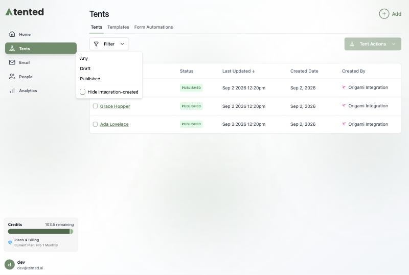

## Changing settings

Select **Edit settings** on the tile to change the table, campaign, template, prompt, or fit score. Changes apply to prospects that don't have a page yet; existing pages and URLs are left alone. Switching campaigns never enrolls prospects who already have a URL into the new campaign.

To use a different Origami API key, select **Disable** and connect again with the new key.

## Disconnecting

Select **Disable** on the Origami tile. Tented stops generating pages for new prospects and removes the webhook it registered. Pages already generated, and URLs already written to your table and campaign, are not deleted.

## Troubleshooting

| What you see | What it means | What to do |
|---|---|---|
| **Paused: out of AI credits** | The workspace has no credits left for new pages. | Add credits. The integration resumes on its own. |
| **Paused: published-tent limit reached** | Your plan's limit on published tents is reached. | Unpublish tents or upgrade your plan. |
| **Paused: Origami rejected the API key** | The key was revoked or rotated in Origami. | Disable the integration and connect again with a current key. |
| **Paused: table or template no longer usable** | The table was deleted in Origami, or the template lost its approval. | Open **Edit settings** and pick a valid table or template. |
| **Live sync is off** | Origami hasn't been given a webhook endpoint yet. | Select **Turn on live sync** and follow Step 3. Scheduled syncs still run every 15 minutes. |
| A prospect is listed as skipped | Most often the campaign already messaged them, or the row has no email or LinkedIn URL to match on. | Select the skipped count in **Activity** for the reason. Fix it in Origami and sync again. |

---

Need help? Contact us at [support@tented.ai](mailto:support@tented.ai).

<Card
  title="Next: Setting Up Email Notifications"
  icon="arrow-right"
  href="/integrations/setting-up-email-notifications"
>
  Learn how to set up email notifications for form submissions.
</Card>
