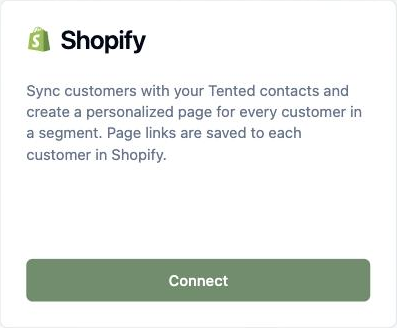
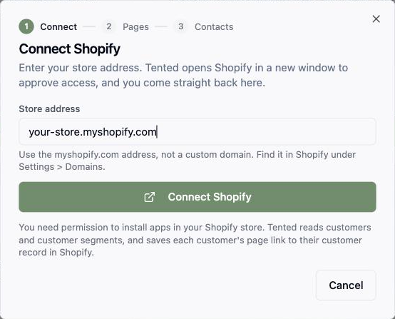
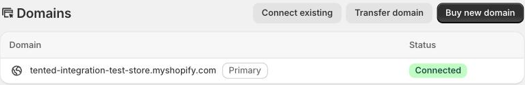
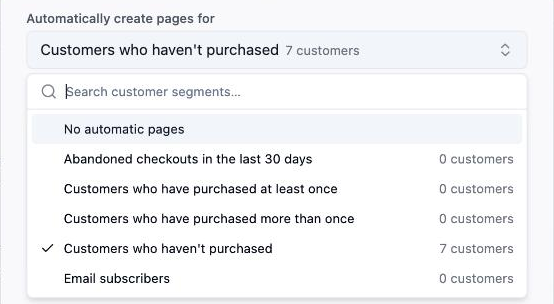
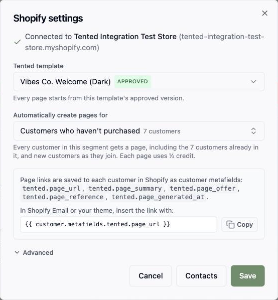
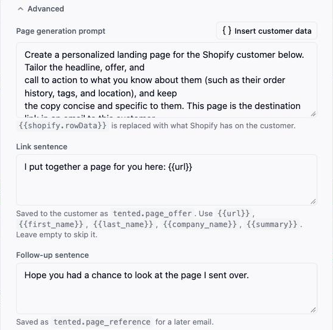
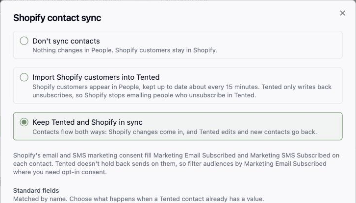
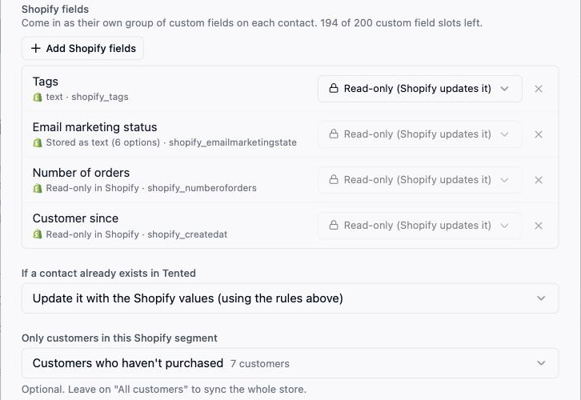
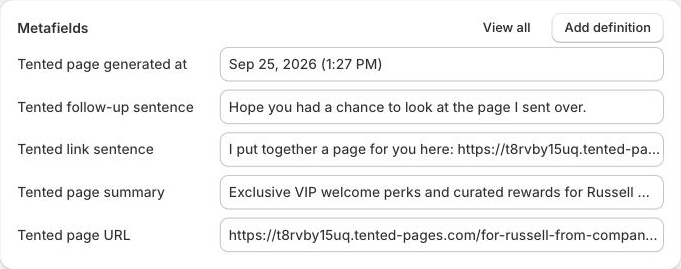
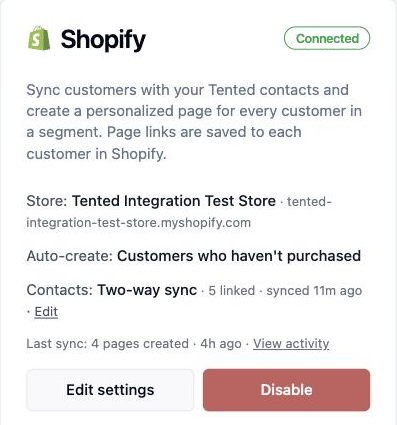

Tented connects to [Shopify](https://www.shopify.com) so every customer in a segment you choose gets a personalized landing page built from one of your approved templates. Tented saves the page link, a short summary, and two ready-made sentences to each customer as metafields, so Shopify Email, your theme, and other apps can use them. Tented can also keep your Shopify customers in **People**, including their email marketing consent.

This guide covers connecting your store, choosing a segment, syncing customers, using the metafields in Shopify, and what to expect afterwards.

## Prerequisites

Before you begin, make sure you have:

- **Admin access** to your Tented workspace. Connecting, changing settings, and disconnecting are admin-only.
- **An approved tent template** in Tented. Pages are generated from a template's approved version. See [Templates](/working-with-tents/tent-templates) if you don't have one yet.
- **Permission to install apps in your Shopify store.** Store owners have it; staff need permission to install apps.
- **Your store's myshopify.com address**, such as `acme.myshopify.com`. Find it in Shopify under **Settings → Domains**. A custom domain won't work here.
- **AI credits**. Each generated page uses half a credit.

## Step 1: Connect Shopify

1. In Tented, open **Settings → Integrations**.
2. On the **Shopify** tile, select **Connect**.
3. Enter your store address and select **Connect Shopify**.
4. Shopify opens in a new window. Review the access Tented asks for and select **Install**. The window closes on its own and Tented moves to the next step.





Not sure of your store address? Shopify lists it under **Settings → Domains**. It's the one ending in `.myshopify.com`:



Tented asks for permission to read and update customers and to read orders. It uses them to read customers and segments, write the page link to each customer, keep contacts in sync if you turn that on, and add a customer's recent purchases to their page.

<Note>
One Shopify store can feed one Tented workspace. To connect a different store, disconnect the current one first.
</Note>

## Step 2: Choose a segment

The **Pages** step sets what Tented generates.

- **Tented template**: the approved template each page starts from. Tented picks your most recently approved template; change it if you like.
- **Automatically create pages for**: pick a Shopify **customer segment**, or leave it on **No automatic pages** to only connect for now. Each segment shows how many customers are in it.



Every customer in the segment gets a page, including customers already in it when you choose it. After that, Tented checks the segment about every 15 minutes (or straight away when you select **Sync now** on the tile) and creates a page for each new member. A customer who already has a page is not given another.



Pages are personalized with what Shopify has on the customer: name, company, city and country, customer tags, number of orders, when they became a customer, and what they bought recently. Email addresses, phone numbers, street addresses, notes, and amounts spent are never put on a page, because pages are public.

<Tip>
Build the segment in Shopify first (**Customers → Segments**), for example "customers who haven't purchased" or "bought in the last 90 days", then pick it here.
</Tip>

### Advanced

Expand **Advanced** to change the copy Tented works from:



- **Page generation prompt**: the instructions each page is generated with. `{{shopify.rowData}}` is replaced with what Shopify has on the customer (see above).
- **Link sentence**: saved to the customer as `tented.page_offer`. Use `{{url}}`, `{{first_name}}`, `{{last_name}}`, `{{company_name}}`, and `{{summary}}`. Leave it empty to skip it.
- **Follow-up sentence**: saved as `tented.page_reference` for a later email.

Select **Next: Contacts** to choose whether to sync customers (below), then **Connect**.

## Syncing customers (optional)

Tented can also keep your Shopify customers in **People**, so lists, flows, and emails in Tented work off the same people as your store. You choose this during setup on the **Contacts** step, and can change it later with **Edit** next to **Contacts** on the Shopify tile.

Pick one of three options:

- **Don't sync contacts.** Customers stay in Shopify. Pages still work.
- **Import Shopify customers into Tented.** Customers appear in People and are kept up to date about every 15 minutes. Tented only writes back one thing: when someone unsubscribes in Tented, their Shopify email marketing status becomes **Unsubscribed**, so Shopify stops emailing them too.
- **Keep Tented and Shopify in sync.** Changes flow both ways: Shopify changes come in, and Tented edits and new Tented contacts go back to Shopify as customers.



### Standard fields

Shopify's standard customer fields (first and last name, email, phone, company, address, and email and SMS consent) are matched to Tented's fields for you. For each one, choose what happens when a Tented contact already has a value, exactly as in a list import: **Overwrite** or **Do Nothing**. With two-way sync the rule works the same way in the other direction: a **Do Nothing** field is only filled in on Shopify's side, never replaced.

Company and address come from the customer's default address in Shopify and are read-only: Tented doesn't change them in Shopify.

### Email and SMS consent

Shopify keeps a marketing consent status for each customer's email and phone. Tented maps it both ways:

- **Unsubscribes from Shopify.** A customer whose email marketing status becomes **Unsubscribed** in Shopify is unsubscribed in Tented. It only ever unsubscribes: a customer who resubscribes in Shopify is not resubscribed in Tented.
- **Unsubscribes from Tented.** A contact who unsubscribes in Tented (from an email's unsubscribe link, or by hand) has their Shopify email marketing status set to **Unsubscribed**. This happens with import and with two-way sync, for contacts linked to a Shopify customer.
- **Consent.** Shopify's email and SMS consent fill **Marketing Email Subscribed** and **Marketing SMS Subscribed** on each contact: **Yes** only when the status is **Subscribed**. Tented doesn't hold back sends based on these fields. Where you need opt-in consent, filter the audience by **Marketing Email Subscribed**.

Consent changes made in Shopify reach Tented on the next sync, usually within 15 minutes.

### Shopify fields

Other customer data can come along too. Select **Add Shopify fields** and pick what you want: email or SMS marketing status, tags, note, number of orders, amount spent, last order date, customer since, language, account status, and any customer metafields your store has defined. For each field choose:

- **Read-only.** Shopify owns the value; it shows on the contact but can't be edited in Tented.
- **Editable.** Available with two-way sync for tags, note, and your own metafields. Edits in Tented are sent back to Shopify.

Order counts, amounts, dates, and other fields Shopify calculates are always read-only. These arrive as a **Shopify fields** group on every contact, next to your own custom fields. Each one uses a custom field slot from your workspace's allowance; the step shows how many are left.



### Matching and duplicates

Contacts are matched on email, then phone. **If a contact already exists in Tented**, choose whether to update it using the field rules above or skip it.

Once a contact is linked to a Shopify customer, that link is what identifies it. An email or phone changed in Shopify updates the same Tented contact rather than creating another.

### Limiting the sync to a segment

**Only customers in this Shopify segment** limits the sync to one segment; leave it on **All customers** to sync the whole store. Customers in the segment come in and, with two-way sync, go back.

A customer who leaves the segment stops syncing from their next change onward, and picks up again when they rejoin. Contacts created in Tented are the one exception: once Tented has created them in Shopify they stay in step whether or not they're in the segment. Contacts that came from a list import or another integration are not sent to Shopify while the sync is limited to a segment.

<Note>
With two-way sync, contacts Tented creates in Shopify are new customers there, and they join any segment whose conditions they match. If you create pages for that segment, they get pages too.
</Note>

### The first sync

The first sync reads every customer in the store (or the chosen segment) and imports them in one run. It shows in **People → Past imports** as a Shopify initial sync. After that, Tented picks up changes about every 15 minutes. Contacts created by the sync show **Shopify** as their source.

The **Contacts** line on the Shopify tile shows the sync mode, how many contacts are linked, and when the last sync ran. If Shopify refuses a contact, the tile shows how many weren't accepted and why; a refused contact is sent again the next time it changes in Tented.

## Using the page link in Shopify

Tented saves five customer metafields in the `tented` namespace to every customer it makes a page for. They show under **Metafields** on the customer in Shopify.



| Metafield | Name in Shopify | What it holds |
| --- | --- | --- |
| `tented.page_url` | Tented page URL | The published page's link |
| `tented.page_summary` | Tented page summary | A one-line description of the page |
| `tented.page_offer` | Tented link sentence | The link sentence, ready to use in an email |
| `tented.page_reference` | Tented follow-up sentence | The follow-up sentence |
| `tented.page_generated_at` | Tented page generated at | When the page was last published |

Use them anywhere Shopify supports Liquid for customers, such as Shopify Email, notification templates, or your theme:

```liquid
{{ customer.metafields.tented.page_url }}
```

To show the link only to customers who have a page, wrap it in a check:

```liquid

  <a href="{{ customer.metafields.tented.page_url }}">See your page</a>

```

To email only those customers, send to the segment you chose in [Step 2](#step-2-choose-a-segment): its members are the customers Tented makes pages for. A customer who just joined gets their page within about 15 minutes, so the check above keeps the email tidy in the meantime.

## What happens after connecting

- The Shopify tile shows **Connected**, the store, and which segment creates pages automatically.
- Pages are published at readable URLs under your Tented domain, such as `https://your-domain/for-ada-from-analytical-engines`.
- Select **View activity** on the tile to see each sync, how many pages were created, and any customers Tented skipped and why. **Sync now** checks your segment straight away instead of waiting for the next pass.
- Generated tents appear in your Tents list with **Shopify Integration** as the creator. Use **Filter → Hide integration-created** to keep them out of the way.



## Changing settings

Select **Edit settings** on the Shopify tile to change the template, the segment, the prompt, or the sentences. Customers who already have a page are not given a new one when settings change.

## Disconnecting

Select **Disable** on the Shopify tile. Tented stops creating pages for customers who join the segment. Pages already generated, and the metafields already saved to your customers, are not deleted.

If contact sync was on, the **Shopify fields** group and its values are removed from every contact; the contacts themselves, and their standard fields, stay in Tented. The confirmation names any lists or flows whose rules use those fields. Those keep running (a rule on a removed field matches nobody) and show **Needs attention** until you change the rule.

### Uninstalling the app in Shopify

If you uninstall Tented in Shopify (**Settings → Apps**), the Shopify tile shows **Paused** with **Shopify access was revoked or the Tented app was uninstalled from the store** within a minute. The metafields on your customers stay in Shopify.

To pick up where you left off, select **Reconnect Shopify** on the tile and approve access again. Your segment, contact sync settings, and contact links are kept.

<Warning>
Shopify asks every app to delete a store's data 48 hours after it's uninstalled. If you haven't reconnected by then, Tented disconnects the store for you: the **Shopify fields** and contact links are removed, as with **Disable**. Contacts and pages stay. Reconnect within 48 hours to keep everything as it was.
</Warning>

## Privacy requests

Tented handles the privacy requests Shopify sends on your customers' behalf:

- **Customer erasure.** When you erase a customer's personal data in Shopify, Tented deletes that customer's page. A contact the sync created in Tented is deleted; a contact that already existed in Tented is kept, but loses its link to Shopify and its Shopify field values.
- **Customer data requests** are recorded for your records. Tented holds the same customer data you can already see in People.

## Troubleshooting

| What you see | What it means | What to do |
| --- | --- | --- |
| **Enter your store's myshopify.com address** | The address isn't a myshopify.com address | Use the address from **Settings → Domains** in Shopify, such as `acme.myshopify.com` |
| **This Shopify store is already connected to another Tented workspace** | One store can only feed one workspace | Disconnect it there first |
| **The Shopify window closed before finishing** | The Shopify window was closed before you selected **Install** | Select **Connect Shopify** again |
| **Paused: out of AI credits** | Your workspace ran out of credits | Add credits; pages resume automatically |
| **Paused: published-tent limit reached** | Your plan's published page limit is full | Unpublish pages or upgrade |
| **Paused: Shopify access was revoked or the Tented app was uninstalled** | The app was uninstalled in Shopify | Select **Reconnect Shopify** on the tile |
| **Paused** with **The Shopify segment "…" no longer exists** | The segment was deleted in Shopify | Select **Edit settings** and pick another segment |
| A new segment member doesn't have a page yet | Tented checks about every 15 minutes; very large segments are checked about hourly | Select **Sync now**, or wait for the next check |
| **This customer no longer exists in Shopify** in the activity | The customer was deleted before their page was made | Nothing to do |
| A customer unsubscribed in Shopify still shows **Marketing Email Subscribed** in Tented | The next sync hasn't run yet | Wait up to 15 minutes |
| A list or flow shows **Needs attention** | A rule uses a Shopify field that was removed from the mapping or with the disconnect | Open the rule and replace the condition |
