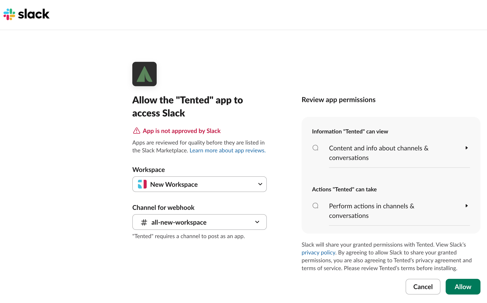
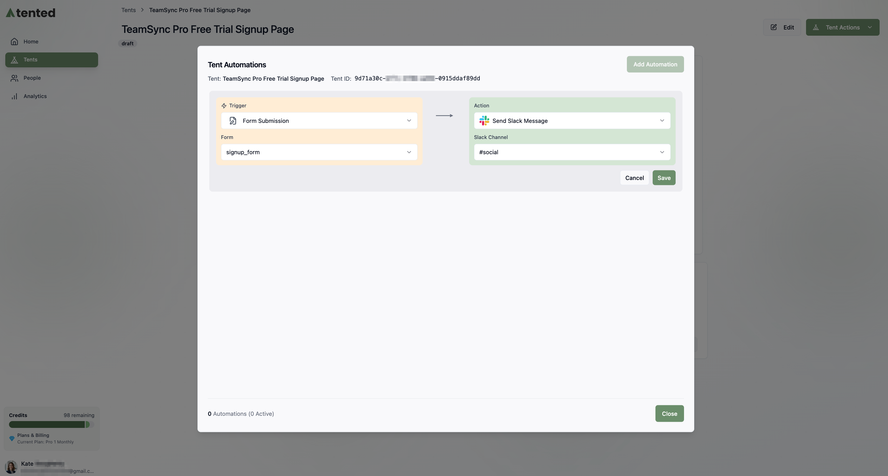

Tented integrates with Slack to send real-time notifications when forms are submitted on your published tents. This guide walks you through connecting your Slack workspace to Tented and configuring a Slack automation.

## Prerequisites

Before you begin, ensure you have:

- **Admin access** to your Tented workspace
- **Permission to install apps** in your Slack workspace (or access to request app installation from your Slack admin)

## Step 1: Connect Slack in Workspace Settings

1. In Tented, click on your **profile icon** in the bottom-left corner.
2. Select **Workspace Settings** from the menu.
3. In the **Integrations area**, select **Add Integrations**. (If you already set up an integration, the button says **Manage Integrations**.)
4. On the **Integrations** page select **Install** on the **Slack** tile.

5. A Slack page opens in a new tab. Select the Slack workspace and channel the notifications should go to.
6. Review the permissions information and select **Allow** if you agree.

7. A confirmation message that Slack is connected to Tented appears. Close the tab and return to Tented.

<tip>
You can also connect Slack when setting up an automation for a specific tent. If Slack is not yet connected to your Tented workspace, you will be prompted to connect it during the automation setup process.
</tip>

## Step 2: Set Up a Slack Automation in Your Tent

Now that Slack is connected to your Tented workspace, you need to set up an automation to send notifications for form submissions.

**Set Up Form Submission Notifications:**
1. Fron the **Tent Details** page of the tent you want to set up notifications for, select the **Add Automation** button. (If you already set up an automation, the button says **Manage Automations**.)
2. In the **Tent Automations** window, select **Add Automation**.
3. On the left, under **Trigger**, select **Form Submission**.  
4. Under the trigger, select the form you want notifications for from the dropdown list. The list shows all forms in the tent.
5. On the right, under **Action**, select **Send Slack Message**.
6. Select the **Slack Channel** you want notifications sent to.
7. Select **Save** to finish.
8. Select **Close** to exit the **Tent Automations** window.

---

Need help? Contact us at [support@tented.ai](mailto:support@tented.ai).

<Card
  title="Next: Setting Up Email Notifications"
  icon="arrow-right"
  href="/integrations/setting-up-email-notifications"
>
  Learn how to set up email notifications for form submissions.
</Card>