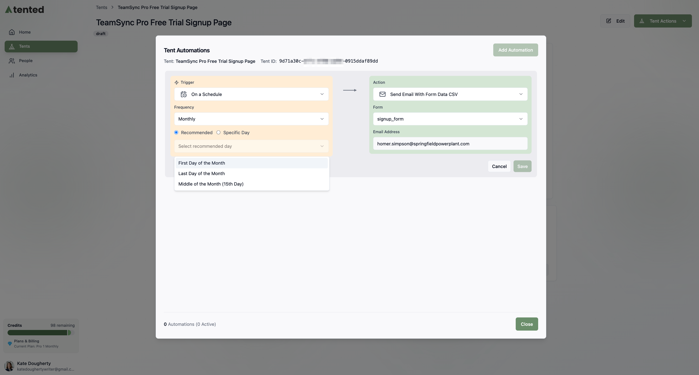

Tented can send notifications to your email when forms are submitted on your published tents. This guide walks you through the setup process.

**Set Up Scheduled Email Notifications**

Scheduled notifications can be sent daily, weekly, or monthly to a specified email address. When you choose a specific time of day, the time follows the timezone associated with your Tented workspace.

1. Fron the **Tent Details** page of the tent you want to set up notifications for, select the **Add Automation** button. (If you already set up an automation, the button says **Manage Integrations**.)
2. In the **Tent Automations** window, select **Add Automation**.
3. On the left, under **Trigger**, select **On a Schedule**.
4. Under the trigger, select the frequency with which you want to receive notifications. The options are **Daily**, **Weekly**, and **Monthly**.
5. Select the specific time or day (if applicable) for the notifications to be sent. If you selected **Daily**, choose the time of day. If you selected **Weekly**, choose the day of the week and time. If you selected **Monthly**, choose one of the **Recommended** options: **First Day of the Month**, **Last Day of the Month**, or **Middle of the Month (15th Day)**. You can also choose a specific day and time.
6. On the right, under **Action**, select **Send Email With Form Data CSV**.
7. Select **Save** to finish.
8. Select **Close** to exit the **Tent Automations** window.

