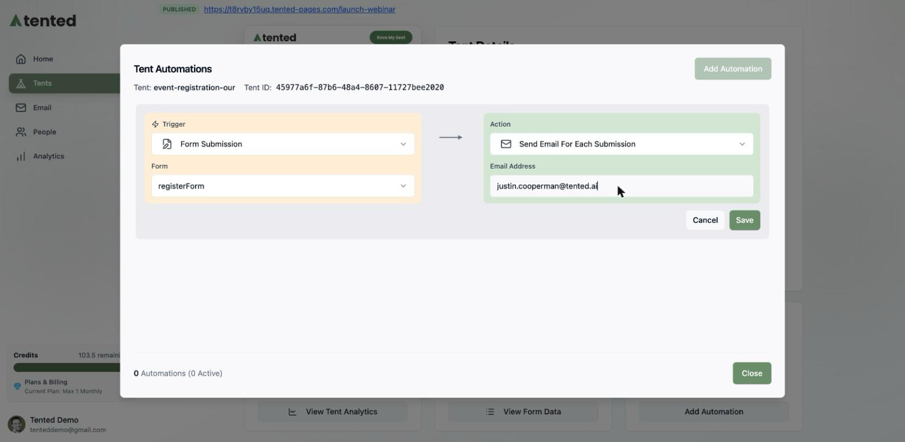
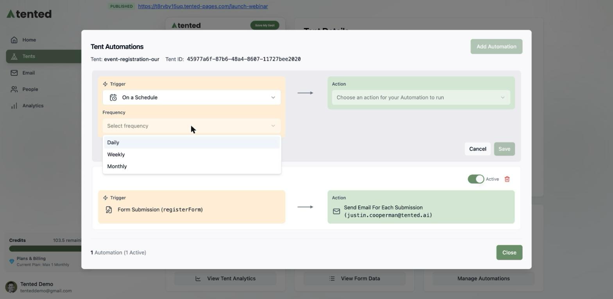

Tented can email you when forms are submitted on your published tents. There are two flavors, both set up as [form automations](/working-with-tents/form-automations): an instant email for every submission, or a scheduled digest with your form data attached as a CSV.

## Instant Notifications (Per Submission)

1. From the **Tent Details** page, select **Add Automation** (or **Manage Automations** if you already have some).
2. In the **Tent Automations** window, select **Add Automation**.
3. On the left, under **Trigger**, select **Form Submission**, then pick the form to watch.
4. On the right, under **Action**, select **Send Email For Each Submission**.
5. Enter the **email address** that should receive the notifications.
6. Select **Save** to finish.

## Scheduled Digest (Daily, Weekly, or Monthly)

Scheduled notifications deliver your form data on a cadence — great for a Monday-morning leads review. Times follow the timezone associated with your Tented workspace.

1. From the **Tent Details** page, select **Add Automation** (or **Manage Automations**).
2. In the **Tent Automations** window, select **Add Automation**.
3. On the left, under **Trigger**, select **On a Schedule**.
4. Choose the **frequency** — **Daily**, **Weekly**, or **Monthly** — and the specific time (and day, if applicable). Monthly offers handy presets: first day, last day, or middle of the month.
5. On the right, under **Action**, select **Send Email With Form Data CSV** and enter the recipient address.
6. Select **Save** to finish.

<Tip>
  Saved automations are active immediately. You can pause or delete them anytime from the **Tent Automations** window, or see them all across tents under **Tents > Form Automations**.
</Tip>

<Card
  title="Related: Form Automations"
  icon="bolt"
  href="/working-with-tents/form-automations"
>
  The full guide to triggers, actions, and managing automations.
</Card>
