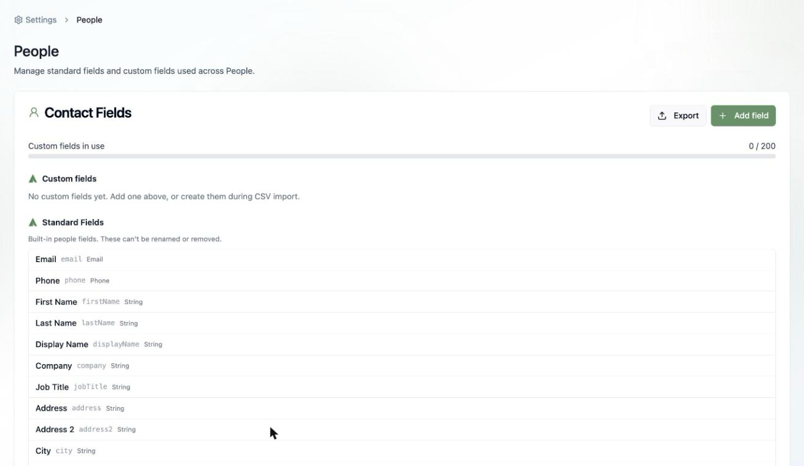
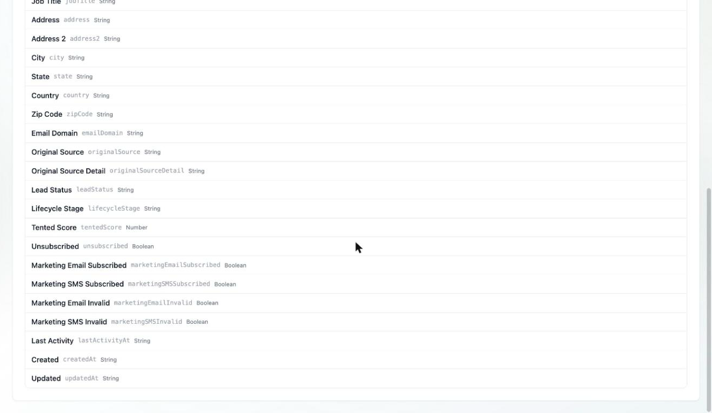
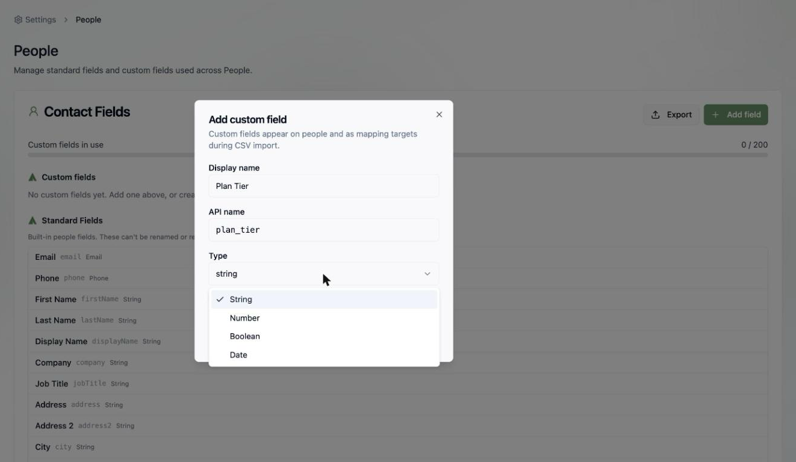
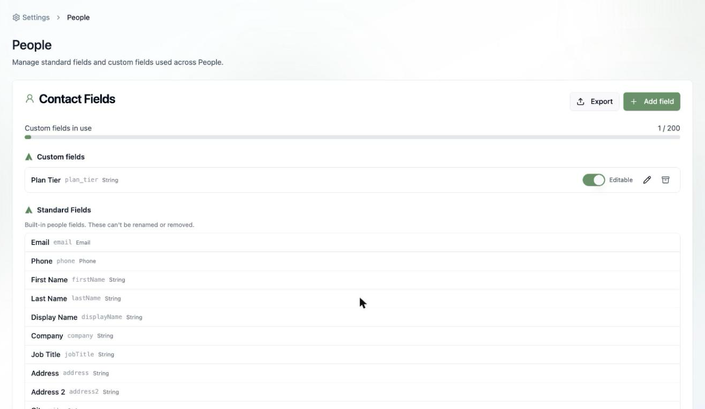

## Where fields live

Every contact in your People database is built from **fields**. Tented ships with a rich set of standard fields, and you can extend them with up to **200 custom fields** of your own.

Manage them all in one place: **Workspace Settings > People > Manage Fields** (or **Settings > People**). From here you can also **Export** your full field schema.

## Standard fields

Standard fields are built in — they can't be renamed or removed, and every contact has them:

| Group | Fields |
|---|---|
| **Identity** | Email, Phone, First Name, Last Name, Display Name, Company, Job Title |
| **Address** | Address, Address 2, City, State, Country, Zip Code |
| **Enrichment & source** | Email Domain, Original Source, Original Source Detail |
| **Lifecycle** | Lead Status, Lifecycle Stage, Tented Score |
| **Email & SMS status** | Unsubscribed, Marketing Email Subscribed, Marketing SMS Subscribed, Marketing Email Invalid, Marketing SMS Invalid |
| **Timestamps** | Last Activity, Created, Updated |

Each field has an **API name** (like `firstName` or `lifecycleStage`) you'll use with the [API](/api-reference/managing-contacts), see in CSV exports, and reference in [email personalization tokens](/email/creating-emails#subject-lines-preheaders-and-personalization) — `{{contact.firstName}}`.

<Note>
  The subscription fields (like **Unsubscribed**) are managed by Tented's email pipeline — they update automatically when contacts unsubscribe, and marketing sends respect them without any work on your part.
</Note>

## Custom fields

Anything your business cares about that isn't standard — plan tier, account owner, renewal date — becomes a custom field. Custom fields show up on contact profiles, as mapping targets during [CSV import](/people/importing-contacts), and in [audience rules](/people/working-with-lists) for filters and dynamic lists.

To add one, click **Add field**:

1. Give it a **display name** — Tented auto-generates the API name (e.g., "Plan Tier" → `plan_tier`).
2. Pick a **type**: String, Number, Boolean, or Date.
3. Decide if it's **editable in the Tented UI** — turn this off for fields that should only be written by imports or the API, and they'll show as read-only on contact profiles.

Your custom fields appear at the top of the fields page, where you can rename them, toggle editability, or archive ones you no longer use.

<Tip>
  You can also create custom fields on the fly during a [CSV import](/people/importing-contacts) — map an unmatched column to a new field without leaving the import flow.
</Tip>

## What's next?

<Card
  title="Next: Importing Contacts via CSV"
  icon="arrow-right"
  href="/people/importing-contacts"
>
  Put your fields to work with a bulk import.
</Card>
