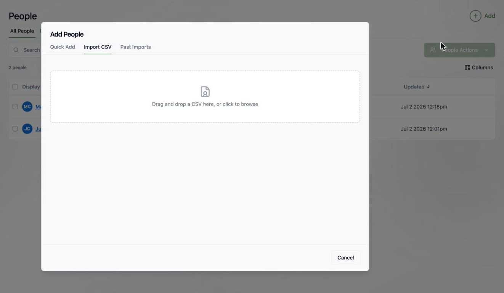
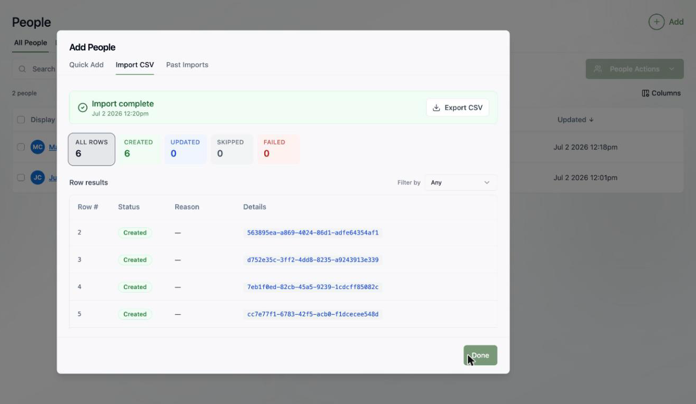

## Before you import

Any CSV with a header row works. A typical file looks like this:

```csv
email,first_name,last_name,company,job_title
diego.ramirez@northwindsupply.com,Diego,Ramirez,Northwind Supply,VP of Marketing
priya.patel@brightlabs.co,Priya,Patel,Bright Labs,Demand Gen Manager
```

A few things that make imports smooth:

- Every contact needs an **email or phone number** — rows without one can't be created.
- Column names don't need to match Tented's field names exactly; you'll get a mapping step.
- Columns can map to [custom fields](/people/contact-fields) too — and you can even create new custom fields during the import.

## Step 1: Upload your file

Go to **People > Add > Import from CSV** and drag your file in (or click to browse).



## Step 2: Map your columns

Tented reads your header row and auto-maps each CSV column to a contact field. For each column you can:

- **Change the target field** — any [standard or custom field](/people/contact-fields)
- **Choose the overwrite behavior** — if a contact already exists (matched by email), decide whether the imported value should **overwrite** a field that's already filled or leave it alone


<Note>
  Imports **update** existing contacts rather than creating duplicates — a row whose email matches an existing contact updates that contact according to your overwrite settings.
</Note>

## Step 3: Start the import

Click **Start Import** and watch rows process in real time. When it finishes you get a full report:

- **Created / Updated / Skipped / Failed** counts, with a filterable row-by-row breakdown
- A **reason** for every skipped or failed row
- **Export CSV** to download the results for your records



## Reviewing past imports

The **Past Imports** tab in the Add People dialog keeps a history of every import — handy when you're trying to work out where a contact came from. Each contact's [Activities timeline](/people/managing-contacts#viewing-a-contact) also records "Person Created — Source: List Import."

## What's next?

<Columns cols={2}>
  <Card
    title="Organize them into lists"
    icon="list"
    href="/people/working-with-lists"
  >
    Turn your imported contacts into targeted audiences.
  </Card>
  <Card
    title="Customize your fields"
    icon="table-columns"
    href="/people/contact-fields"
  >
    Add custom fields so your CSV columns have a proper home.
  </Card>
</Columns>
