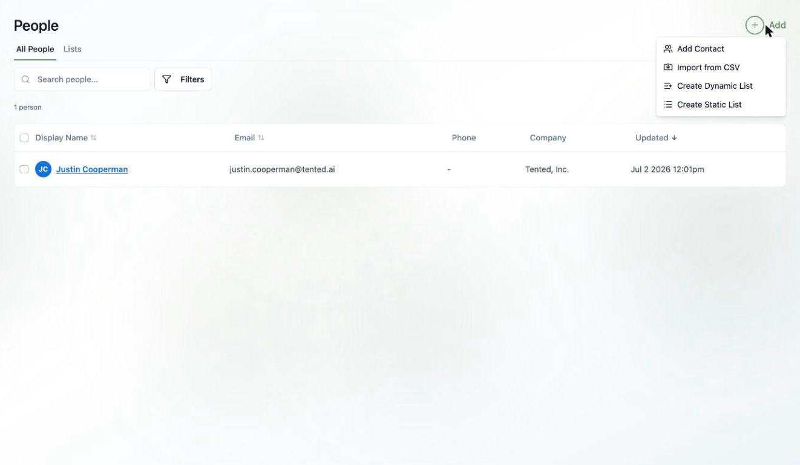
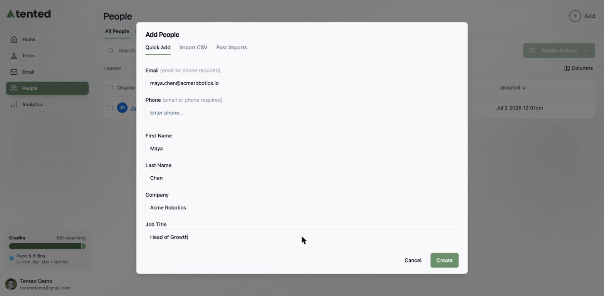
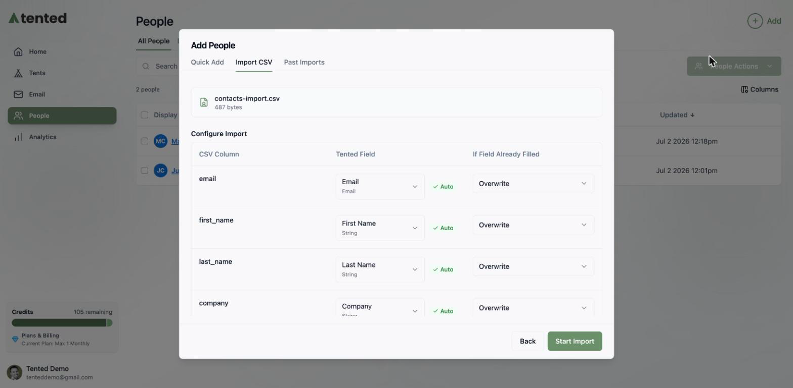
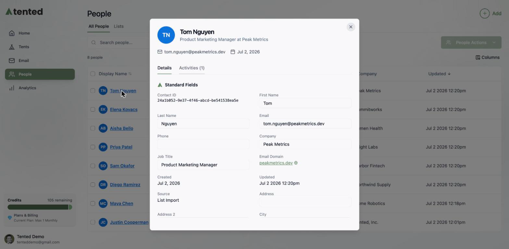
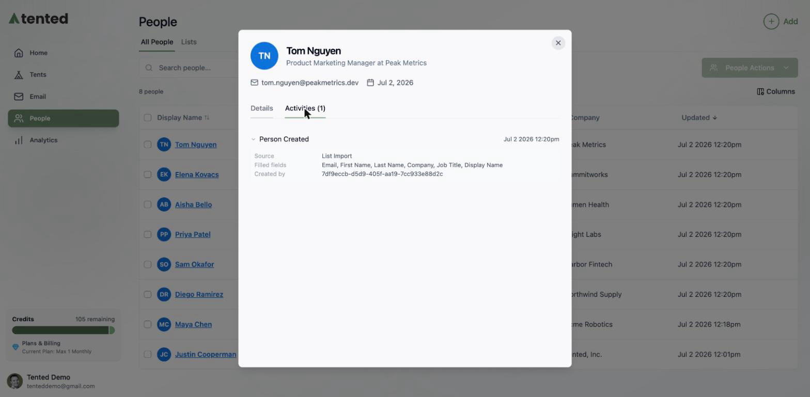
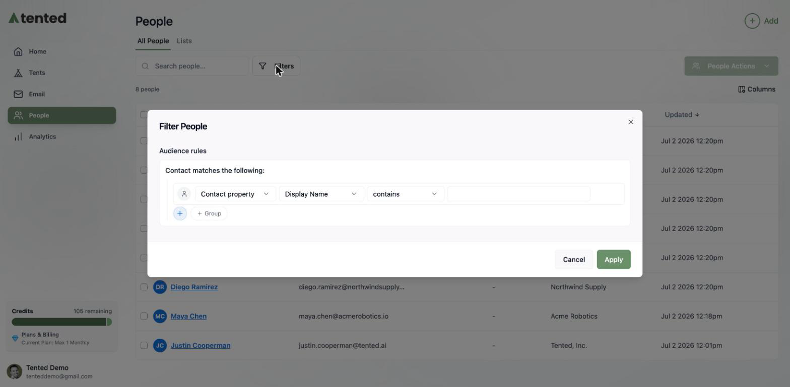
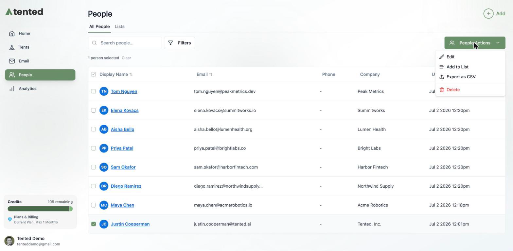
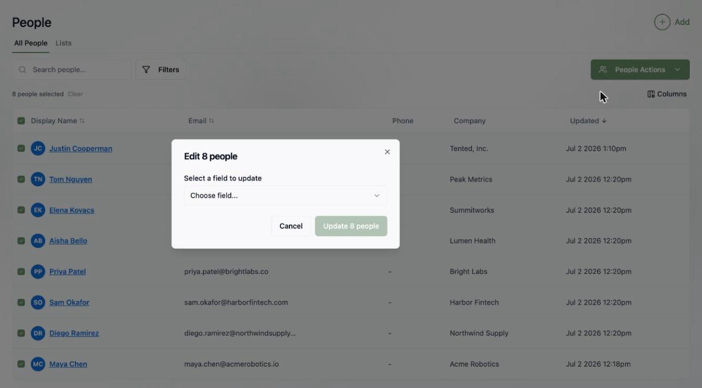

## Meet the People area

The **People** area is your contact database inside Tented. Every person you market to — leads from tent forms, imported lists, customers you add by hand — lives here, ready to be organized into lists and reached through [email blasts](/email/email-blasts) and [triggered flows](/email/triggered-flows).

Click **People** in the sidebar to see everyone in your database. You can sort by any column, search by name or email, and customize which columns appear with the **Columns** button.

## Adding contacts

Click the **Add** button in the top-right corner to see your options:

### Quick Add

Perfect for adding one person at a time. An email *or* phone number is required — everything else is optional:

- **Email** and **Phone**
- **First Name** and **Last Name**
- **Company** and **Job Title**

Click **Create** and the contact appears in your database instantly.

### Import from CSV

Got a whole list? Choose **Import from CSV** and drag in your file. Tented reads your column headers, auto-maps them to contact fields, and gives you a row-by-row report when it's done.

For the full walkthrough — column mapping, overwrite behavior, custom fields, and import history — see [Importing Contacts via CSV](/people/importing-contacts).

## Viewing a contact

Click any contact's name to open their profile. The **Details** tab shows all their [standard and custom fields](/people/contact-fields) — name, email, company, job title, address, lead status, lifecycle stage, and their **Unsubscribed** status for email marketing. You'll also see which [lists](/people/working-with-lists) they belong to and any [triggered flows](/email/triggered-flows) they're enrolled in.

The **Activities** tab is a running timeline of everything that's happened with this contact — when they were created, which fields were updated, forms they submitted, and lists they joined or left.

## Filtering people

Click **Filters** to slice your database with audience rules. Rules can match on:

- **Contact property** — any standard field, like *Job Title contains "Marketing"*
- **Activity** — things that happened, like *Form Submitted in the last 7 days*
- **List membership** — whether someone is (or isn't) on a specific list

Combine multiple rules and groups to get as specific as you need.

<Note>
  These are the same audience rules used to build [dynamic lists](/people/working-with-lists#dynamic-lists) — so if you find yourself applying the same filter over and over, save it as a dynamic list instead.
</Note>

## Bulk actions

Select one or more contacts with the checkboxes and the **People Actions** menu lights up. From there you can:

- **Edit** — bulk-update a field across every selected contact (see below)
- **Add to List** — drop them into an existing static list or create a new one on the spot
- **Export as CSV**
- **Delete** contacts you no longer need

### Bulk-editing a field

Select your contacts, choose **People Actions > Edit**, pick a field (any [standard or custom field](/people/contact-fields)), enter a new value, and apply it to everyone in the selection at once. Perfect for setting a lifecycle stage or lead status on a whole segment.

## What's next?

<Card
  title="Next: Working with Lists"
  icon="arrow-right"
  href="/people/working-with-lists"
>
  Organize your contacts into static and dynamic lists — the audiences behind your campaigns.
</Card>
