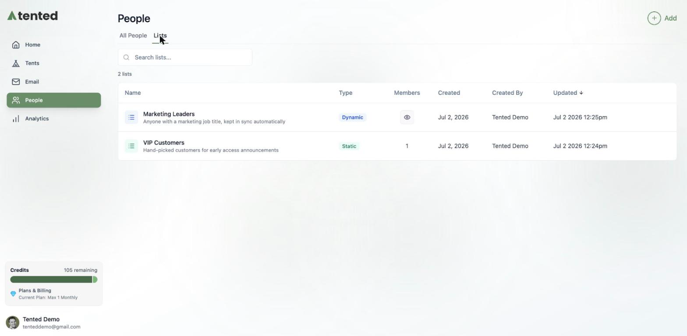
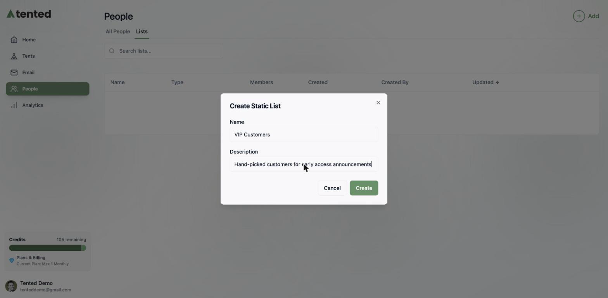
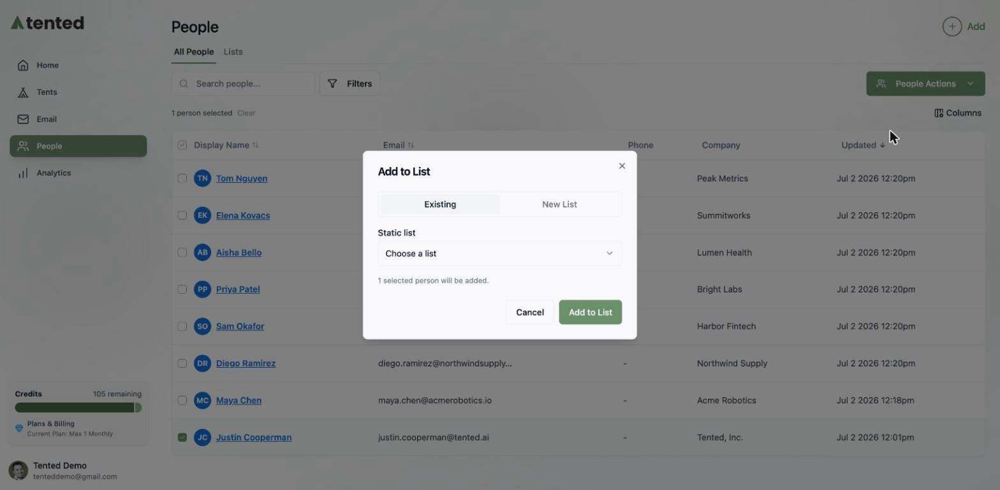
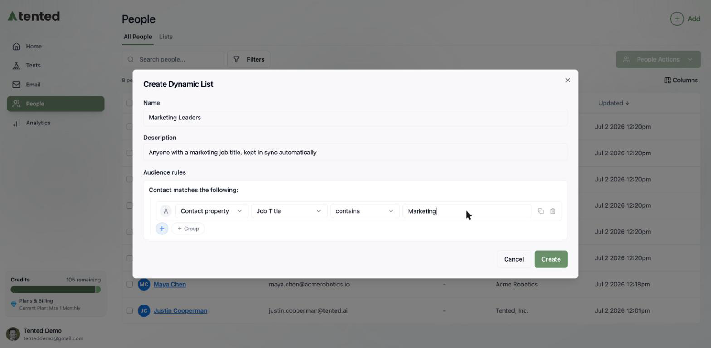
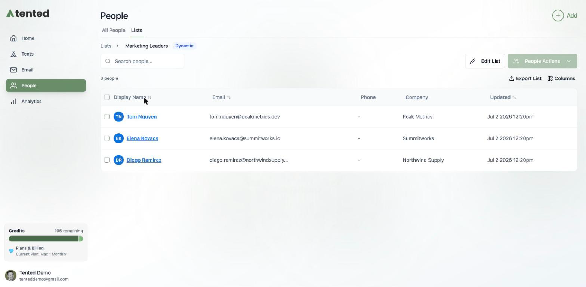

## Why lists?

Lists are how you turn a big database of people into targeted audiences. Every [email blast](../email/email-blasts) sends to a list, and [triggered flows](../email/triggered-flows) can enroll contacts the moment they join one — so getting comfortable with lists pays off everywhere else in Tented.

Head to **People > Lists** to see them all, along with each list's type, member count, and when it was last updated.

There are two kinds of lists, and picking the right one is the whole game:

<CardGroup cols={2}>

<Card title="Static lists" icon="list">
  A fixed roster you manage by hand. Members stay put until you add or remove them. Great for hand-picked groups like VIP customers, event invitees, or a test audience.
</Card>

<Card title="Dynamic lists" icon="wand-magic-sparkles">
  A saved set of audience rules. Membership updates automatically as contacts change — anyone who matches is in, anyone who stops matching is out. Great for segments like "everyone with a marketing job title."
</Card>

</CardGroup>

## Creating a static list

1. Click **Add > Create Static List**.
2. Give it a name and an optional description.
3. Click **Create**.

Your new list starts empty. To fill it, go to the **All People** tab, select some contacts, and choose **People Actions > Add to List**. Pick an existing list — or spin up a new one right from the dialog.

To remove people later, open the list, select them, and use **People Actions > Remove from List**.

## Creating a dynamic list

1. Click **Add > Create Dynamic List**.
2. Name it, then build your **audience rules** — the same rule builder you know from [filtering people](/people/managing-contacts#filtering-people). Match on contact properties, activities, or membership in other lists.
3. Click **Create**.

That's it — Tented finds everyone who matches right away, and keeps the list in sync as contacts are created, updated, or deleted. Here's our "Job Title contains Marketing" list, automatically pulling in three matching contacts:

<Note>
  You can't manually add or remove members from a dynamic list — the rules decide. If you need hand-picked control, use a static list. Use **Edit List** on a dynamic list to change its rules at any time.
</Note>

## Managing lists

From a list's page you can:

- **Search** and sort its members
- **Export List** to CSV
- **Edit List** (dynamic lists) to tweak the rules
- Run **People Actions** on selected members, just like in All People

## Static vs. dynamic: a quick cheat sheet

| You want to... | Use |
|---|---|
| Hand-pick a test audience for a blast | Static |
| Target everyone at companies in a certain industry | Dynamic |
| Trigger a welcome flow when someone is added | Static (flows trigger on static list adds) |
| Keep a segment fresh without maintenance | Dynamic |

## What's next?

<Card
  title="Next: Setting Up Email"
  icon="arrow-right"
  href="/email/email-setup"
>
  Verify your sending domain and sender details so your lists have somewhere to go.
</Card>
