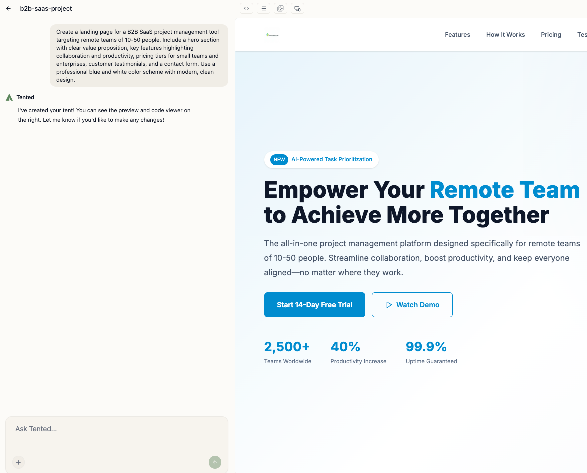

## The Art of AI Prompting

Writing effective prompts is crucial for getting the best results from Tented's AI. A well-crafted prompt can mean the difference between a generic landing page and a perfectly tailored, conversion-optimized page.

## Prompt Structure

### The Perfect Prompt Formula

**Context + Goal + Details + Constraints = Great Results**

- **Context:** Who you are and what you do
- **Goal:** What you want to achieve
- **Details:** Specific features and content
- **Constraints:** Technical or design limitations

### Example Breakdown

**Poor Prompt:**
"Create a landing page"

**Good Prompt:**
"Create a landing page for a B2B SaaS project management tool targeting remote teams of 10-50 people. Include a hero section with clear value proposition, key features highlighting collaboration and productivity, pricing tiers for small teams and enterprises, customer testimonials, and a contact form. Use a professional blue and white color scheme with modern, clean design."

## Context Setting

### Industry and Business Type

**Be Specific About Your Industry:**
- "B2B SaaS productivity tool" vs. "software"
- "Online fitness coaching service" vs. "fitness"
- "AI-powered mortgage rate comparison tool" vs "mortgage software"

**Include Business Model:**
- Subscription-based service
- One-time purchase product
- Service-based business
- E-commerce store

### Target Audience

**Define Your Ideal Customer:**
- "Busy professionals aged 25-45"
- "Small business owners with 5-20 employees"
- "Tech-savvy millennials in urban areas"
- "Parents looking for family-friendly services"

**Include Pain Points:**
- "Teams struggling with remote collaboration"
- "Businesses overwhelmed by manual processes"
- "Consumers seeking convenience and speed"

## Goal Definition

### Primary Objectives

**Conversion Goals:**
- Lead generation through contact forms
- Product sales and purchases
- Newsletter signups
- Demo requests or consultations

**Brand Goals:**
- Establish credibility and trust
- Showcase expertise and experience
- Build brand awareness
- Drive traffic to other channels

### Success Metrics

**What Success Looks Like:**
- "High conversion rate for demo requests"
- "Clear path from visitor to customer"
- "Mobile-optimized for on-the-go users"
- "Professional appearance for enterprise clients"

## Content Specifications

### Essential Sections

**Hero Section:**
- Compelling headline and subheadline
- Clear value proposition
- Primary call-to-action
- Hero image or video

**Features/Benefits:**
- Key product features
- Customer benefits
- Unique selling propositions
- Social proof elements

**Social Proof:**
- Customer testimonials
- Case studies or success stories
- Logos of well-known clients
- User reviews or ratings

### Content Tone and Style

**Brand Personality:**
- Professional and corporate
- Friendly and approachable
- Innovative and cutting-edge
- Trustworthy and established

**Communication Style:**
- Technical and detailed
- Simple and accessible
- Urgent and action-oriented
- Educational and informative

You can specify your communication style in the **Brand** area of your [Workspace Settings](../configuring-tented/workspace-settings).

## Design Preferences

### Visual Style

**Design Aesthetic:**
- Modern and minimalist
- Bold and attention-grabbing
- Elegant and sophisticated
- Playful and creative

**Color Preferences:**
- Brand colors (specify hex codes)
- Industry-appropriate colors
- Psychological color choices
- Accessibility considerations

### Layout Preferences

**Page Structure:**
- Traditional or unconventional layout
- Mobile-first or desktop-first

**Content Flow:**
- Linear storytelling
- Problem-solution format
- Feature-benefit progression
- Social proof integration

## Technical Requirements

### Functionality Needs

**Interactive Elements:**
- Contact forms with specific fields
- Newsletter signup integration
- Social media links
- Live chat or support options

**Integration Requirements:**
- CRM system connections
- Email marketing platforms
- Analytics tracking
- Payment processing

## Common Prompt Patterns

### E-commerce Landing Pages

**Template:**
"Create a landing page for [product type] targeting [audience]. Include hero section with product showcase, key benefits, customer reviews, pricing options, and secure checkout. Use [brand colors] with [design style]."

**Example:**
"Create a landing page for premium wireless headphones targeting audiophiles and music professionals. Include hero section with product imagery, sound quality benefits, professional reviews, pricing tiers, and secure checkout. Use black and gold colors with sleek, modern design."

### SaaS Product Pages

**Template:**
"Create a landing page for [SaaS product] targeting [business type]. Include hero with value proposition, key features, pricing plans, customer testimonials, and free trial signup. Use [colors] with professional, trustworthy design."

**Example:**
"Create a landing page for a team collaboration platform targeting remote teams of 5-50 people. Include hero with productivity benefits, key features like video calls and file sharing, pricing for small teams and enterprises, customer success stories, and free trial signup. Use blue and white colors with clean, professional design."

### Service Business Pages

**Template:**
"Create a landing page for [service type] targeting [location/audience]. Include hero with service overview, process explanation, portfolio examples, testimonials, and contact form. Use [brand colors] with [personality] design."

**Example:**
"Create a landing page for a local web design agency targeting small businesses in the Denver area. Include hero with service overview, design process explanation, portfolio of recent projects, client testimonials, and consultation booking form. Use green and white colors with creative, professional design."

## Advanced Prompting Techniques

### Iterative Refinement

**Start Broad, Then Specific:**
1. "Create a landing page for a fitness app"
2. "Make it target busy professionals who want quick workouts"
3. "Add a 7-day free trial and highlight mobile convenience"
4. "Include success stories from users who lost weight"

### Visual References

**Include Design Inspiration:**
- "Use a design similar to Apple's product pages"
- "Make it look like Stripe's landing page but for fitness"
- "Apply Material Design principles with our brand colors"

### Constraint-Based Prompting

**Set Clear Boundaries:**
- "Keep the page under 5 sections"
- "Use only our brand colors: #2563eb and #ffffff"
- "Include exactly 3 pricing tiers"
- "Make it mobile-first responsive"

<Card
  title="Next: Previewing Tents"
  icon="arrow-right"
  href="/working-with-tents/previewing-tents"
>
  Learn how to effectively preview and test your tents before publishing.
</Card>
