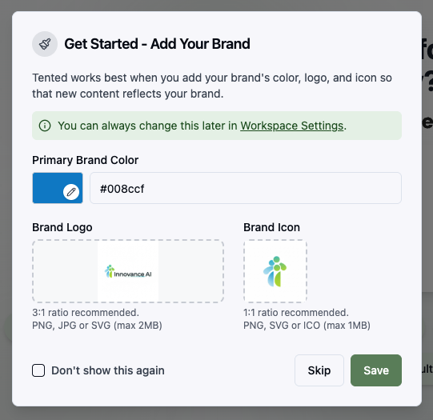
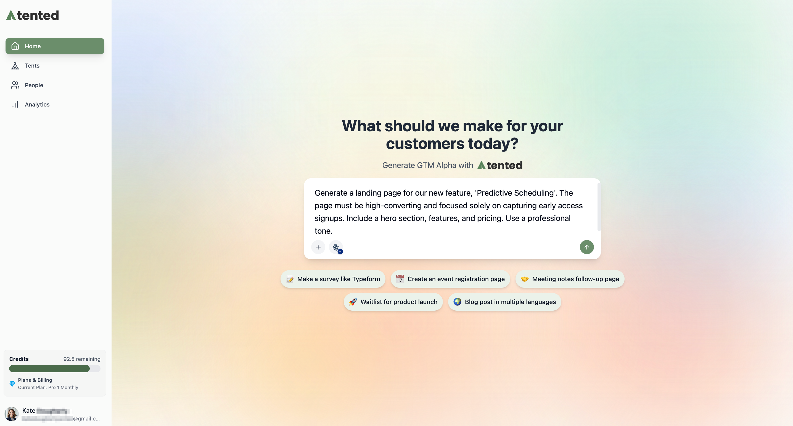
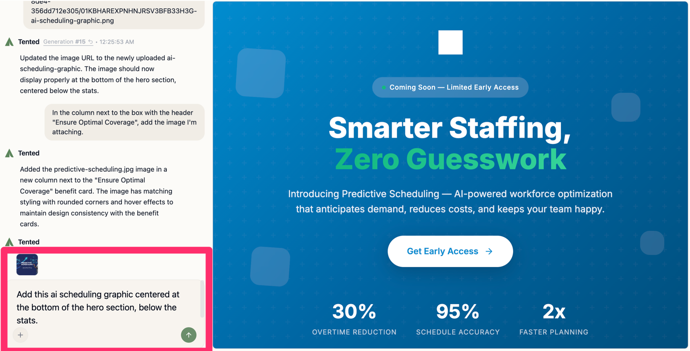
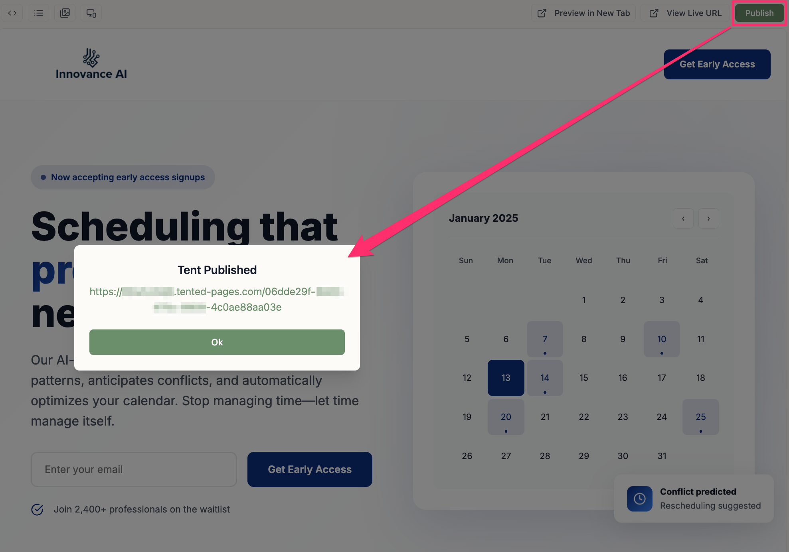
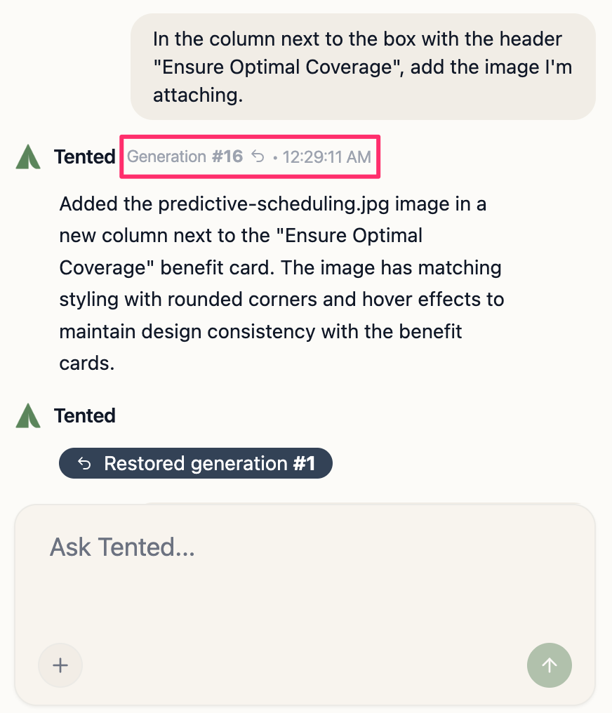

## Creating Your First Tent

Creating a tent in Tented is as simple as describing what you want in natural language. Our AI will generate a complete, modern landing page based on your description.

## The Creation Process

### 1. Set Your Branding

Before you start, customize your brand identity. You're asked to do this when you first sign up, but you can always update it later in the **Brand** section of your **Workspace Settings**.

  <Accordion icon="palette" title="Brand Colors">
    Set your brand information:
    - **Primary Brand Color**: Your main brand color (used for buttons)
    - **Brand Logo**: The logo that represents your brand
    - **Brand Icon**: A smaller icon version of your logo

    

  </Accordion>

### 2. Write a Prompt

Navigate to the **Home** page in your dashboard. In the prompt interface, describe your landing page.

**Good prompts include:**
- Your industry or business type
- Target audience
- Key features or benefits to highlight
- Desired page sections (hero, features, pricing, contact, etc.)
- Brand personality (professional, playful, modern, etc.)

**Example prompts:**
- "Create a landing page for a SaaS productivity tool targeting busy professionals, with a hero section, key features, pricing tiers, and a contact form"
- "Build a professional landing page for a 'Predictive Scheduling' feature with a sign-up form to capture early access leads"
- "Design a modern resource hub page for a 'Q3 E-commerce Trend Report' with a form to download the PDF asset"

    

### 3. Generate Your Tent

Once you've set your branding and written your prompt:

1. **Click the send icon** to start the AI creation process
2. **Wait for generation** (typically 60-70 seconds)
3. **Preview** your new tent on the web by clicking **Preview in New Tab** in the top menu, or click the **Mobile Preview icon**

    

### 4. Refine and Iterate

Refine your tent through natural conversation in the chat interface. Request changes like:

- "Make the hero section more prominent"
- "Add a testimonials section"
- "Make the call-to-action button larger"  
- "Add a sign-up form at the bottom"

### 5. Add Images and files
You can enhance your tent with images and downloadable content:
    
    - **Upload images** to include product photos
    - **Add downloadable files** like brochures, reports, or white papers
    
    

### 6. Publish Your Tent   

    1. **Click "Publish"** at the top right.
    2. **Copy your live URL** - your tent is now accessible worldwide!

    

## Understanding Generations

A **generation** is a complete version of your tent created by AI. Each time you create a new tent or make significant changes, a new generation is created.

**Generation Types:**
- **Initial Generation**: The first version created from your prompt
- **Iteration**: Updates made through chat-based editing
- **Reverted Generation**: When you go back to a previous version

**Generation Features:**
- Each generation has a unique ID and timestamp
- You can revert to any previous generation
- Generations preserve your brand settings and assets
- Version history tracks all changes and iterations

To manage existing generations or view a generation number and timestamp, hover on the chatbot response. Clicking the generation number restores that version of your tent.

<Warning>
Reverting creates a new generation and cannot be undone. Make sure you want to lose recent changes before reverting.
</Warning>

    

## Best Practices for Creating Tents

### Writing Effective Prompts

**Be Specific:**
- Instead of: "Create a landing page"
- Try: "Create a landing page for a B2B SaaS project management tool targeting remote teams, with hero section, key features, pricing, testimonials, and contact form"

**Include Context:**
- Your industry and target market
- Key value propositions
- Desired page sections
- Call-to-action goals

**Set Expectations:**
- Mention if you want specific design styles
- Include any must-have elements
- Specify a mobile-first or desktop-first approach

### Tips for Brand Settings

**Color Selection:**
- Use your existing brand colors for consistency
- Ensure good contrast for accessibility
- Consider how colors work together

**Images:**
- Use high-quality, relevant images
- Optimize file sizes for web performance
- Include alt text for accessibility

## What Happens Next?

After creating your tent, you can:

- Continue to **edit and iterate** using the chat interface
- **Track form submissions** and analytics
- **Clone** for variations or A/B testing

<Card
  title="Next: Viewing Tent Details"
  icon="arrow-right"
  href="/working-with-tents/viewing-tent-details"
>
  Learn how to navigate and understand the tent details page.
</Card>
