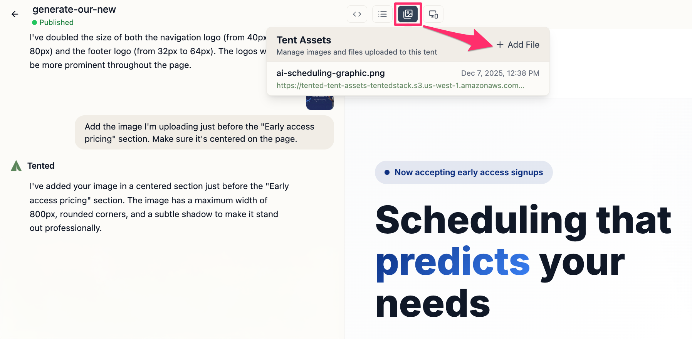

## Creating Your First Tent

Creating a tent in Tented is as simple as describing what you want in natural language. Our AI will generate a complete, modern landing page based on your description.

## The Creation Process

### 1. Set Your Branding

Before you create your tent, customize your brand identity. You're prompted to do this when you first sign up. Here's the information you'll need to provide:

 - **Primary Brand Color**: Your main brand color (used for buttons)
 - **Brand Logo**: The logo that represents your brand
 - **Brand Icon**: A smaller icon version of your logo

 <tip>
- Logos should have a 3:1 aspect ratio and a transparent background. They should be saved as a PNG or SVG file for best results. 
- Icons should be square and also a transparent PNG or SVG file.
</tip>

After you sign up for Tented, you'll see a prompt like this:

1. Enter or select your primary brand color. Enter a hex code or use the color picker.
2. Upload your logo and icon.
3. Click **Save** to finish.

You can also skip this step and add your branding later in [Workspace Settings](../configuring-tented/workspace-settings).

### 2. Write a Prompt

Navigate to the **Home** page in your dashboard. In the prompt interface, describe your landing page.

**Good prompts include:**
- Your industry or business type
- Target audience
- Key features or benefits to highlight
- Desired page sections (hero, features, pricing, contact, etc.)
- Brand personality (professional, playful, modern, etc.)

**Example prompts:**
- "Create a landing page for a SaaS productivity tool targeting busy professionals, with a hero section, key features, pricing tiers, and a contact form"
- "Build a professional landing page for a 'Predictive Scheduling' feature with a sign-up form to capture early access leads"

For more information, see our [Best Practices for AI Prompting](best-practices-prompting) guide.

    

### 3. Generate Your Tent

Once you've set your branding and written your prompt:

1. **Click the send icon** to start the AI creation process.
2. **Wait for generation** (typically 60-70 seconds).
3. **Preview** your new tent. For details, see [Previewing Tents](previewing-tents).

    

### 4. Refine and Iterate

Refine your tent through natural conversation in the chat interface. Request changes like:

- "Add a testimonials section"
- "Make the call-to-action button larger"  
- "Add a sign-up form at the bottom"

### 5. Add Images and files
You can enhance your tent with images and downloadable content like brochures, reports, or white papers. There are two ways to add an image or file.

**From the chat input area:**

1. In the chat input area, click the **plus button > Add Images or Files**.
2. Select the image or file from your computer.
3. A thumbnail for the file appears above the chat input area. Reference it in your prompt. For example, "Add this AI scheduling graphic centered at the bottom of the hero section, below the stats."
4. Click the **send icon** to submit your prompt with the image or file reference.
    
    

**Through the Manage Assets option:**

1. In the tent editor, click the **image icon** in the top menu.
2. In the **Tent Assets** window that appears, click **Add File**.
3. Select the image or file from your computer.
4. The file is added to the **Tent Assets** list. You can now reference it in your prompts. For example, "Add this brochure download link below the pricing section."

    

### 6. Publish Your Tent   

To make your tent live on the web, follow the steps in [Publishing Tents](publishing-tents).
    
    Your tent is now accessible worldwide!

    

## Troubleshooting

### Common Issues

**Preview Not Updating:**
- Refresh the preview panel
- Check for JavaScript errors
- Verify code syntax

**Changes Not Applied:**
- Ensure clear, specific instructions
- Check chat history for errors
- Try rephrasing your request

**Layout Problems:**
- Test on different screen sizes
- Check CSS for conflicts
- Use browser developer tools

## What Happens Next?

After creating your tent, you can:

- Continue to **edit and iterate** using the chat interface
- **Track form submissions** and analytics
- **Clone** for variations or A/B testing

<Card
  title="Next: Viewing Tent Details"
  icon="arrow-right"
  href="/working-with-tents/viewing-tent-details"
>
  Learn how to navigate and understand the tent details page.
</Card>
