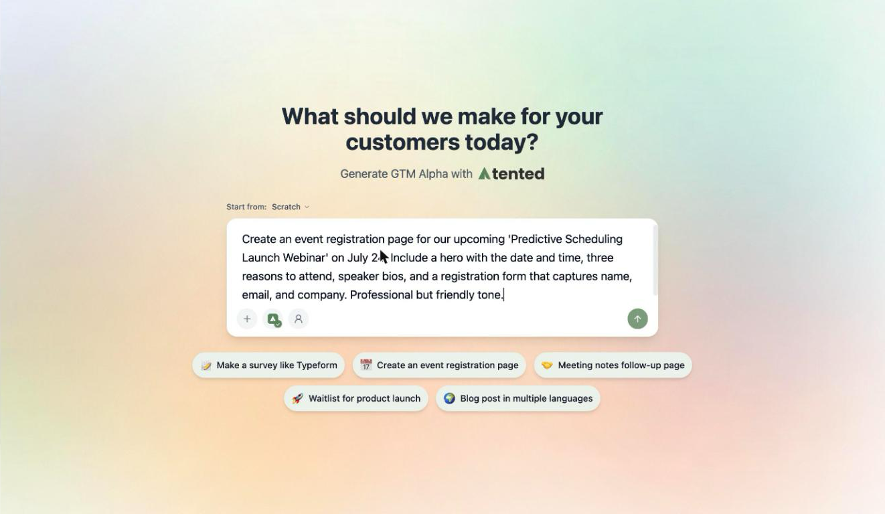
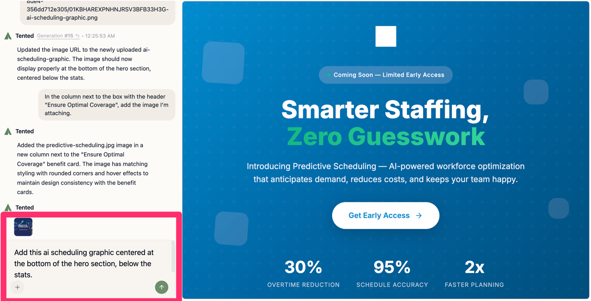
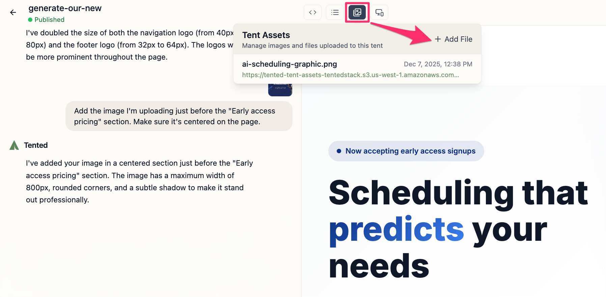
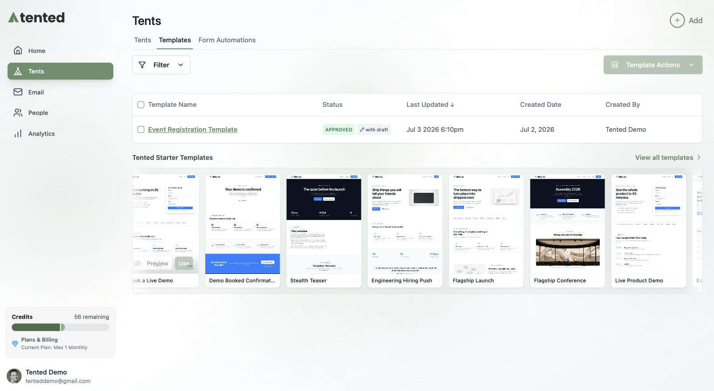
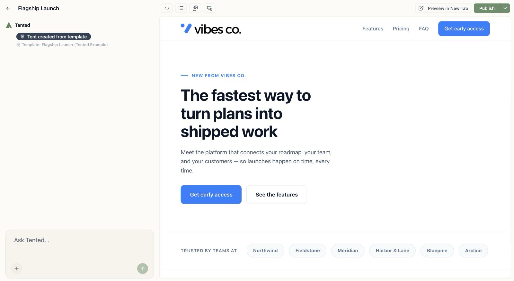

## Creating Your First Tent

Creating a tent in Tented is as simple as describing what you want in natural language. Our AI will generate a complete, modern landing page based on your description.

## The Creation Process

### 1. Set Your Branding

Before you create your tent, customize your brand identity. You're prompted to do this when you first sign up. Here's the information you'll need to provide:

 - **Primary Brand Color**: Your main brand color (used for buttons)
 - **Brand Logo**: The logo that represents your brand
 - **Brand Icon**: A smaller icon version of your logo

Logos should have a 3:1 aspect ratio and a transparent background. They should be saved as a PNG or SVG file for best results. Icons should have a 1:1 (square) aspect ratio. They should also be saved as a transparent PNG or SVG file.

After you sign up for Tented, you'll see a prompt like this:

1. Set your primary brand color by entering a hex code or using the color picker.
2. Upload your logo and icon.
3. Click **Save** to finish.

Or, you can skip this step and add your branding later in your [Workspace Settings](/configuring-tented/workspace-settings).

### 2. Write a Prompt

Navigate to the **Home** page in your dashboard. In the prompt interface, describe your landing page.

**Good prompts include:**
- Your industry or business type
- Target audience
- Key features or benefits to highlight
- Desired page sections (hero, features, pricing, contact, etc.)
- Brand personality (professional, playful, modern, etc.)

**Example prompts:**
- "Create a landing page for a SaaS productivity tool targeting busy professionals, with a hero section, key features, pricing tiers, and a contact form"
- "Build a professional landing page for a 'Predictive Scheduling' feature with a sign-up form to capture early access leads"

For more information, see our [Best Practices for AI Prompting](/working-with-tents/best-practices-prompting) guide.

    

### 3. Generate Your Tent

Once you've set your branding and written your prompt:

1. **Click the send icon** to start the AI creation process.
2. **Wait for generation** (typically 60-70 seconds).
3. **Preview** your new tent. For details, see [Previewing Tents](/working-with-tents/previewing-tents).

    

### 4. Refine and Iterate

Refine your tent through natural conversation in the chat interface. Request changes like:

- "Add a testimonials section"
- "Make the call-to-action button larger"  
- "Add a sign-up form at the bottom"

### 5. Add Images and files
Consider enhancing your tent with images and downloadable content like brochures, reports, or white papers. There are two ways to add an image or file.

**From the chat input area:**

1. In the chat input area, click the **plus button > Add Images or Files**.
2. Select the image or file from your computer.
3. A thumbnail for the file appears above the chat input area. Reference it in your prompt. For example, "Add this AI scheduling graphic centered at the bottom of the hero section, below the stats."
4. Click the **send icon** to submit your prompt with the image or file reference.
    
    

**Through the Manage Assets option:**

1. In the tent editor, click the **image icon** in the top menu.
2. In the **Tent Assets** window that appears, click **Add File**.
3. Select the image or file from your computer.
4. The file is added to the **Tent Assets** list. You can now reference it in your prompts. For example, "Add this brochure download link below the pricing section."

    

<Tip>
  Don't want to start from a prompt? Create from a template instead: **Tents > Add > Create Tent** opens a gallery of [Tented example templates](#tented-example-templates), every one already rendered in your branding. And when you've made something you'll want to reuse, save it as a [tent template](/working-with-tents/tent-templates) so future tents can start from the same design.
</Tip>

### 6. Publish Your Tent   

To make your tent live on the web, follow the steps in [Publishing Tents](/working-with-tents/publishing-tents) — you can customize the URL, add password protection, and remove the Tented badge along the way.
    
    Your tent is now accessible worldwide!

    

## Tented Example Templates

Prompting from scratch isn't the only way in. Every workspace includes the **Tented example template collection** for tents: dozens of professionally designed landing pages covering product launches, event pages, webinars, ABM plays, lead magnets, demo signups, waitlists, and careers pages. The collection **automatically enables your branding**. Every design in the gallery renders with the logo, brand color, and company details from your [workspace settings](/configuring-tented/workspace-settings), so the previews already look like your pages, not someone else's.

To create a tent from the gallery:

1. Go to **Tents** in the sidebar and click **Add > Create Tent**.
2. The **Choose Tent Template** gallery opens. Browse by category (Product Launches, Event Pages, Webinars & Workshops, ABM & Target Accounts, and more), or search by name. Click **Preview** on any card to see the full page.
3. Click a template to select it.
4. Name your tent and click **Create Tent**.

You can also browse the collection any time under **Tents > Templates**, in the **Tented Starter Templates** row. In a hurry? Hover any card there and click **Use**: Tented creates the tent immediately, named after the template, and drops you straight into the editor.

Either way, the new tent opens in the editor with the template's full design in place, rendered in your branding, and a chat pill recording which template it started from. From here it behaves like any other tent: iterate in chat, then preview and publish as usual.

<Note>
  Creating a tent from an example template spends no generation credits. Credits are only used when you ask the AI to generate or edit content.
</Note>

The same gallery has a **My Templates** section listing the [tent templates](/working-with-tents/tent-templates) your team has saved and approved, right next to Tented's examples.

## Troubleshooting

### Common Issues

Here are some common issues you might encounter while working with Tented's AI, along with suggested solutions.

**Preview Not Updating:**
If you notice the preview isn't updating as expected, a few steps can resolve this: first, try refreshing the preview panel. If that doesn't work, check for JavaScript errors in the console, and finally, carefully verify your code syntax for any mistakes that might be preventing the update. 

**Changes Not Applied:**
If you find that changes you requested are not being applied correctly, you should ensure your instructions are clear and specific to the AI. It's also helpful to check the chat history for any errors or confusing previous inputs, or simply try rephrasing your request to see if a different approach yields the correct result. 

**Layout Issues:**
For any layout problems, you should begin by testing the output on different screen sizes to identify the scope of the issue. You should then check your CSS for conflicts that might be causing unexpected rendering. Use browser developer tools for detailed inspection and debugging of the layout elements.

## What Happens Next?

After creating your tent, you might want to [edit and iterate](/working-with-tents/editing-tents) to perfect it. You can also track form submissions and analytics on the [Tent Details](/working-with-tents/viewing-tent-details) page.

<Card
  title="Next: Viewing Tent Details"
  icon="arrow-right"
  href="/working-with-tents/viewing-tent-details"
>
  Learn how to navigate and understand the **Tent Details** page.
</Card>
