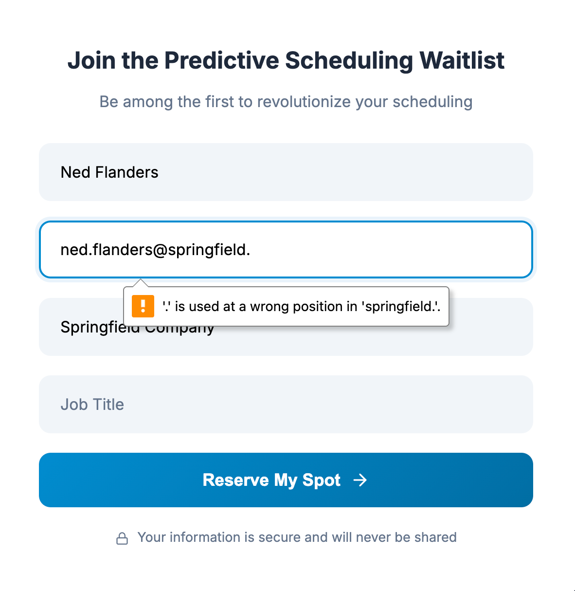
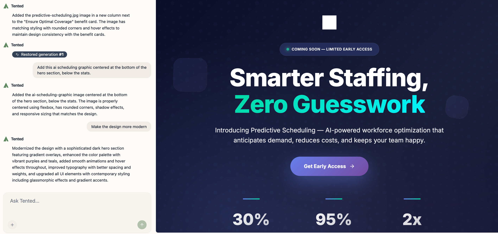
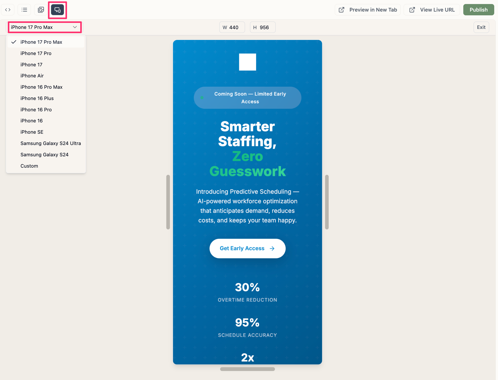

## Editing Workflow

Editing tents is designed to be intuitive and conversational. You can make changes through natural language, see updates in real-time, and iterate quickly to perfect your landing page.

## Types of Edits

### Content Edits

**Text Changes:**
- "Change the headline to 'Transform Your Business Today'"
- "Update the pricing from $99 to $79 per month"
- "Add 'Free 30-day trial' to the call-to-action button"

**Content Additions:**
- "Add a features section with 3 key benefits"
- "Include customer testimonials below the pricing"
- "Add a FAQ section at the bottom"

**Content Removal:**
- "Remove the testimonials section"
- "Delete the pricing table"
- "Take out the social media links"

### Design Changes

**Layout Modifications:**
- "Make the hero section full-screen height"
- "Center all content on the page"
- "Add more white space between sections"

**Color and Styling:**
- "Change the primary color to #2563eb"
- "Make the background gradient from blue to purple"
- "Update all buttons to use rounded corners"

**Typography Updates:**
- "Increase the headline font size to 48px"
- "Change the body font to Inter"
- "Make the subheadings bold"

### Functional Changes

**Form Modifications:**
- "Add a phone number field to the contact form"
- "Change the form submit button text to 'Get Started'"
- "Add form validation for email addresses"

**Interactive Elements:**
- "Add a smooth scroll to the pricing section"
- "Include hover effects on all buttons"
- "Add a loading animation to the form"

**Navigation Updates:**
- "Add a sticky navigation bar"
- "Include anchor links to each section"
- "Add a back-to-top button"

  

## Advanced Editing Techniques

### Iterative Refinement

**Start Broad, Get Specific:**
1. **Layout**: "Make the layout more modern"
2. **Sections**: "Add more spacing between sections"
3. **Details**: "Increase padding to 2rem on all sections"

**Build Incrementally:**
- Make one change at a time
- Test each change before proceeding
- Build complexity gradually

  

### Visual References

**Upload Images for Inspiration:**
- Screenshots of designs you like
- Brand guidelines or style guides
- Reference websites or competitors

**Describe Visual Elements:**
- "Make it look like the Apple website"
- "Use a design similar to Stripe's landing page"
- "Add shadows like in Material Design"

  

### Context-Aware Editing

**Reference Existing Elements:**
- "Make the pricing buttons match the hero button style"
- "Use the same font as the headline for subheadings"
- "Apply the same color scheme throughout"

**Maintain Consistency:**
- Reference previously established styles
- Build on existing design patterns
- Maintain visual hierarchy

## Chat Interface Best Practices

### Effective Communication

**Be Clear and Specific:**
- Instead of: "Fix the layout"
- Try: "Make the hero section take up the full viewport height and center the content both horizontally and vertically"

**Use Action Words:**
- "Add", "Change", "Remove", "Update", "Make"
- "Increase", "Decrease", "Move", "Center"
- "Replace", "Insert", "Delete"

**Provide Context:**
- Mention which section you're referring to
- Reference existing elements by name
- Describe the desired outcome

### Handling Complex Requests

**Break Down Large Changes:**
- Instead of: "Redesign the entire page"
- Try: "First, update the hero section, then we'll work on the features"

**Use Sequential Instructions:**
- "First, change the background color"
- "Then, update the text color to match"
- "Finally, adjust the button styling"

**Verify Understanding:**
- Ask clarifying questions if needed
- Confirm changes before proceeding
- Request explanations of modifications

## Real-Time Collaboration

### Live Preview Updates

**Instant Feedback:**
- See changes immediately in the preview
- Test interactions in real-time
- Verify responsive behavior

**Multi-Device Testing:**
- Switch between device views
- Test touch interactions
- Verify mobile responsiveness

### Version Control

**Generation History:**
- Each edit creates a new generation
- Track all changes over time
- Compare different versions

**Revert Capability:**
- Go back to any previous generation
- Undo unwanted changes
- Experiment without fear

## Quality Assurance

### Testing Your Edits

**Functionality Testing:**
- Test all interactive elements
- Verify form submissions
- Check navigation and links

**Visual Testing:**
- Review on different screen sizes
- Test color contrast and readability
- Verify alignment and spacing

**Performance Testing:**
- Check page load speed
- Verify image optimization
- Test on slower connections

### Common Editing Mistakes

**Avoid These Pitfalls:**
- Making too many changes at once
- Not testing on mobile devices
- Ignoring accessibility considerations
- Forgetting to test form functionality

**Best Practices:**
- Test each change individually
- Maintain design consistency
- Consider the user experience
- Keep performance in mind

## Troubleshooting Edits

### When Changes Don't Apply

**Check Your Request:**
- Ensure clear, specific instructions
- Avoid ambiguous language
- Provide sufficient context

**Review Chat History:**
- Look for error messages
- Check if previous changes conflicted
- Verify the AI understood your request

**Try Alternative Approaches:**
- Rephrase your request
- Break down complex changes
- Use more specific terminology

**Ask the AI to verify its work. Telling it to THINK HARD adds reasoning to its workflow:**
- "Please review the last change and ensure it was applied correctly"
- "Please double-check the layout adjustments I requested"
- "Please THINK HARD and remove the predictive-scheduling dashboard image from the hero section; I still see it even after you recent attempt to remove it" 

### Handling Conflicts

**Style Conflicts:**
- Check for competing CSS rules
- Verify specificity of selectors
- Test changes in isolation

**Layout Issues:**
- Test on different screen sizes
- Check for overflow problems
- Verify responsive behavior

<Card
  title="Next: Reverting to Previous Generations"
  icon="arrow-right"
  href="/working-with-tents/reverting-generations"
>
  Learn how to revert to previous versions of your tent.
</Card>
