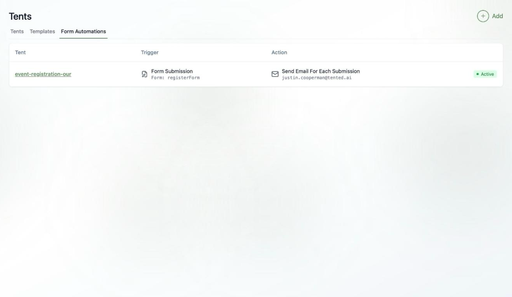
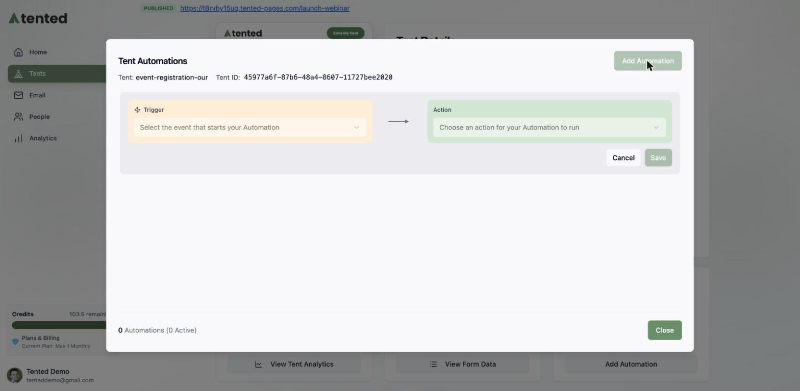
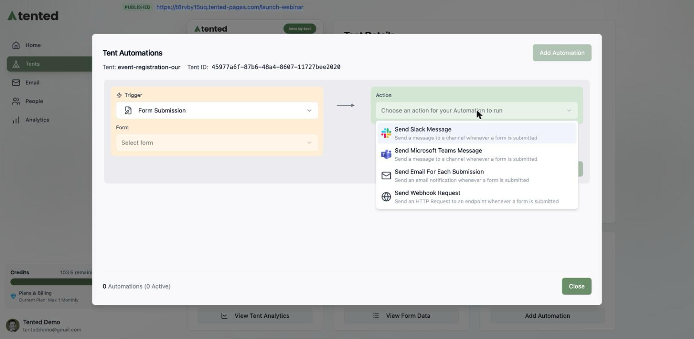
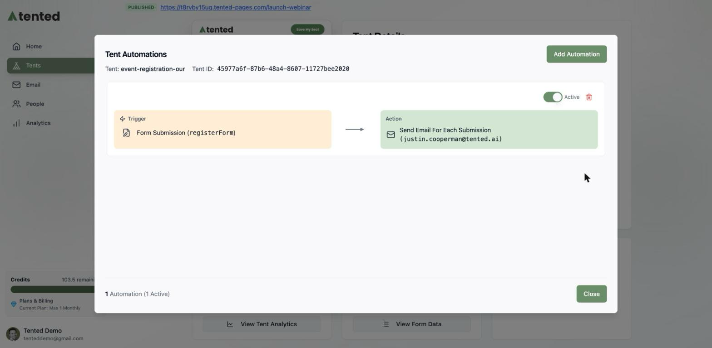

## What are form automations?

Every published tent can capture form submissions. **Form automations** make sure those submissions go somewhere useful the moment they arrive — a Slack channel, a Teams channel, your inbox, or any webhook endpoint — plus scheduled digest emails of your form data.

You can see every automation across all your tents in one place: **Tents > Form Automations**.

## Adding an automation

Automations are set up per tent:

1. Open your tent's details page (**Tents >** click the tent name).
2. On the **Automations** card, click **Add Automation** (or **Manage Automations** if you already have some — it's also in the **Tent Actions** menu).
3. In the **Tent Automations** window, click **Add Automation**.

You'll get a simple two-part builder: pick a **Trigger** (when it runs) and an **Action** (what happens).

## Trigger: Form Submission

Fires immediately, every time someone submits a form. Choose which of the tent's forms to watch, then pick an action:

- **Send Slack Message** — post to a public or private channel (requires the [Slack connector](/integrations/connecting-slack))
- **Send Microsoft Teams Message** — same idea, for Teams (see [Connecting Microsoft Teams](/integrations/connecting-microsoft-teams))
- **Send Email For Each Submission** — an email notification to any address, per submission
- **Send Webhook Request** — an HTTP request to your endpoint, for CRMs and custom pipelines

Here's an email notification automation ready to save:

## Trigger: On a Schedule

Prefer a digest? The **On a Schedule** trigger sends recurring summaries instead of one-at-a-time pings:

- **Frequency**: Daily, Weekly, or Monthly (with handy presets like first/middle/last day of the month), at the time you pick — in your workspace's timezone.
- **Action**: **Send Email With Form Data CSV** — a scheduled email with your form data attached as a CSV.

## Managing automations

Click **Save** and your automation is live — no separate activation step. From the Tent Automations window you can:

- **Toggle** any automation between Active and paused
- **Delete** automations you no longer need
- See the count of total and active automations at a glance

<Tip>
  Want submissions to do more than notify? Tent forms can also flow into your [People database](/people/managing-contacts), where a **Form Submitted** trigger can enroll contacts into [triggered email flows](/email/triggered-flows) — a full lead-capture-to-nurture pipeline.
</Tip>

## What's next?

<Card
  title="Next: Viewing Form Submissions"
  icon="arrow-right"
  href="/working-with-tents/viewing-form-submissions"
>
  See, search, and export the form data your tents collect.
</Card>
