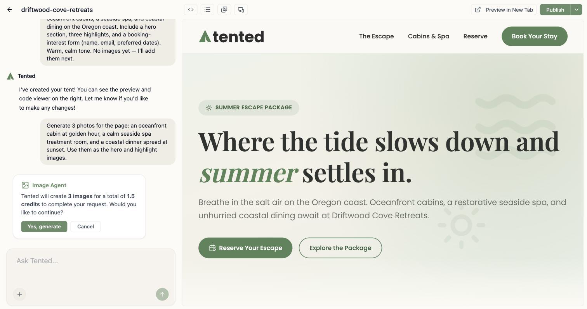
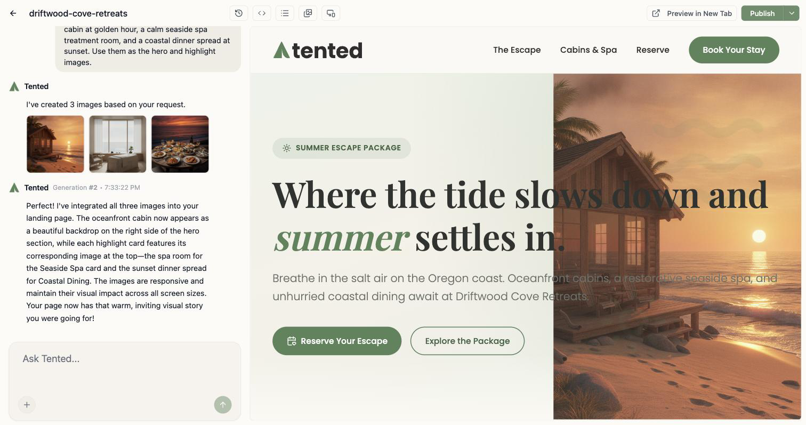
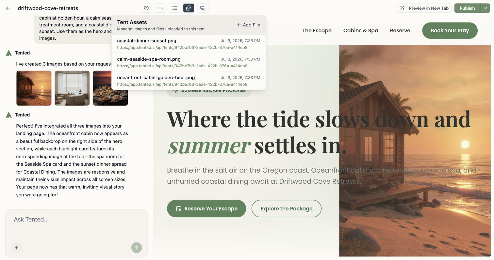

## Tented makes images, too

The same chat that writes your copy and codes your pages can **generate original images**: hero photos, product shots, textures, illustrations — whatever your page or email needs. Just describe the image in your prompt, the way you'd describe anything else:

> Add a hero image of an oceanfront cabin at golden hour, and give the dining section a photo of a coastal dinner spread.

Tented's image agent generates each image, saves it to your assets, and weaves it into the design. It works everywhere you chat with Tented: the **tent editor**, the **email editor**, and both **template** editors.

<Tip>
  Be as specific with images as you are with copy — subject, mood, lighting, and style all help. "A warm, editorial photo of fresh sourdough on a rustic wooden counter, morning light" beats "a bread photo."
</Tip>

## What it costs

Image generation uses AI credits, separate from the code generation that places the images:

- **0.5 credits per image**
- Up to **5 images per request**

A single image generates right away. Ask for **two or more** and Tented pauses to confirm the cost first:

Click **Yes, generate** to proceed, or **Cancel** to rewrite your request — canceling costs nothing. If you ask for more than five images, Tented offers to generate the first five; you can always request the rest in a follow-up message.

## Where the images go

Generated images appear right in the chat as they finish, and the follow-up generation codes them into your design:

Every generated image is also saved to the tent's **assets** (the image icon in the top bar), with a descriptive filename — so you can reuse or download it later, even if you change the design:

You can also generate images *without* touching the design — handy for building up an asset library:

> Generate a photo of a seaside spa treatment room and save it to my assets. Don't change the page.

## Generated vs. uploaded images

Two ways to get images into your work, and they play well together:

- **Generate** when you need something custom that doesn't exist yet — Tented creates it from your description.
- **Upload** (the **+** button in the chat, or the assets window) when you have the real thing — your product photos, your logo, your team headshots.

Reference either kind in your prompts: "use the photo I just uploaded as the hero background" works exactly like "use the second image you generated."

<Note>
  Image generations are tracked in [Analytics](/configuring-tented/analytics) alongside initial and iterative generations, so you can see how your credits are being spent.
</Note>

## Tips for better images

- **One subject per image.** Five focused requests beat one crowded collage prompt.
- **Name the style.** "Editorial photography," "flat illustration," "watercolor," "3D render" — the agent follows style cues closely.
- **Match your brand.** Mention your palette or mood ("warm neutrals, soft morning light") so generated images sit naturally next to your brand colors.
- **Iterate like everything else.** Don't like a result? Ask for a variation: "regenerate the hero image, but at dusk and with no people."

<Card
  title="Next: Best Practices for AI Prompting"
  icon="arrow-right"
  href="/working-with-tents/best-practices-prompting"
>
  Sharpen the prompts behind your pages, emails, and images.
</Card>
