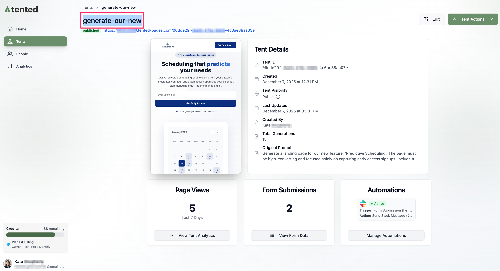
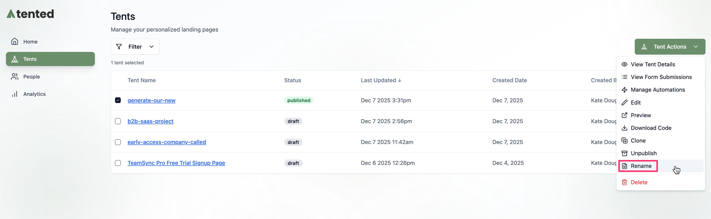
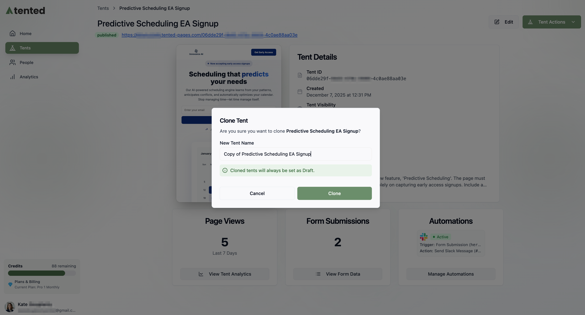

## Tent Management Overview

Managing your tents effectively is crucial for maintaining an organized workspace and optimizing your landing page campaigns. Tented provides tools for all aspects of tent lifecycle management. You can find all of your tents in the **Tents** page of your workspace.

**Sorting and Filtering:**
- Sort by: **Tent Name**, **Last Updated**, and **Created Date** 
- Filter by status: **Any**, **Draft**, **Published**

  

## Basic Tent Operations

### Renaming Tents

You can change the autogenerated name for a tent to better reflect its purpose or campaign association. This option is available from multiple locations within the Tented interface.

**From the tent editor or Tent Details page:**
1. Double-click on the tent name to make it editable.
2. Type the new name.
3. Press **Enter/Return** or click outside the field to save your change.

  

  <tip>You can also Click **Tent Actions > Rename** at the top right of the **Tent Details** page.</tip>

**From the tent list:**
1. Navigate to the **Tents** page.
2. Select the checkbox next to the tent name.
3. Click **Tent Actions > Rename** at the top right.
4. In the **Rename Tent** window that opens, type the new name and click **Save**.

  

### Deleting Tents

You can delete tents that are no longer needed. 

<Warning>
Deleting a tent is permanent and cannot be undone. All associated data, including form submissions and analytics, will be lost forever. Be sure to export any important data before proceeding. Consider using the [clone feature](#cloning-tents) for backups.
</Warning>

**From the Tent Details page:**
1. Click **Tent Actions > Delete** at the top right.
2. Confirm the deletion in the dialog box.

**From the tent list:**
1. Navigate to the **Tents** page.
2. Select the checkbox next to the tent name.
3. Click **Tent Actions > Delete** at the top right.
4. Confirm the deletion in the dialog box.

**What Gets Deleted:**
- Tent code and content
- Generation history
- Form submission data
- Analytics data
- Published URL (becomes inactive)

### Cloning Tents

You can clone a tent to create variations of your landing page for A/B testing, or for other reasons. Here are some other use cases for cloning tents:

- Creating variations for different audiences
- Seasonal campaign updates
- Regional or language variations

**From the Tent Details page:**
1. Click **Tent Actions > Clone** at the top right.
2. In the **Clone Tent** window, enter a name for the new tent and click **Clone**.

The tent is cloned and appears in your tent list. It will have a status of **Draft**.

  

**From the tent list:**
1. Navigate to the **Tents** page.
2. Select the checkbox next to the tent name.
3. Click **Tent Actions > Clone** at the top right.
4. Confirm the deletion in the dialog box.

**What Gets Cloned:**
- Complete tent code and design
- Brand settings and colors
- Images and assets
- Form structure and fields

**What Doesn't Get Cloned:**
- Form submission data
- Analytics and performance data
- Published URL
- Generation history

## Publishing Management

### Unpublishing a Tent

You can unpublish your tent so it is no longer live on the web.

**From the Tent Details page:**
1. Select **Tent Actions > Unpublish** at the top right.
2. Confirm that you want to unpublish the tent.

The tent becomes private. The URL is inactive and the tent status returns to **Draft**.

You can [republish](publishing-tents) it later.

## Data Management

### Viewing and Exporting Tent Data

For information on form submission data and analytics, see:

- [Viewing Form Submissions](viewing-form-submissions)
- [Viewing Current Usage](../billing-subscriptions/viewing-usage)

<Card
  title="Next: Workspace Settings"
  icon="arrow-right"
  href="/configuring-tented/workspace-settings"
>
  Learn how to configure workspace settings and preferences.
</Card>
