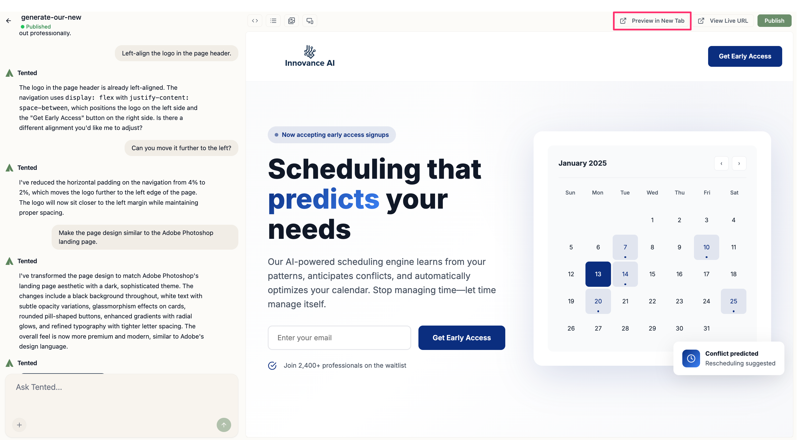
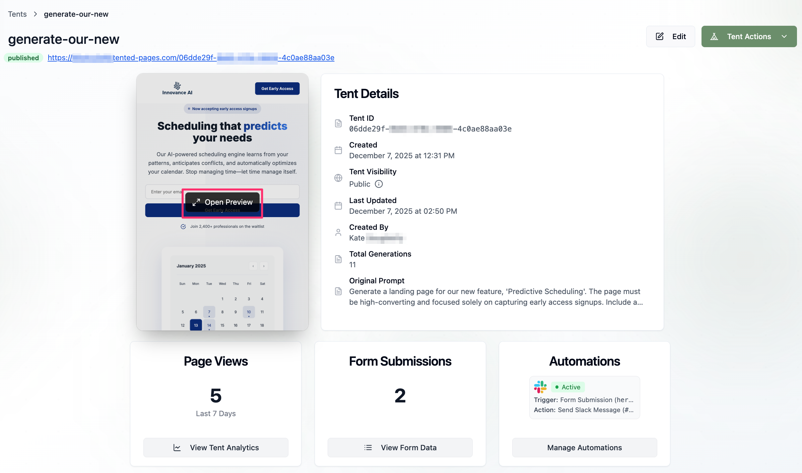

## Preview Overview

Previewing your tent is a crucial step before publishing. Tented's preview system allows you to test your landing page across different devices, verify functionality, and ensure everything works perfectly before going live.

## How to Preview Your Tent on the Web

There are two ways to preview how a tent will look on the web:

- Open the tent in the tent editor and click **Preview in New Tab** at the top of the screen.
  

- Open the tent details page, hover over the preview tile, and click the **Open Preview** button that appears.
  

## How to Preview Your Tent on Mobile Devices

To preview how a tent will look on a mobile device:

 1. In the tent editor, click the **mobile preview icon**.
 2. The mobile preview defaults to the **iPhone 17 Pro Max**. To switch to a different device, select the drop-down arrow next to the device name. 
  <tip>You can also specify exact screen dimensions by entering them in the width and height boxes in the top-center of the screen.</tip>
 3. When you're done previewing on mobile, click the **mobile preview icon** again to return to the standard tent editor view. 

  

## Interactive Testing

**Form Functionality:**
- Submit test data to all forms.
- Verify form validation works correctly.
- Test submission handling and responses.
- Check error messaging and success states.

**Navigation Testing:**
- Click through all links and buttons.
- Test smooth scrolling to sections.
- Verify anchor links work properly.
- Check external link behavior.

**Interactive Elements:**
- Test hover effects and animations.
- Verify mobile menu functionality.
- Check dropdown menus and modals.
- Test all JavaScript interactions.

<Card
  title="Next: Publishing Tents"
  icon="arrow-right"
  href="/working-with-tents/publishing-tents"
>
  Learn how to publish your tent and make it live on the web.
</Card>
