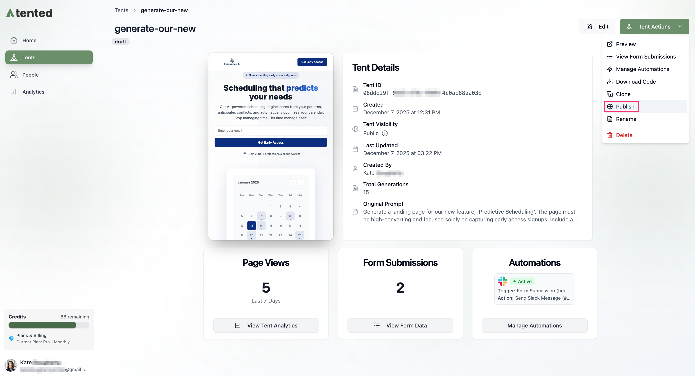
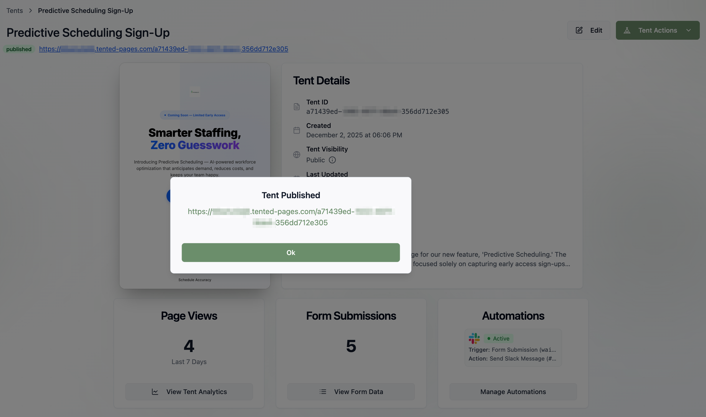

## Publishing Overview

Publishing your tent makes it available on the web with a unique URL that you can share with your audience. The publishing process is simple and fast, taking just a few clicks to go from draft to live website.

## Publishing Process

### Initial Publishing

Make sure you [preview your tent](previewing-tents) first.

There are two ways to publish your tent to the web.

**From the tent editor:**
1. Click **Publish** at the top right of the screen.
2. Confirm publishing in the dialog box.
     
3. Wait for the publishing process to complete.
4. Copy the live URL provided.
5. Click **OK** to finish.

**From the Tent Details page:**
1. Select **Tent Actions > Publish** at the top right.
  
2. Confirm publishing in the dialog box.
3. Wait for the publishing process to complete.
4. Copy the live URL provided.
5. Click **OK** to finish.

    

### About Domains and URLs

When you publish a tent, you can choose from three domain options for your tent's URL:

<AccordionGroup>
  <Accordion icon="globe" title="Default Domain">
    Your tent gets a unique URL on the tented.ai domain:
    - Format: `https://[workspace-slug].tented-pages.com/[unique-id]`
    - SEO-friendly URLs
    - SSL certificate included
    - Global CDN for fast loading
  </Accordion>
  
  <Accordion icon="link" title="Custom Subdomain">
    Use your own subdomain (coming soon):
    - Format: `https://yourname.tented-pages.com/[unique-id]`
    - Branded URL structure
    - Easy to remember and share
    - Professional appearance
  </Accordion>
  
  <Accordion icon="shield" title="Custom Domain">
    Use your own domain with DNS redirects:
    - Point your domain to tented.ai
    - Maintain your brand identity
    - Professional custom URLs
    - Full control over domain

    For details, see our [Custom Domains](../configuring-tented/custom-domains) guide.
  </Accordion>
</AccordionGroup>

## Publishing Updates

Here's what stays the same when you publish updates to an existing tent:

- Your tent URL remains unchanged.
- Form submission data is preserved.
- Analytics data continues tracking.
- SEO rankings are maintained.

<Card
  title="Next: Viewing Form Submissions"
  icon="arrow-right"
  href="/working-with-tents/viewing-form-submissions"
>
  Learn how to view, manage, and export form submission data.
</Card>
