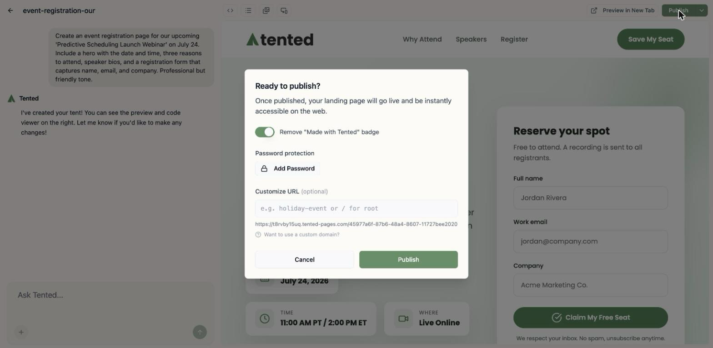
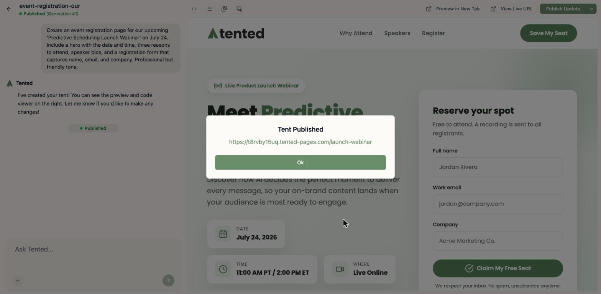
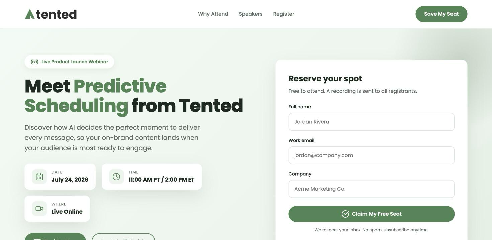
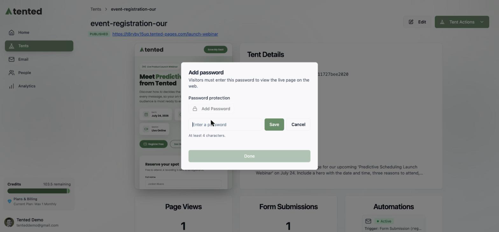

## Publishing Overview

Publishing your tent makes it available on the web with a unique URL that you can share with your audience. The process takes a few clicks — and the publish dialog packs some useful options worth knowing about.

## Publishing Process

Make sure you [preview your tent](/working-with-tents/previewing-tents) first. Then, in the tent editor, click **Publish** at the top right.

The dialog gives you three options before you go live:

- **Remove "Made with Tented" badge** — hide the badge on your published page (available on paid plans).
- **Password protection** — click **Add Password** to gate the page. Great for internal reviews and client previews.
- **Customize URL** — replace the auto-generated ID with a friendly slug, like `/launch-webinar`. You can also change it later via **Tent Actions > Customize URL**.

Click **Publish**, and within seconds you'll get your live URL:

Your tent is now accessible worldwide. In the editor, the status badge switches to **Published**, and you'll see **View Live URL** and **Publish Update** buttons at the top.

<Note>
  Once published, edits don't go live automatically — keep iterating safely in the editor, then click **Publish Update** when you're ready to ship the changes.
</Note>

## About Domains and URLs

<AccordionGroup>
  <Accordion icon="globe" title="Default domain">
    Your tent gets a unique URL on your workspace's subdomain:
    - Format: `https://[workspace-slug].tented-pages.com/[custom-slug-or-id]`
    - SSL certificate included
    - Global CDN for fast loading
  </Accordion>

  <Accordion icon="link" title="Custom URL slug">
    Pick the path yourself in the publish dialog (or via **Tent Actions > Customize URL**) — `/launch-webinar` beats `/45977a6f-87b6...` on any billboard.
  </Accordion>

  <Accordion icon="shield" title="Branded custom domain">
    Serve tents from your own domain with a CNAME alias (paid plans). See our [Custom Domains](/configuring-tented/custom-domains) guide.
  </Accordion>
</AccordionGroup>

## Password-protecting a tent

Want to keep a published tent private — for an internal review, a client preview, or a gated launch? Add a password, and visitors must enter it before they can see the live page.

You can do this two ways:

- **While publishing** — toggle **Add Password** in the publish dialog.
- **Anytime after** — on the **Tent Details** page, choose **Tent Actions > Add Password**.

Either opens the password panel. Click **Add Password**, enter one (at least 4 characters), and **Save**.

From the same panel you can later change or remove the password. Remove it and the page is public again — no republish needed.

<Note>
  Password protection is available on paid plans.
</Note>

## Publishing Updates

When you publish updates to an existing tent, the important things stay stable: your URL doesn't change, form submission data is preserved, and analytics keep tracking seamlessly. Update your content as often as you like without disrupting anything.

## Unpublishing

Changed your mind? **Tent Actions > Unpublish** takes the page off the web — the URL goes inactive and the tent returns to **Draft**. You can republish anytime.

<Card
  title="Next: Viewing Form Submissions"
  icon="arrow-right"
  href="/working-with-tents/viewing-form-submissions"
>
  Learn how to view, manage, and export form submission data.
</Card>
