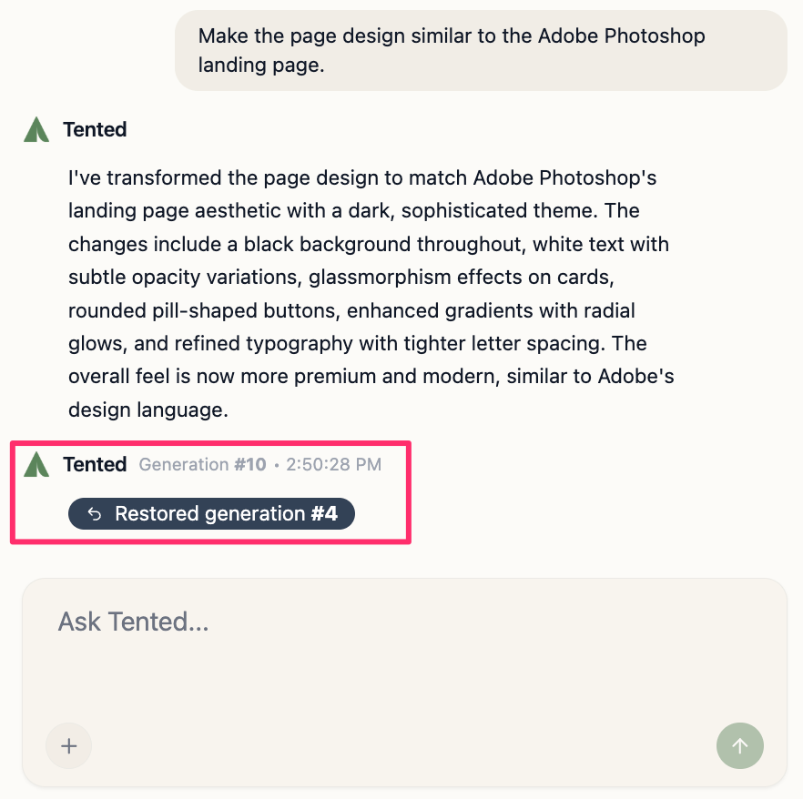

## Understanding Generation History

Every tent maintains a complete history of all generations. Each time you create a tent or make significant changes, a new generation is created. This allows you to explore different directions and return to a previous version if needed.

## What is a Generation?

A **generation** is a complete snapshot of your tent at a specific point in time:

- **Initial Generation**: The first version created from your original prompt
- **Iteration Generation**: Updates made through chat-based editing
- **Reverted Generation**: When you go back to a previous version

Each generation includes:
- Complete HTML, CSS, and JavaScript code
- All brand settings and uploaded assets
- Timestamp and creator information

## Viewing Generation History

The entire generation history for a tent is retained in the tent editor chat interface. You can open it at any time. 

To access the generation history for a tent:

1. In the dashboard, select **Tents** from the sidebar.
2. Click the link for the tent you want to view.
3. On the **Tent Details** page, select **Edit** at the top right.

The tent opens in the tent editor. In the chat interface, you can scroll through all past generations to understand how your tent has evolved. To view the details about a specific generation, hover on the confirmation message from Tented in the history list. The generation number and timestamp will appear.

## Reverting to a Previous Generation

If you want to go back to a previous version of your tent, you can easily revert to any prior generation from the chat history.

- All form submission data from all generations is preserved
- Analytics data remains intact
- Published URLs continue to work

### Step-by-Step Process

1. Browse through the generation history for the tent.
2. Hover over the the confirmation message from Tented for the generation you want to revert to.
3. Click on the generation number that appears.
4. Confirm that you want to revert the tent.

The tent reverts to that generation. If the tent was already live on the web, you will need to republish it for the changes to become public.

<tip>
If you reverted by mistake, you can always revert again to the last generation or any other generation. All previous generations remain available in the history.
</tip>

<Card
  title="Next: Best Practices for AI Prompting"
  icon="arrow-right"
  href="/working-with-tents/best-practices-prompting"
>
  Learn how to write effective prompts for better AI-generated results.
</Card>
