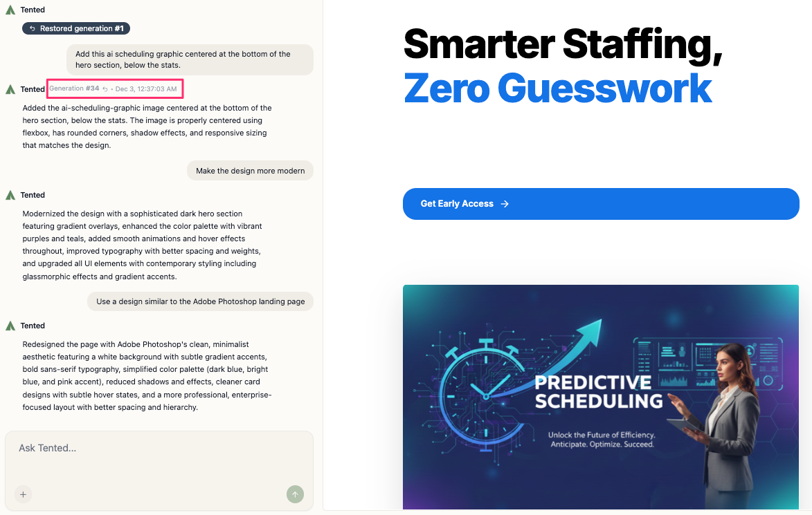

## Understanding Generation History

Every tent maintains a complete history of all generations. Each time you create a tent or make significant changes, a new generation is created. This allows you to explore different directions and always return to a previous version if needed.

## What is a Generation?

A **generation** is a complete snapshot of your tent at a specific point in time:

- **Initial Generation**: The first version created from your original prompt
- **Iteration Generation**: Updates made through chat-based editing
- **Reverted Generation**: When you go back to a previous version

Each generation includes:
- Complete HTML, CSS, and JavaScript code
- All brand settings and uploaded assets
- Timestamp and creator information

## Viewing Generation History

The entire generation history for a tent is retained in the tent editor chat interface. You can open it at any time. 

To access the generation history for a tent:

1. In the dashboard, select **Tents** from the sidebar.
2. Click the link for the tent you want to view.
3. On the **Tent Details** page, select **Edit** at the top right.

The tent opens in the tent editor. In the chat interface, you can scroll through all past generations to understand how your tent has evolved. To view the details about a specific generation, hover on the confirmation message from Tented in the history list. The generation number and timestamp will display.

## Reverting to a Previous Generation

### Step-by-Step Process

1. Browse through your generation history.
2. Hover over the the confirmation message from Tented for the generation you want to revert to.
3. Click on the generation number that appears.
4. A new dialog box asks you if you're sure you want to revert the tent. Click **Confirm**.

The tent reverts to that generation. If the tent was already live on the web, you will need to republish it for the changes to become public.

### What Happens During Revert

**Code Restoration:**
- All HTML, CSS, and JavaScript is restored to that point
- Brand settings are preserved from the target generation
- Uploaded assets remain available

**New Generation Created:**
- A new "Reverted" generation is created
- This becomes your current active generation
- Previous generations remain in history

**Data Preservation:**
- Form submission data is preserved
- Analytics data remains intact
- Published URLs continue to work

## When to Revert

### Good Reasons to Revert

**Experimentation Gone Wrong:**
- You tried a new design direction that didn't work
- Multiple changes created conflicts
- The tent no longer matches your vision

**Accidental Changes:**
- Unintended modifications were made
- Important content was accidentally removed
- Brand guidelines were violated

**Performance Issues:**
- Recent changes caused layout problems
- Mobile responsiveness was broken
- Form functionality was compromised

### Alternatives to Reverting

**Before Reverting, Consider:**
- Can you fix the issue with targeted edits?
- Would a few specific changes solve the problem?
- Is there a middle ground between versions?

**Prompts For Incremental Fixes:**
- "Revert just the hero section styling"
- "Keep the new content but fix the layout"
- "Restore the original colors but keep the new sections"

## Best Practices

### Before Making Major Changes

**Create Checkpoints:**
- Make a mental note of good stopping points
- Consider the current generation as a "save point"
- Plan your changes in logical groups

**Test Incrementally:**
- Make one major change at a time
- Test thoroughly before proceeding
- Keep track of what works and what doesn't

## Troubleshooting Reverts

### Common Issues

**Revert Not Working:**
- Verify the target generation is complete
- Check for any system errors during revert

**Unexpected Results:**
- Review what the target generation actually contained
- Check if brand settings were different
- Verify uploaded assets are still available

### Recovery Options

**If Revert Goes Wrong:**
- You can always revert again to a different generation
- Previous generations remain available
- No permanent data loss occurs

**Finding Lost Content:**
- Browse through generation history
- Look for specific content in previous versions
- Use comparison tools to identify differences

<Card
  title="Next: Best Practices for AI Prompting"
  icon="arrow-right"
  href="/working-with-tents/best-practices-prompting"
>
  Learn how to write effective prompts for better AI-generated results.
</Card>
