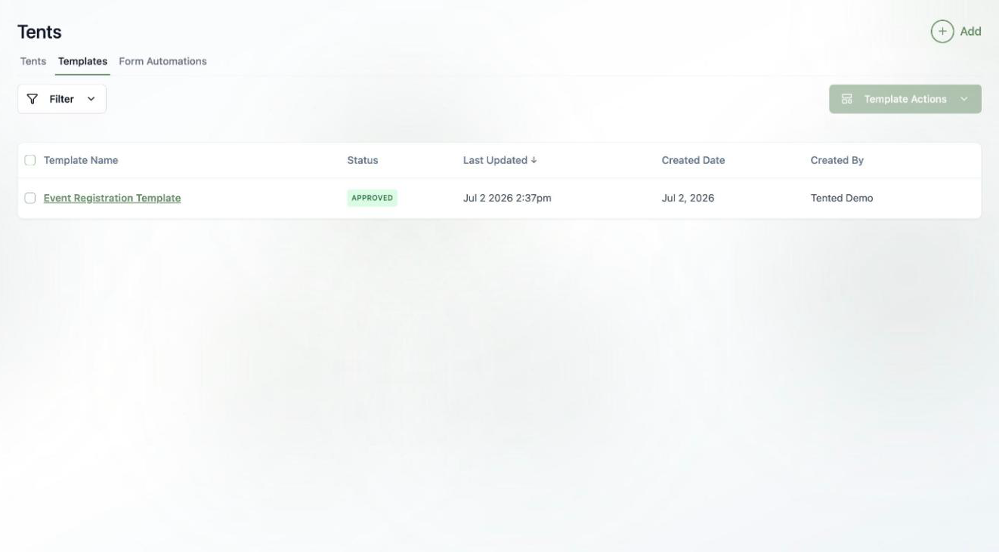
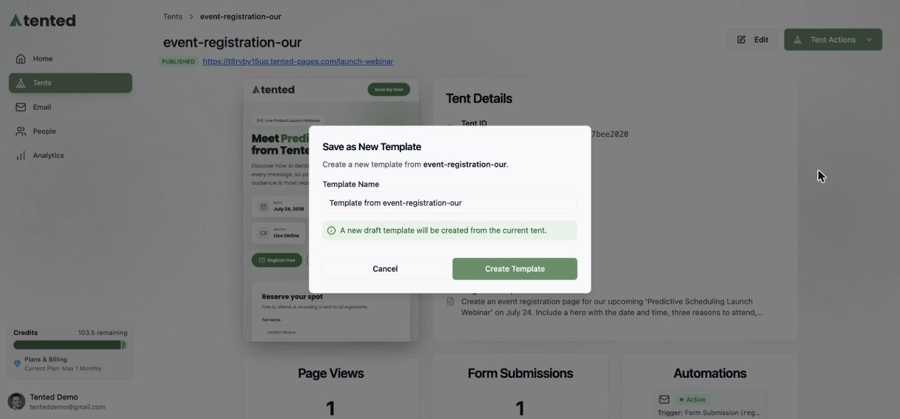
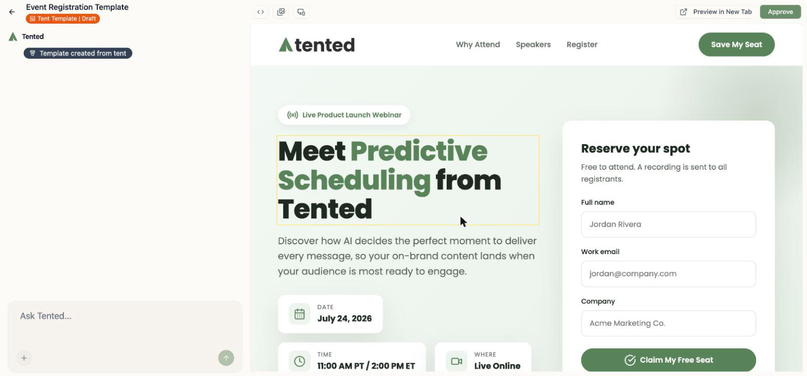
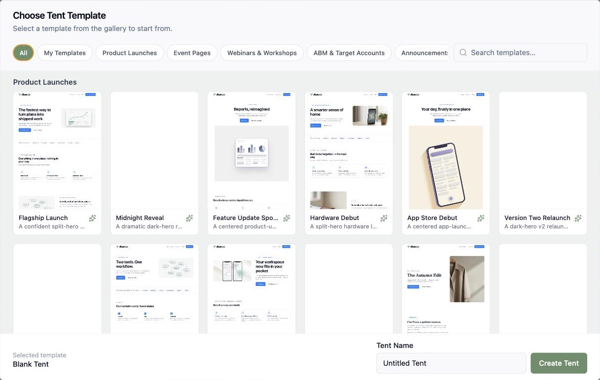

## Why templates?

Built a tent whose layout and style you'll want again — a webinar registration page, a product waitlist, a case-study layout? Save it as a **template** and every new tent can start from that design instead of a blank page. Great for keeping a consistent look across campaigns, or handing your team a proven starting point.

Templates live under **Tents > Templates**, alongside the built-in [Tented example template collection](/working-with-tents/creating-tents#tented-example-templates), which automatically renders every starter design in your branding.

## Creating a template

The easiest way is to save an existing tent:

1. Open the tent's **Tent Details** page.
2. Choose **Tent Actions > Save as New Template**.
3. Name it and click **Create Template**.

This creates a new **draft** template — a full copy of the tent's design that you can refine independently.

## Editing and approving

A template opens in the same editor as a tent: chat to refine it, or edit the code directly.

Like emails, templates use an **approval** step: click **Approve** when it's ready. Only **approved** templates appear in the "start from a template" picker — so you can keep works-in-progress as drafts without cluttering everyone's options.

## Using a template

When you create a tent (**Tents > Add > Create Tent**), the **Choose Tent Template** gallery opens. Your approved templates appear in its **My Templates** section, next to [Tented's example templates](/working-with-tents/creating-tents#tented-example-templates). Pick one, name the tent, and click **Create Tent**. Your new tent starts from that design, and you customize it with chat, leaving the template untouched.

<Tip>
  Templates also power the **Create Tent** step in [triggered flows](/email/triggered-flows#the-create-tent-step) — choose **From template** there to spin up a personalized page per contact without spending generation credits.
</Tip>

<Card
  title="Next: Editing Tents"
  icon="arrow-right"
  href="/working-with-tents/editing-tents"
>
  Master the chat-based editing workflow.
</Card>
