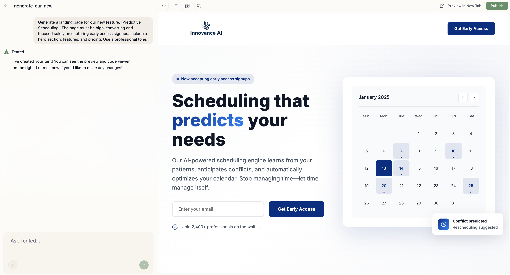
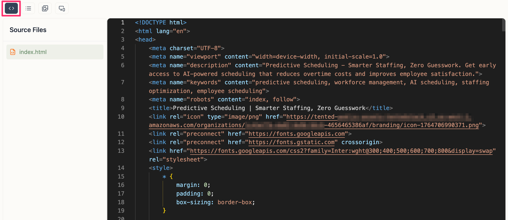

## Tent Editor Overview

The tent editor is your workspace for creating, editing, and refining your AI-generated landing pages. It combines a chat interface for natural language editing with a live preview and code view.

  

## Interface Layout

### Top menu
The top menu provides access to key functions:

- **"Previous" Arrow**: Returns to the previous page.
- **Tent Name**: Click to rename your tent.
- **Code Icon**: Toggles between chat mode and code mode.
- **View Form Submissions**: Opens the form submissions panel if your tent includes a form.
- **Image Icon**: Opens the **Tent Assets** window to upload and view images and files.
- **Mobile Preview**: Toggles a mobile device frame in the preview panel.
- **Preview in New Tab**: Opens your tent in a new browser tab for full-page viewing.
- **Publish**: Publishes your tent to a live URL.

### Left Panel: Chat Interface

The chat interface serves as your primary tool for both generating and iterating on your tents, acting as the main control panel on the left side of the page. This area is composed of two main sections: the input area and the chat history.

The input area allows you to provide commands through text input using natural language, upload images for visual references, or include files for downloadable assets like PDFs, while also displaying a generating indicator during AI processing. Above this, the chat history keeps a complete record of all previous conversations and edits, including generation numbers and timestamps for each interaction. This gives you the ability to easily reference and revisit previous changes.

### Right Panel: Live Preview

This area shows a real-time preview of your tent. This means you can see changes instantly as you make them, giving immediate visual feedback. All interactive elements you create will work correctly in this preview window.

### Code Mode (Optional)

Code mode allows you to directly edit the HTML, CSS, and JavaScript of your tent. To switch to code mode:

1. Click the **code icon** at the top of the screen.
2. **Edit** the code directly.
3. The tent updates in real time.
4. Click the **code icon** again to return to chat mode.

  

## Making Changes

Simply describe what you want to change. For details, see the [Editing Tents](editing-tents) guide.

<Card
  title="Next: Editing Tents"
  icon="arrow-right"
  href="/working-with-tents/editing-tents"
>
  Learn advanced techniques for editing and iterating on your tents.
</Card>
