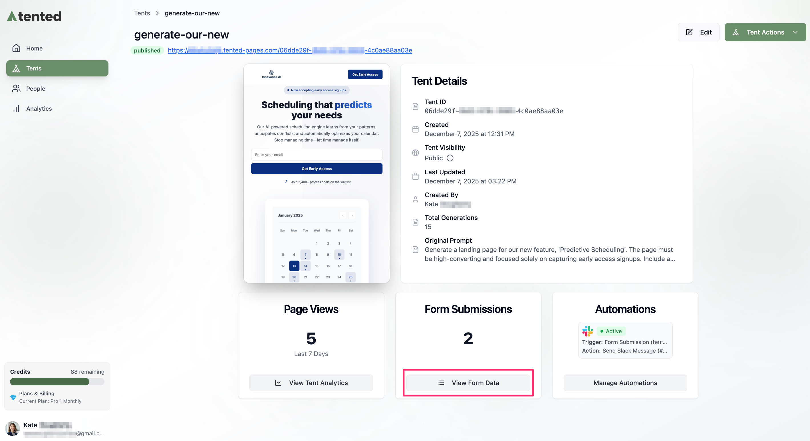
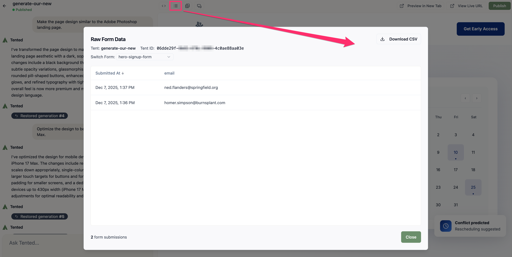

## Form Submissions Overview

Every tent with forms automatically captures and stores submission data. You can view, manage, and export this data to track leads, analyze conversion rates, and follow up with potential customers.

## Accessing Form Submissions

**From the Tent Details page:**
1. On the **Form Submissions** tile, click **View Form Data**. This button is located below the total number of form submissions for the tent.
2. The **Raw Form Data** window opens and displays a complete record of all form submission data for the tent. It includes the timestamp, form fields, and submitted values.
3. To export the data, click the **Download CSV** button.
4. When you're done, select **Close** to exit the window.

  

**From the Tent Editor:**
You might want to view form submissions while editing a tent to confirm that your form is working correctly and make adjustments if needed. To do this:
1. Click the **View Form Submissions icon** (hamburger menu) in the top menu.
2. The **Raw Form Data** window opens and displays a complete record of all form submission data for the tent. It includes the timestamp, form fields, and submitted values.
3. To export the data, click the **Download CSV** button.
4. When you're done, select **Close** to exit the window.

  

## Automations

You can get real-time notifications of new form submissions by using Tented's prebuilt integrations with popular collaborative software platforms:

- [Slack](../integrations/connecting-slack)
- [Microsoft Teams](../integrations/connecting-microsoft-teams)

Scheduled notifications can also be sent to an email address. Learn more in our [Receiving Form Submission Notifications by Email](../integrations/setting-up-email-notifications) guide.

<Card
  title="Next: Managing Tents"
  icon="arrow-right"
  href="/working-with-tents/managing-tents"
>
  Learn how to rename, delete, clone, and manage your tents.
</Card>
